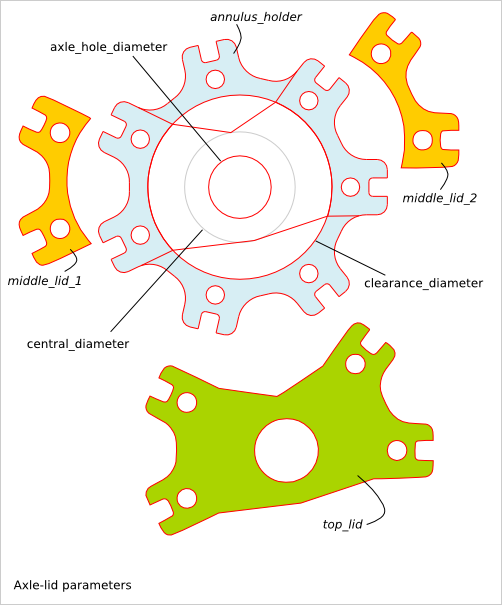
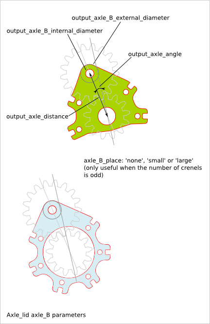
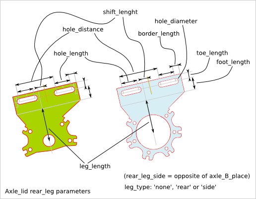
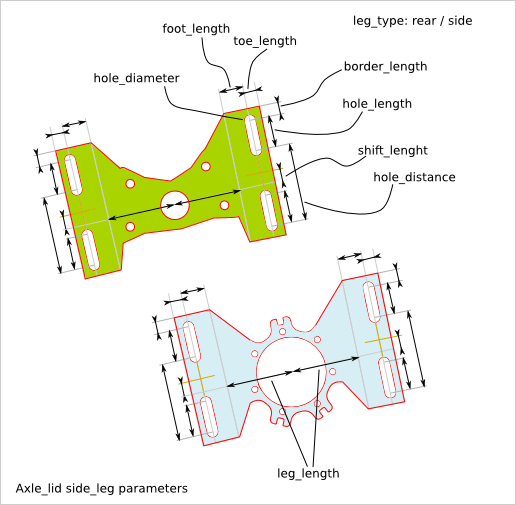
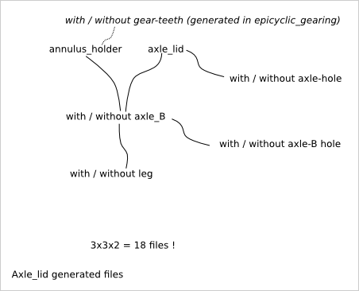

===============
Axle Lid Design
===============

Ready-to-use parametric *axle_lid* design kit. The *axle_lid* is a an assembly of three parts:

  - annulus-holder
  - middle-axle-lid
  - top_axle-lid

To get an overview of the possible axle_lid designs that can be generated by *axle_lid()*, run::

  > python axle_lid.py --run_self_test

Axle-lid Parameter List
=======================

The parameter relative to the external outline are inherit from the :doc:`gearring_design`.

Axle-lid Parameter Dependency
=============================

Diameters
---------

The following relations between diameters (or radius) must be respected::

  cnc_router_bit_radius < axle_hole_diameter/2
  axle_hole_diameter    < central_diameter
  central_diameter      < clearance_diameter
  clearance_diameter    < holder_diameter

Generated files
---------------

For a same set of parameters, you may need several flavour of the design such as a plate with a hole and the same plate without this hole. Instead of adding input parameters to select if the plate must have a hole or not, the both variants are generated. You just need to pick up the file you need.

