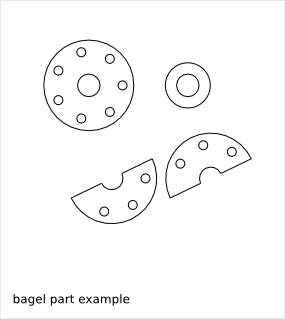
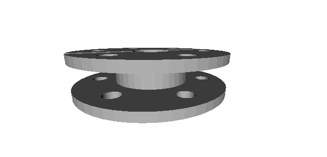
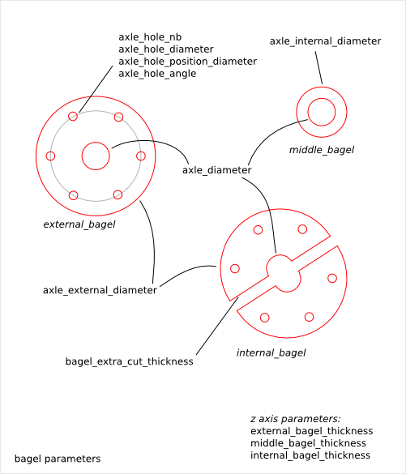

============
Bagel Design
============

Ready-to-use parametric *bagel* design. It is the axle-guidance for the *bell* piece. The *bagel* is fixed to the *bell* but is mounted after the *axle* has been set in positon.

To get an overview of the possible *bagel* designs that can be generated by *bagel()*, run::

  > python bagel.py --run_self_test

Bagel Parts and Parameters
==========================

The *bagel* is composed out of the following flat parts:

* external_bagel
* middle_bagel
* internal_bagel

Bagel Parameter Dependency
==========================

axle_internal_diameter
----------------------

The *bell* design and the *bagel* design have both the *axle_internal_diameter* parameter. With ideal conditions, these two parameters get the same value. But you might want to but slightly different values to adjust the fit of the *middle_bagel* into the *bell axle internal hole*.

