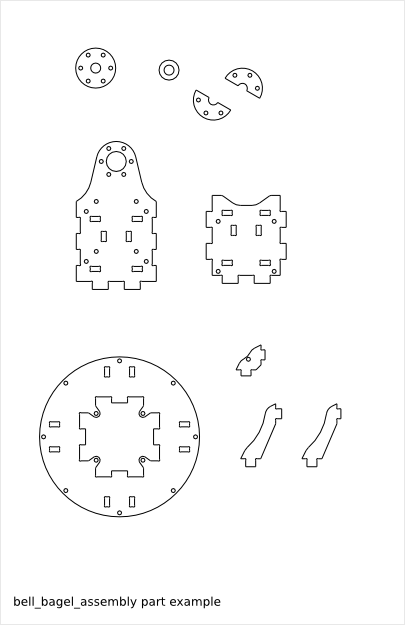
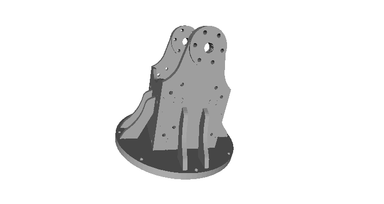

===================
Bell Bagel Assembly
===================

Ready-to-use parametric *bell bagel assembly*. It generates the *bell* and the *bagel* parts.

To get an overview of the possible *bell_bagel_assembly* designs that can be generated by *bell_bagel_assembly()*, run::

  > python bell_bagel_assembly.py --run_self_test

Bell-Bagel-Assembly Parameters
==============================

The *bell_bagel_assembly* parameters are directly inherited from the :doc:`bell_design` parameters and the :doc:`bagel_design` parameters.

Bell-Bagel-Assembly Parameter Dependency
========================================

axle_internal_diameter
----------------------

The *bell* design and the *bagel* design have both the *axle_internal_diameter* parameter, respectly called *axle_internal_diameter* and *bagel_axle_internal_diameter*. With ideal conditions, these two parameters get the same value. But you might want to but slightly different values to adjust the fit of the *middle_bagel* into the *bell axle internal hole*.

