===========
Bell Design
===========

Ready-to-use parametric *bell* design. It is the extremity piece of a *gimbal* assembly. The *bell* piece is composed of several flat parts fixed together.

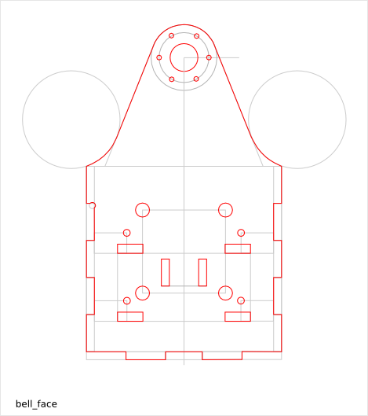

To get an overview of the possible *bell* designs that can be generated by *bell()*, run::

  > python bell.py --run_self_test

Bell Parts and Geometry
=======================

The *bell* is composed out of the following flat parts:

* bell_face x2
* bell_side x2
* bell_base x1
* bell_internal_buttress x8
* bell_external_buttress x8
  (alternative: bell_external_buttress_face x4 and bell_external_buttress_side x4)

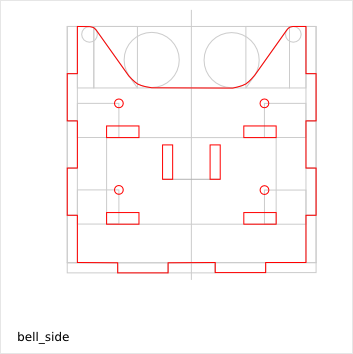
.. image:: images/bell_base.png
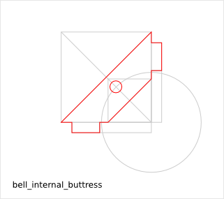
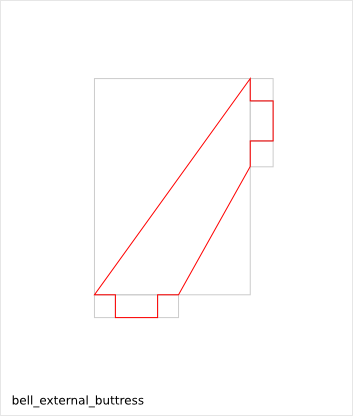

Bell Parameter List
===================

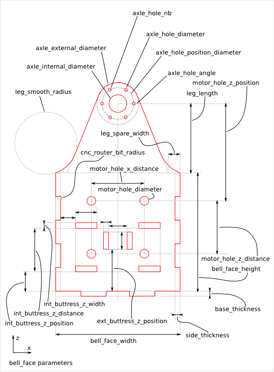
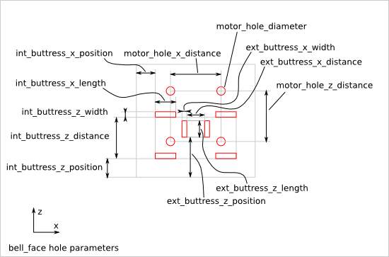
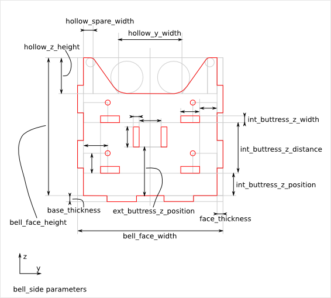
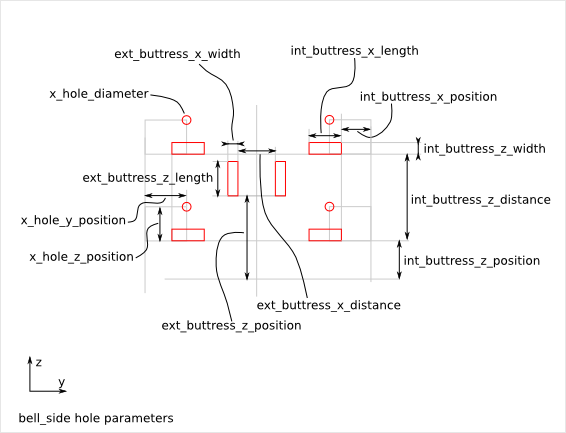
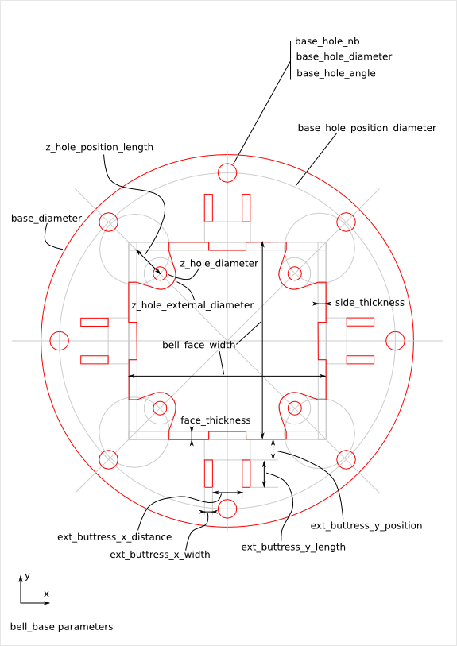
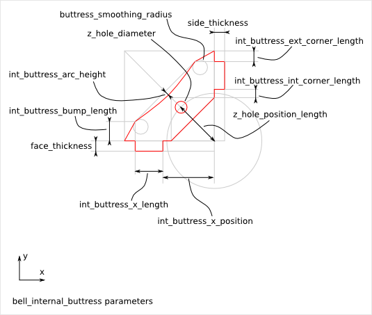
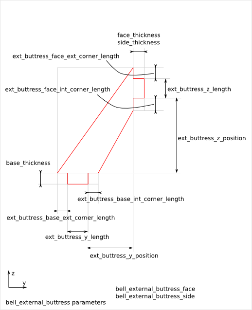

Bell Parameter Dependency
=========================

router_bit_radius
-----------------

The two parameters *leg_smooth_radius* and *cnc_router_bit_radius* are related to the *router_bit_radius*. The parameter *cnc_router_bit_radius* guarantees the smallest possible *router_bit_radius* value. So, we have the relations::

  cnc_router_bit_radius < leg_smooth_radius

