=========================
Box Wood Frame Conception
=========================

1. Design purpose
=================

The Box_Wood_Frame design is a solid and cost effective piece of furniture that can be piled up.

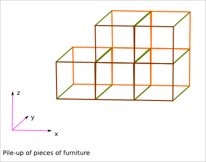

The pile-up feature is useful for:

- rearranging interior
- transporting the pieces of furniture
- moving accommodation
- And also, maybe, building straw house
- it lets make big pieces of furniture out of small pieces of material
- the conception is also cut in several small problematics
- the big pieces of furniture can be easily dismount, transport and remount

The frame is made out of solid wood planks. The faces can then be closed with light plywood.

A module corresponds to one or several box of the grid.
We focus on the concatenation of box along the x axis.
N is the number of concatenated box (along the x axis).

2. Construction method
======================

The planks are fixed by crenel and glue.

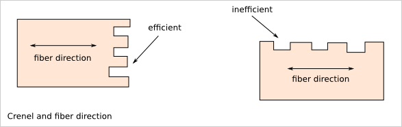

3. Design proposal
==================

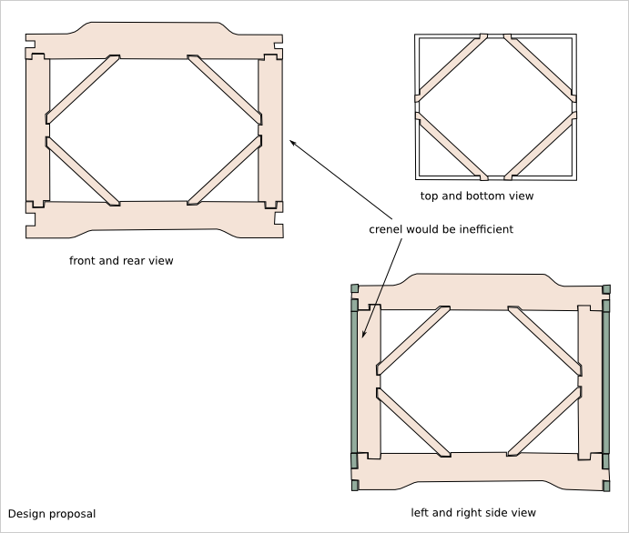

Wood frame plank list:

- horizontal plank: 20x60
- vertical plank: 20x30
- diagonal: 10x30 (thiner to give space for the face plywood)

4. Box wood frame parameters
============================

A module is defined by:

- The box dimension (w*d*h): 300*300*300
- The number of aggregated box: N*1*1

N is the length of the module. It is a number of boxes.   

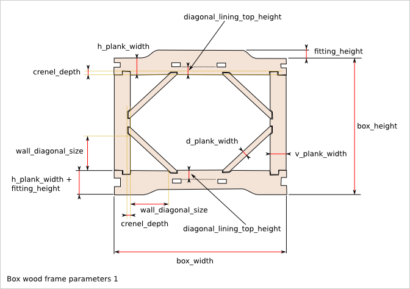

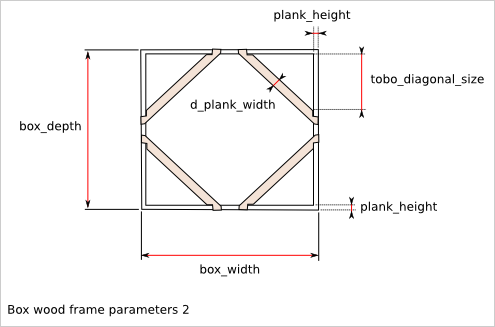

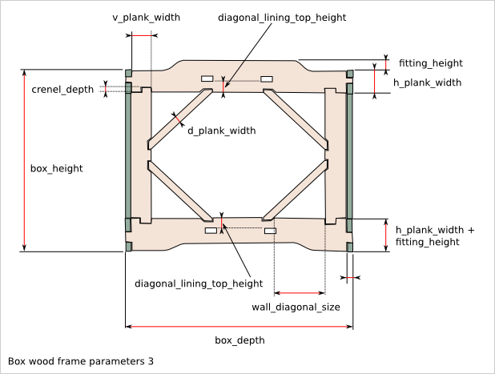

5. Plank outline description
============================

Q is the number of required planks to build one module. It can depends on N, the length of the module.

5.1. plank01_xz_bottom
----------------------
Q = 2

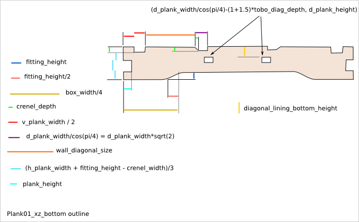

5.2. plank02_xz_top
-------------------
Q = 2

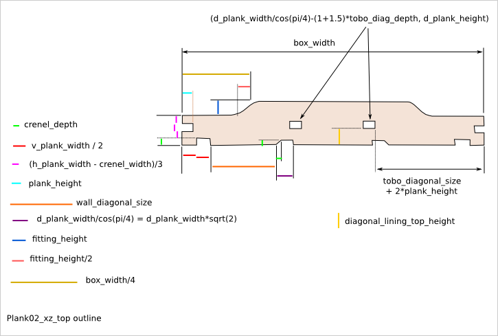

5.3. plank03_yz_bottom
----------------------
Q = 2

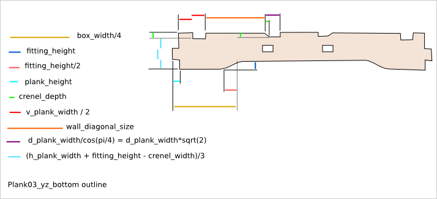

5.4. plank04_yz_top
-------------------
Q = 2

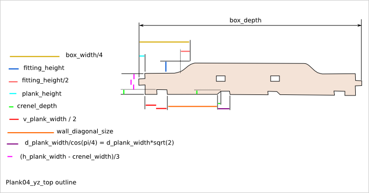

5.5. plank05_z_side
-------------------
Q = 2*(3+N)

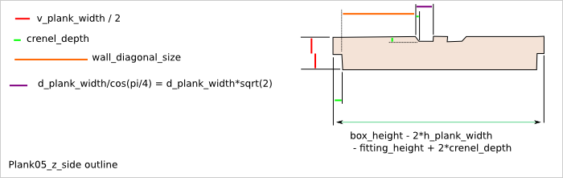

5.6. plank06_zx_middle
----------------------
Q = 2*(N-1)

.. image:: images/plank06_zx_middle_outline.png

5.7. plank07_wall_diagonal
--------------------------
Q = 4*(1+3*N)

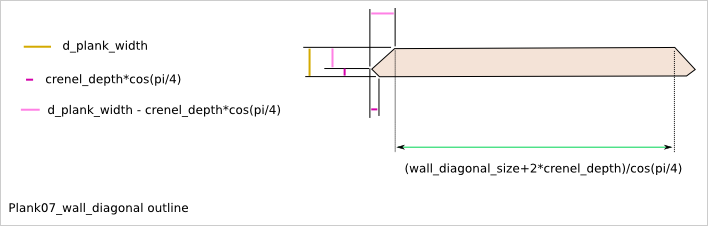

5.8. plank08_tobo_diagonal
--------------------------
Q = 8*N

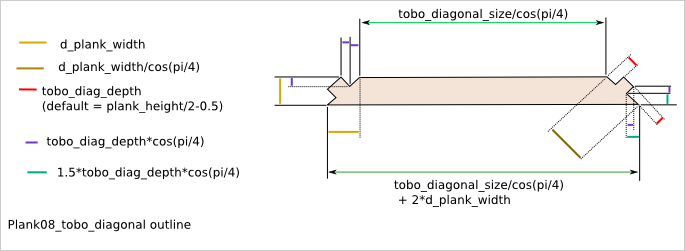

5.9. hole_cover
---------------
Q = 8*(N+1)

The plank09_hole_cover has an aesthetic functionality.

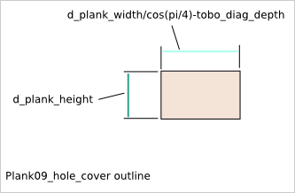

6. Diagonal plank reorientation
===============================

The planks are positioned in the cuboid assembly with the place_plank() function. To position the diagonal planks with this function, the diagonal planks must first be rotated of 45 degrees and affected with virtual length and width corresponding to the assimilated straight plank.

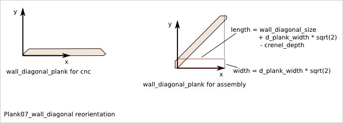
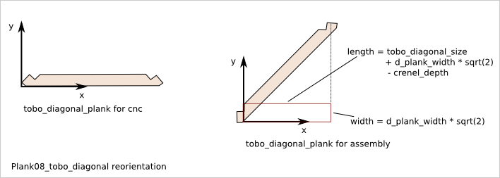

7. Slab outline description
===========================

7.1. slab51_tobo_single
-----------------------
Q = 2 if (N==1) else 0

.. image:: images/slab51_tobo_outline.png
.. .. image:: images/slab51_tobo_single_outline.png

7.2. slab52_tobo_side
---------------------
Q = 4 if (N>1) else 0

Same outline as slab51_tobo_single except that the length is::

  box_width - 1.5*plank_height

.. .. image:: images/slab52_tobo_side_outline.png

7.3. slab53_tobo_middle
-----------------------
Q = 2*(N-2) if (N>2) else 0

Same outline as slab51_tobo_single except that the length is::

  box_width - 1.0*plank_height

.. .. image:: images/slab53_tobo_middle_outline.png

7.4. slab54_side_left_right
---------------------------
Q = 2

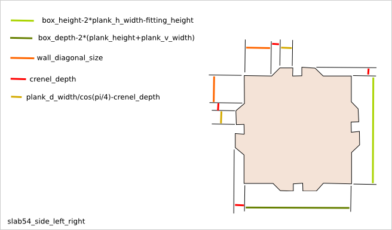

7.5. slab55_side_rear_single
----------------------------
Q = 1 if (N==1) else 0

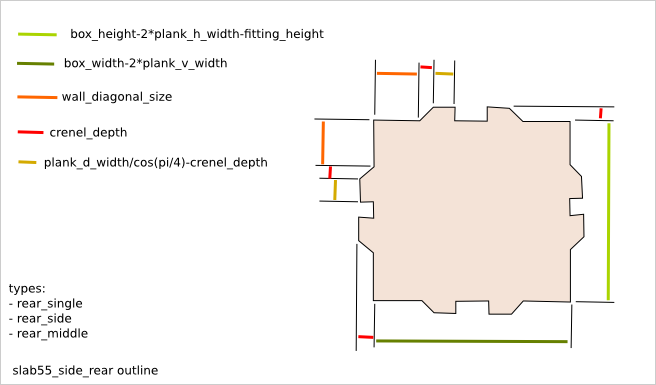
.. .. image:: images/slab55_side_rear_single_outline.png

7.6. slab56_side_rear_side
--------------------------
Q = 2 if (N>1) else 0

Same outline as slab55_side_rear_single except that the length is::

  box_width - 1.5*plank_v_width

.. .. image:: images/slab56_side_rear_side_outline.png

7.7. slab57_side_rear_middle
----------------------------
Q = N-2 if (N>2) else 0

Same outline as slab55_side_rear_single except that the length is::

  box_width - 1.0*plank_v_width

.. .. image:: images/slab57_side_rear_middle_outline.png

7.8. slab58_front
-----------------
Q = 4*N

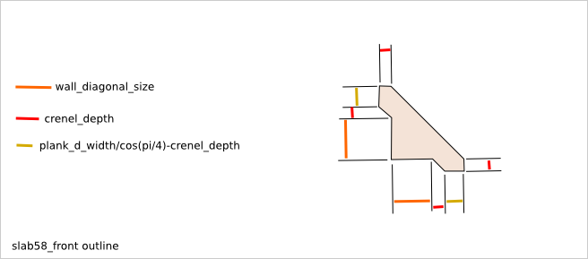

