=====================
Box Wood Frame Design
=====================

Box wood frame presentation
===========================

*Box wood frame* is the name of this piece of furniture:

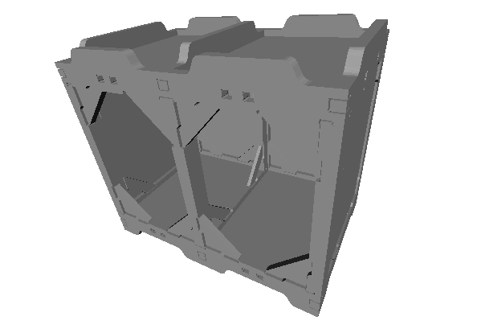
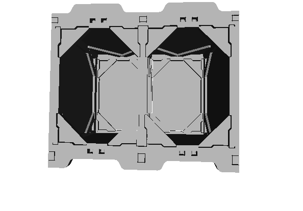

Its main characteristic is its top and bottom fittings that lets pile-up a *Box wood frame* over an other:

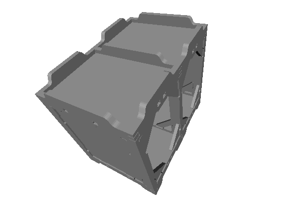
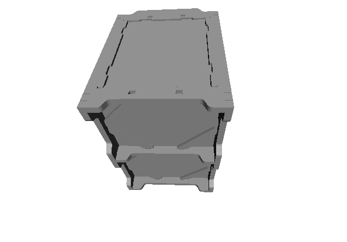

This *pile-up* functionality has several goals:

- split the manufacturing of large wardrobe into several small modules
- make easier the move of furniture
- be part of the structure of *straw houses*.

The *Box wood frame* design uses complex and precise recessed fittings to assemble the planks. So the cuts of the planks must be done with a CNC_ or with a manual `wood router`_ and templates. Then the planks can be glued together.

Box wood frame creation
=======================

After installing FreeCAD_ and the Python package Cnc25D_ as described at the paragraph :ref:`cnc25d_installation`, run the executable *cnc25d_example_generator.py* in the directory where you want to create the *Box wood frame*::

  > cd /directory/where/I/want/to/create/a/box/wood/frame/
  > cnc25d_example_generator.py # answer 'y' or 'yes' when it asks you to generate the example  box_wood_frame_example.py
  > python box_wood_frame_example.py

After several minutes of computation, you get plenty of DXF_ and STL_ files that let you manufacture a *Box wood frame*. Read the *text_report.txt* file to get further information on your generated *Box wood frame* and on the descriptions of the other generated files. Use LibreCAD_ to view the DXF_ files. Use MeshLAB_ to view the STL_ files::

  > librecad bwf37_assembly_with_amplified_cut.dxf
  > meshlab     # import bwf36_assembly_with_amplified_cut.stl
  > less bwf49_text_report.txt

Your *Box wood frame* has been generated with the default parameters. You may want to changes these parameter values to adapt them to your need. Edit the file *box_wood_frame_example.py*, change some parameters values, save your changes and run again::

  > python box_wood_frame_example.py

Now you get the *Box wood frame* design files according to your parameters.

Box wood frame parameters
=========================

bwf_box_width
-------------
bwf_box_width default value : 400.0

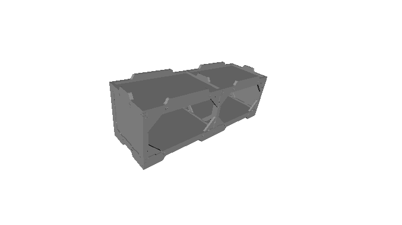

bwf_box_depth
-------------
bwf_box_depth default value : 400.0

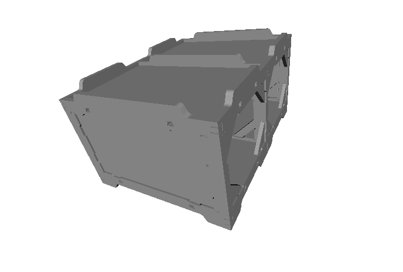

**recommendation:** Keep bwf_box_depth = bwf_box_width to get more pile up possibilities.

bwf_box_height
--------------
bwf_box_height default value : 400.0

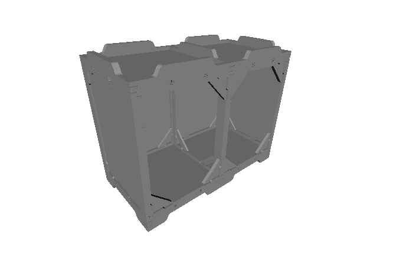

bwf_fitting_height
------------------
bwf_fitting_height default value : 30.0

.. image:: images/bwf_parameter_fitting_height.png

bwf_h_plank_width
-----------------
bwf_h_plank_width default value : 50.0

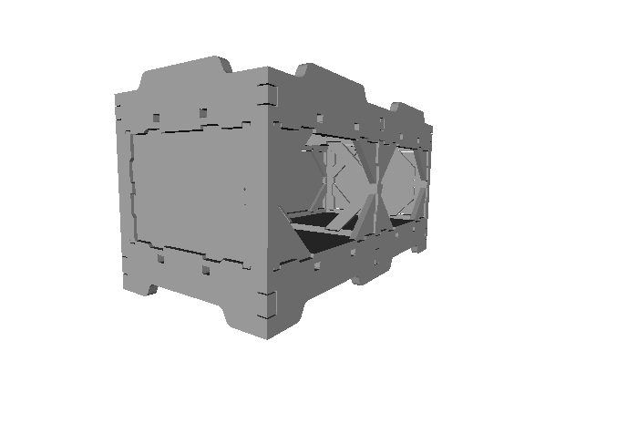

bwf_v_plank_width
-----------------
bwf_v_plank_width default value : 30.0

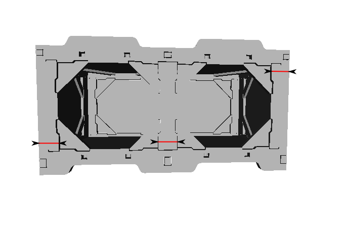

bwf_plank_height
----------------
bwf_plank_height default value : 20.0

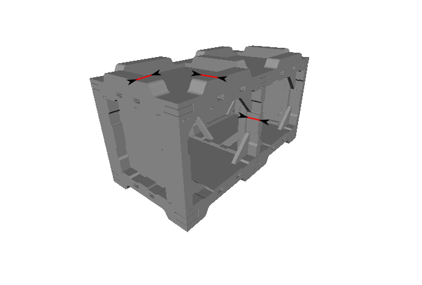

bwf_d_plank_width
-----------------
bwf_d_plank_width default value : 30.0

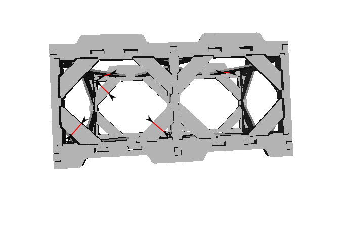

bwf_d_plank_height
------------------
bwf_d_plank_height default value : 10.0

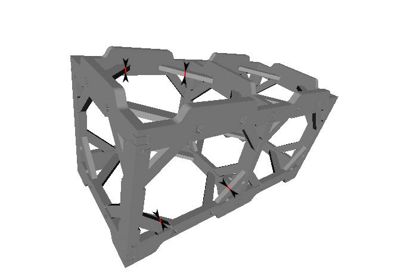

bwf_crenel_depth
----------------
bwf_crenel_depth default value : 5.0

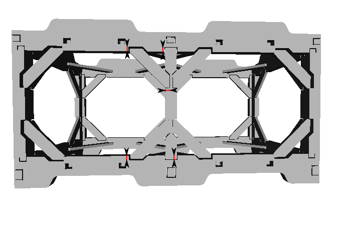

bwf_wall_diagonal_size
----------------------
bwf_wall_diagonal_size default value : 50.0

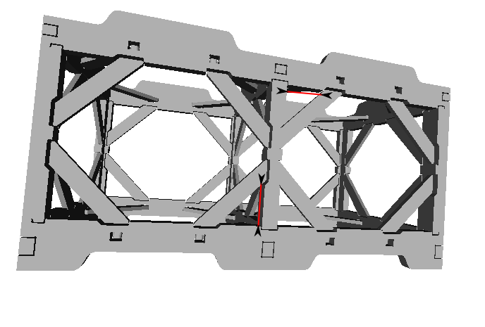

bwf_tobo_diagonal_size
----------------------
bwf_tobo_diagonal_size default value : 100.0

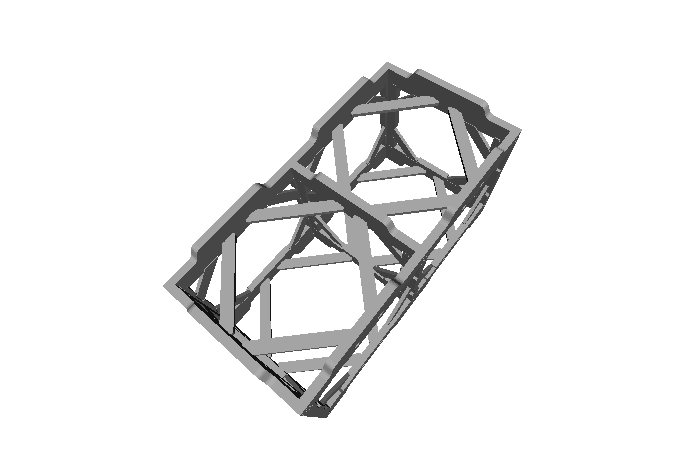

bwf_diagonal_lining_top_height
------------------------------
bwf_diagonal_lining_top_height default value : 20.0

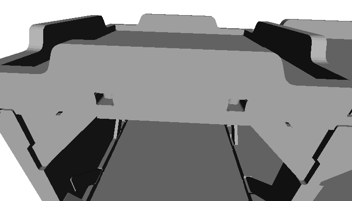

bwf_diagonal_lining_bottom_height
---------------------------------
bwf_diagonal_lining_bottom_height default value : 20.0

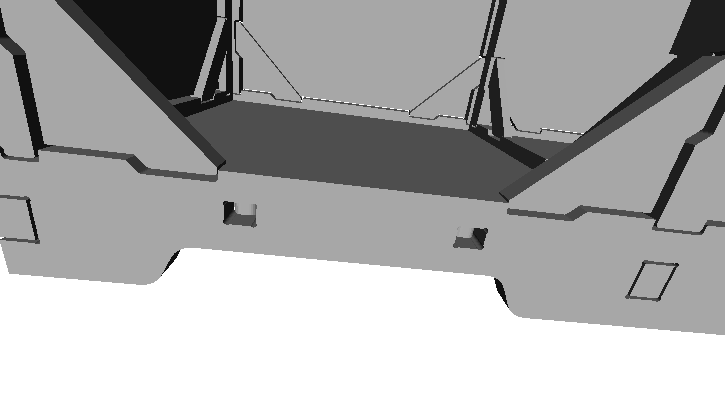

bwf_module_width
----------------
bwf_module_width default value : 1

bwf_module_width = 1

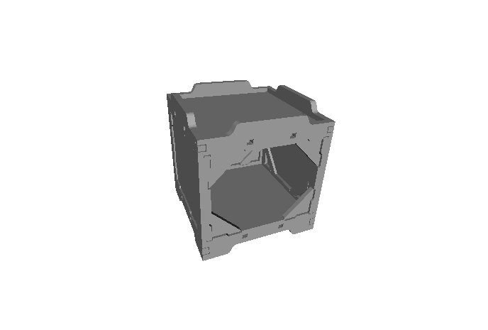

bwf_module_width = 2

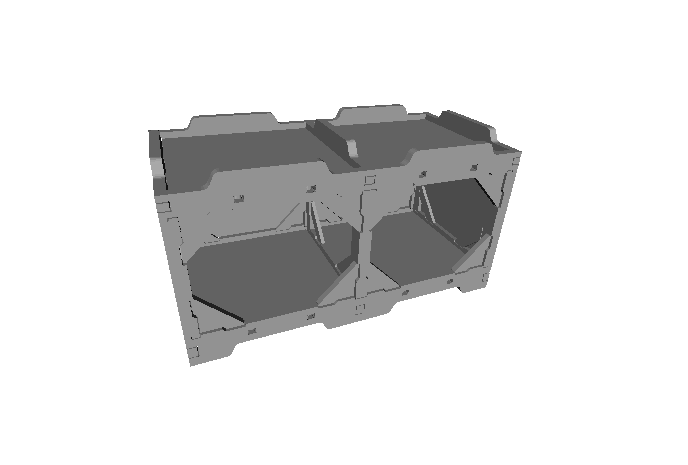

bwf_module_width = 3

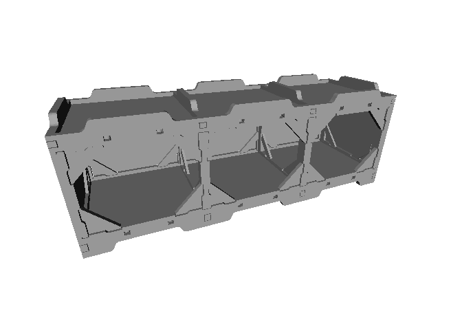

bwf_module_width = 5

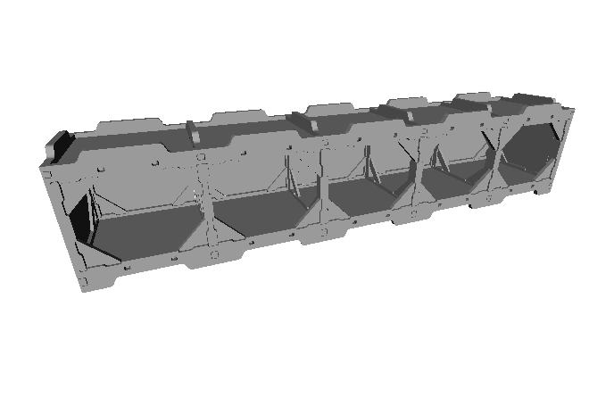

bwf_router_bit_radius
---------------------
bwf_router_bit_radius default value : 2.0

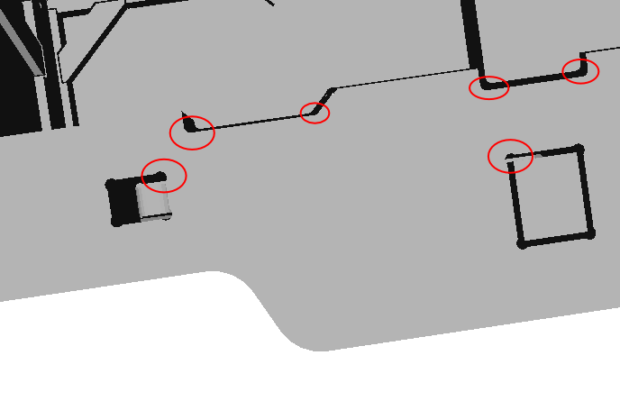

bwf_cutting_extra
-----------------
bwf_cutting_extra default value : 2.0

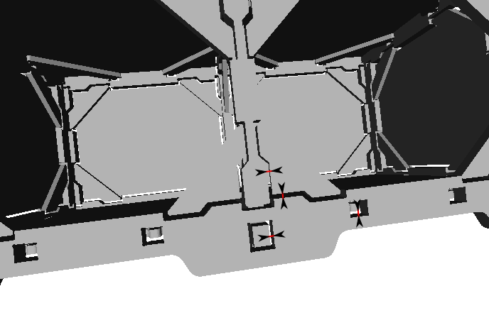

**Note:** The parameter *bwf_cutting_extra* doesn't affect the cnc cutting plan. It just help to see the junction between the plans.

bwf_slab_thickness
------------------
bwf_slab_thickness default value : 5.0

The slabs are the skin of your *box wood frame*. Set the slab thickness to the available plywood thickness of your supplier. Try to keep this relation::

  bwf_plank_height > bwf_d_plank_height + bwf_slab_thickness

bwf_output_file_basename
------------------------
bwf_output_file_basename default value : ""

Set the parameter *bwf_output_file_basename* to a not-empty string if you want to generate the output files. The *box_wood_frame_example.py* generates many files. These files can be generated in a directory or be identified by a common basename. The generated text file *text_report.txt* described all generated files.

Output file base name example::

  bwf_output_file_basename = "my_output_dir/" 
  bwf_output_file_basename = "my_output_dir/my_output_basename" 
  bwf_output_file_basename = "my_output_basename" 

Box wood frame conception
=========================

The notes relative to process of conception of the *Box wood frame* are available in the chapter :doc:`box_wood_frame_conception_details`.

Box wood frame manufacturing
============================
As you can see in the design files, the outline of the planks are quiet complex. Those many recessed fittings enable a solid assembly. To cut the planks precisely according to design files you have two methods:

- Use a 3-axis CNC_
- Use a manual `wood router`_ and templates for each type of planks.

Notice that you need a CNC to make the templates.

The CNC method is well adapted when you want just few pieces of *Box wood frame*. The planks are cut in large plywood slabs (long and wide). This increase the final price of a *Box wood frame* module.

After getting the templates fitting your *Box wood frame* parameters, you can use a manual route to duplicate the planks. As raw material you can use solid wood plank (long and narrow). This is cheaper and provide a stronger assembly.

.. _FreeCAD : http://www.freecadweb.org/
.. _Cnc25D : https://pypi.python.org/pypi/Cnc25D
.. _CNC : http://en.wikipedia.org/wiki/CNC_wood_router
.. _`wood router` : http://en.wikipedia.org/wiki/Wood_router

.. _DXF : http://en.wikipedia.org/wiki/AutoCAD_DXF
.. _STL : http://en.wikipedia.org/wiki/STL_%28file_format%29
.. _LibreCAD :  http://librecad.org
.. _MeshLab : http://meshlab.sourceforge.net/

