==========
Cnc25D API
==========

1. Cnc25D Workflow
==================

**FreeCAD** provides many GUI and API functions to sculpt and assemble 3D designs. **Cnc25D** proposes a script methodology and an API on top of the `FreeCAD API`_ to design 2.5D parts.

.. _`FreeCAD API` : http://free-cad.sourceforge.net/api/index.html

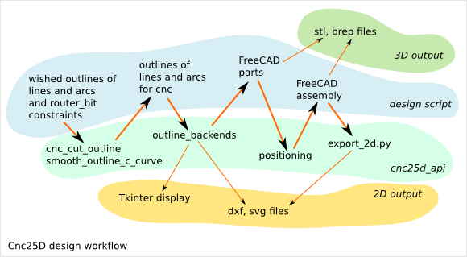
.. image:: images/cnc25d_workflow_data_evolution.png

The Cnc25D methodology
----------------------

1. Create a list of 2D points you want that your outline go through.
An outline is a list of lines and/or arcs. Other curve type must be generated by using multiple small lines.

2. Enlarge or Smooth the corners of the outline to do it makeable by a 3-axis CNC.
The cnc25d_api.cnc_cut_outline() function do it for you.
It returns a new list of 2D points defining the new lines and arcs of the new outline.

3. Exploit the 2D outline.
This new outline can already be export as SVG or DXF.
It can also be displayed using Tkinter.
Finally, it can be converted intor FreeCAD Part outline to be extruded in 3D part.

4. Create your 3D assembly.
After creating the 3D parts with the FreeCAD Part API, cnc25d_api.place_plank() provides a more natural way to place 3D parts in an assembly than the standard rotate() and translate() methods.

5. Export your design.
Export a cut of a 3D parts with cnc25d_api.export_2d().
Get a 3D scanning of your assembly with cnc25d_api.export_xyz_to_dxf()

2. Cnc25D API functions and class
=================================

::

  cnc25d_api.importing_freecad()
  cnc25d_api.outline_shift_x(outline_AB, x-offset, x-coefficient)
  cnc25d_api.outline_shift_y(outline_AB, y-offset, y-coefficient)
  cnc25d_api.outline_shift_xy(outline_AB, x-offset, x-coefficient, y-offset, y-coefficient)
  cnc25d_api.outline_rotate(outline_AB, center-x, center-y, rotation_angle)
  cnc25d_api.outline_close(outline_AB)
  cnc25d_api.outline_reverse(outline_AB)
  cnc25d_api.cnc_cut_outline(outline_A, mark_string)
  cnc25d_api.smooth_outline_c_curve(outline_C, angle_precision, router_bit_request, mark_string)
  cnc25d_api.smooth_outline_b_curve(outline_B, angle_precision, router_bit_request, mark_string)
  cnc25d_api.outline_arc_line(outline_B, backend)
  cnc25d_api.outline_circle((center-x, center-y), radius, backend)
  cnc25d_api.Two_Canvas(Tkinter.Tk()) # object constructor
  cnc25d_api.place_plank(freecad_part_object, x-size, y-size, z-size, flip, orientation, x-position, y-position, z-position)
  cnc25d_api.export_to_dxf(freecad_part_object, direction_vector, depth, filename)
  cnc25d_api.export_xyz_to_dxf(freecad_part_object, x-size, y-size, z-size, x-depth-list, y-depth-list, z-depth-list, filename)

3. Cnc25D outline creation
==========================

3.1. Cnc25D outline
-------------------

Cnc25D helps you to work on outline before extruding it into 3D parts. *Cnc25D outlines* are defined in the XY-plan and consist of a series of lines and/or arcs. A *line* is defined by a start point and an end point. An *arc* is defined by a start point, a passing-through point and an end point.

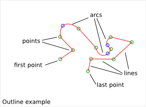

Manipulating Cnc25D outline consists of working on 2D points. This requires much less CPU resources as invoking a complete 3D software. If you want to create other types of curve than lines or arcs, you must approximate those curves with multiple small lines.

Cnc25D outline vocabulary:

- outline: a series of segments
- segment: a line or an arc
- start-point: the starting point of a line or an arc
- end-point: the ending point of a line or an arc
- middle-point: the passing-through point of an arc (it doesn't have to be in the middle of the arc)
- first-point: the start point of the first segment of an outline
- corner: the junction between two consecutive segments.
- corner-point: the end-point of the previous segment or the start-point of the next segment
- *rbrr* : the router_bit radius request (how to transform a corner to do it millable by a router_bit of radius R?)
- closed outline: *True* if the end-point of the last segment is equal to the first-point
- outline orientation: *Counter Clock Wise* (CCW) or *Clock Wise* (CW) (this has a meaning only for closed outline)
- curved outline: outline representing a curve. The outline approximates the curve with some discrete points.
- tangent inclination: angle between the (Ox) direction and the oriented tangent of a point of an oriented curve.
- outline format A: pythonic description of an outline used as argument by the function cnc25d_api.cnc_cut_outline()
- outline format B: pythonic description of an outline returned by cnc25d_api.cnc_cut_outline() and used as argument by cnc25d_api.outline_arc_line()
- outline format C: pythonic description of a curved-outline used as argument by the function cnc25d_api.smooth_outline_c_curve()

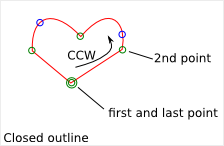

3.2. Cnc25D outline format A
----------------------------

In short, the *Cnc25D outline format A* is a list of list of 3 or 5 floats.

The purpose of the *Cnc25D outline format A* is to define your wished outline. In addition to the start, middle and end points of the segments, you define for each corner the associated *rbrr*. That means that you can request different router_bit radius for each corner. In general, you will set the same value for all corners of your outline. But you also have the flexibility to set different *rbrr* for each corner.

The first element of the *outline format A* list is the *first-point*. It is defines by a list of 3 floats: X-coordinate, Y-coordinate and the *rbrr* of the *first-point*.

The second element of the *outline format A* list is the first segment of the outline. If the first segment is a line, it is defines by a list of 3 floats: end-point-X, end-point-Y and the *rbrr* of the end-point of the segment. If the first segment is an arc, it is defines by a list of 5 floats: middle-point-X, middle-point-Y, end-point-X, end-point-Y and the *rbrr* of the end-point of the segment.

All elements of the *outline format A* list define a segment except the first element that defines the *first-point*. An outline composed of N segments is described by a list of N+1 elements. A segment is defined by 3 floats if it is a line or 5 floats if it is an arc. The start-point of a segment is never explicitly defined as it is the end-point of the previous segment. If the X and Y coordinates of the end-point of the last segment are equal to the X and Y coordinates of the first-point of the outline, the outline is closed.

*rbrr* (a.k.a *router_bit radius request*) defines how cnc25d_api.cnc_cut_outline() must modify a corner:

- if rbrr = 0, the corner is unchanged
- if rbrr > 0, the corner is smoothed to fit the router_bit radius *rbrr*
- if rbrr < 0, the corner is enlarged to fit the router_bit radius *abs(rbrr)*

*Good practice*: If the outline is closed, the *rbrr* of the last segment must be set to zero. If the outline is open (i.e. not closed), the *rbrr* of the *first-point* and the *rbrr* of the last segment must be set to zero.

The *outline format A* can be defined with *list* or *tuple*. The orientation of a closed outline can be CCW or CW.

outline format A example::

  outline_A = [
    [  0,  0, 10],            # first-point
    [ 50,  0, 15],            # horizontal line
    [ 43, 43,  0,  50, 20],   # arc
    [  0,  0,  0]]            # vertical line and close the outline

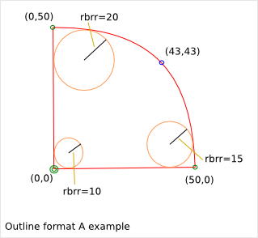

3.3. Cnc25D outline format B
----------------------------

In short, the *Cnc25D outline format B* is a list of list of 2 or 4 floats.

The purpose of the *Cnc25D outline format B* is to define an outline with points. This is a simplification of the *outline format A*, where the *rbrr* information is removed.

The first element of the *outline format B* list is the *first-point*. It is defines by a list of 2 floats: X-coordinate, Y-coordinate.

The second element of the *outline format B* list is the first segment of the outline. If the first segment is a line, it is defines by a list of 2 floats: end-point-X, end-point-Y. If the first segment is an arc, it is defines by a list of 4 floats: middle-point-X, middle-point-Y, end-point-X, end-point-Y.

All elements of the *outline format B* list define a segment except the first element that defines the *first-point*. An outline composed of N segments is described by a list of N+1 elements. A segment is defined by 2 floats if it is a line or 4 floats if it is an arc. The start-point of a segment is never explicitly defined as it is the end-point of the previous segment. If the X and Y coordinates of the end-point of the last segment are equal to the X and Y coordinates of the first-point of the outline, the outline is closed.

The *outline format B* can be defined with *list* or *tuple*. The orientation of a closed outline can be CCW or CW.

outline format B example::

  outline_B = [
    [  0,  0],            # first-point
    [ 50,  0],            # horizontal line
    [ 43, 43,  0,  50],   # arc
    [  0,  0]]            # vertical line and close the outline

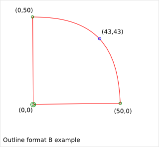

3.4. Cnc25D outline format C
----------------------------

In short, the *Cnc25D outline format C* is a list of list of 3 floats.

The purpose of the *Cnc25D outline format C* is to define a curved-outline with points and tangents. This is an extension of the *outline format B*, where the *tangent inclination* is added at each point. This format must be preferred to described a curved-outline.

Each element of the *outline format C* list is a curve sampling point. It is defines by a list of 3 floats: X-coordinate, Y-coordinate and the *tangent inclination angle*. The first element of the *outline format C* list is the *first-point*. The outline is oriented from the *first-point* to its last point. The *tangent inclination* is the angle (included in [-pi, pi]) between the (Ox) direction vector and the oriented curve tangent at the considered sampling point.

The *outline format C* can be defined with *list* or *tuple*.

outline format C example (the X,Y coordinates and the tangent inclination angle are rounded for a better readability)::

  outline_C = [
    [ 10,  0, math.pi/6],    # first-point
    [ 20,  5, math.pi/3],           
    [ 30, 15, math.pi/2],
    [ 40, 20, math.pi/4],
    [ 50, 22, math.pi/8]]

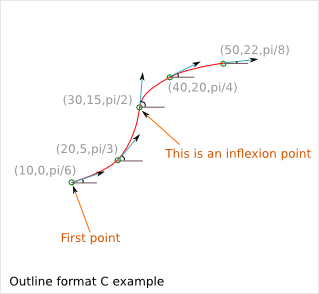

The *Cnc25D outline format C* is used as argument by the function *cnc25d_api.smooth_outline_c_curve()*.

If the curved-outline contains one or several inflexion points, it is recommended to chose those points as sampling points. Thus the function *cnc25d_api.smooth_outline_c_curve()* is able to smooth the entire curved-outline. Otherwise segments containing an inflexion point are leave as line by the function *cnc25d_api.smooth_outline_c_curve()*.

3.5. The function Cnc_cut_outline()
-----------------------------------

| ``cnc25d_api.`` **cnc_cut_outline(** *list, string* **)**
|   Return a *list*.

3.5.1. cnc_cut_outline purpose
^^^^^^^^^^^^^^^^^^^^^^^^^^^^^^
If you work with 3-axis CNC, your free XY-path gets actually some constraints due to the router_bit diameter. Real inner angle can not be manufacture and must be replaced either by a smoothed angle or an enlarged angle.

.. image:: images/inner_angle_for_3_axis_cnc.png

The *cnc_cut_outline* function aims at converting an outline defined by a list of points into an outline with lines and arcs makable by a 3-axis CNC. For each point, you choose if you want to enlarge the angle, smooth it or leave it sharp.

Look at the :doc:`cnc_cut_outline` chapter to get more information on when you should enlarge and when you should smooth a corner angle.

3.5.2. cnc_cut_outline usage
^^^^^^^^^^^^^^^^^^^^^^^^^^^^

The cnc_cut_outline() function provides three possibilites as corner transformation: smooth, unchange, enlarge.

.. image:: images/cnc_cut_outline_transformations.png

If *rbrr* (a.k.a. router_bit radius request) is positive, the angle is smoothed. If *rbrr* is negative, the angle is enlarged. If *rbrr* is zero, the angle is unmodified.

*Smoothing a corner* is a closed problem: there is only one arc of radius R (= *rbrr*) that is tangent to the two adjacent segments.

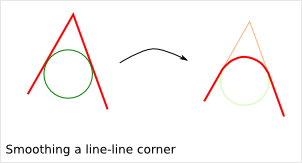
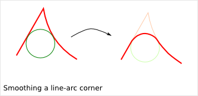
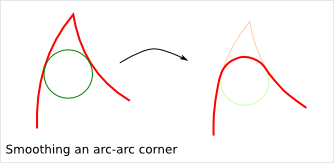

*Enlarging a corner* is an open problem: there are several arcs of radius R (= *rbrr*) that can clear the wished outline. *Cnc25D* chose the arc of radius R (= *rbrr*) of which the center is on the line defined by the corner-point and the center of the associated smoothed corner. If you want an other solution, you can modify slightly your wished outline (in format A) to influence the final result as shown in the next paragraph *alternative enlarged corner*.

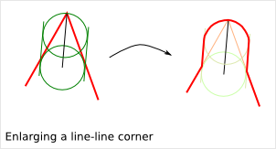
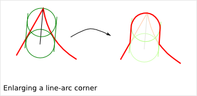
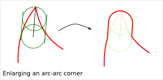

Notice that the interior of an closed outline is not influencing the process of smoothing or enlarging a corner. Only the local geometry (namely the two adjacent segments) influence this process.

The *cnc_cut_outline()* function needs as argument an outline of *format A* and returns an outline of *format B*. The *format B outline* can easily be converted into a FreeCAD Part Object, that can be after some conversions be extruded::

  my_outline_A = [
    [  0.0 ,  0.0,  0.0],   # this corner will be leaved sharp
    [ 20.0 ,  0.0,  5.0],   # this corner will be smoothed
    [  0.0 , 20.0, -5.0]]   # this corner will be enlarged
  my_outline_B = (cnc25d_api.cnc_cut_outline(my_outline_A, "demo_my_outline_A")
  my_part_face = Part.Face(Part.Wire(cnc25d_api.outline_arc_line(my_outline_B, 'freecad').Edges))
  my_part_solid = my_part_face.extrude(Base.Vector(0,0,20))

Look at the script *cnc25d_api_example.py* that you can generate with the executable *cnc25d_example_generator.py* for a more complete example.

If the requested *router_bit radius* is too large, the corner transformation may not be applied because of geometrical constraints. You get a *warning* or *error* message containing *string* set as argument. A good practice is to set *string* to the function name that calls *cnc_cut_outline()*. So you can find out which outline is not compatible with the requested *router_bit radius* in case of error. Below an example of warning message due to a too large *router_bit radius*. Thanks to the *string*, we know that the outline issue is located in the *plank_z_side* function::

  WARN301: Warning, corner plank_z_side.1 can not be smoothed or enlarged because edges are too short! 

3.5.3. Alternative enlarged corner
^^^^^^^^^^^^^^^^^^^^^^^^^^^^^^^^^^

As the problematic of enlarging a corner doesn't have a unique solution, you may want an other *enlarging corner* than the default one proposed by *cnc_cut_outline()*. For example, you may want to enlarge a corner without milling one of the adjacent segment. By changing the input outline, you can achieve it:

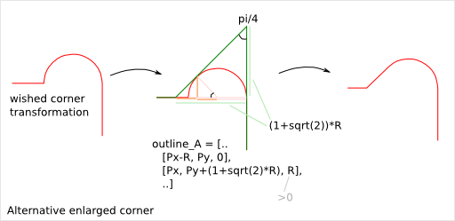

For comparison, the default result would be:

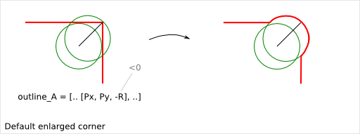

3.6. The function smooth_outline_c_curve()
------------------------------------------

| ``cnc25d_api.`` **smooth_outline_c_curve(** *list, float, float, string* **)**
|   Return a *list*.

It reads a *format C outline* and returns a *format B outline* with the following characteristics:

- the outline is made out of arcs
- the outline goes through the sampling points
- the outline tangent at the sampling points has the requested direction (a.k.a. tangent inclination)
- the outline tangent is continuous

With an input *format C outline* of (N+1) points (i.e. N segement), the function *smooth_outline_c_curve()* returns a *format B outline* of 2*N arcs. If a segment contains an inflexion point, the arcs are replace by a line. If input points are aligned or almost aligned, arcs are also replaces by lines.

If the input curve contains *inflexion* points, choose these points as sampling points. This way, the function *smooth_outline_c_curve()* can returns an approximated outline containing only arcs. In this case, the outline tangent is continuous along the full path.

To approximate a mathematical or free-hand curve, it is better to use arcs than lines because with arcs you can keep the property of continuous tangent. Most of the 3-axis CNC can handle arcs at the motor driving level. So this function helps you to integrate your curve into a high quality workflow.

*float* **ai_precision**: defines the minimal angle to consider that points are not aligned and arcs must be created. Typical value: pi/1000.

*flaot* **ai_router_bit_request**: defines the minimal *radius of curvature* of the returned outline. If a computed arc has a radius smaller than *ai_router_bit_request*, a warning message is printed without changing the returned outline. Set *ai_router_bit_request* to your *router_bit radius*. If you get warnings, create a more regular curve or choose a smaller router_bit.

*string* **ai_error_msg_id**: this string is added in the error message and helps you to track bugs.

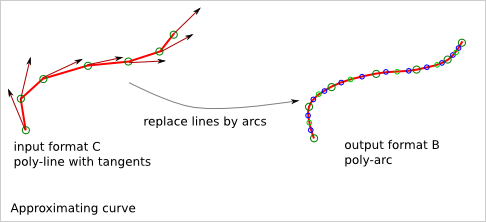

For more details on the implementation of *smooth_outline_c_curve()*, read the chapter :doc:`smooth_outline_curve`

3.7. The function smooth_outline_b_curve()
------------------------------------------

| ``cnc25d_api.`` **smooth_outline_b_curve(** *list, float, float, string* **)**
|   Return a *list*.

It reads a *format B outline* and returns a *format B outline* with the same characteristics as *smooth_outline_c_curve()*.

The function *smooth_outline_b_curve()* guests the curve tangent at each sampling point according to the previous and following sampling points and then computes the approximated outline with arcs using *smooth_outline_c_curve()*. The result is poorer than using *smooth_outline_c_curve()* because the curve tangents are approximated. Use this function only when you can not get the tangent inclinations at the sampling points.

3.8. Other outline help functions
---------------------------------

*Cnc25D outline format A* and *B* reduce the description of an outline to the 2D coordinates of points. That's a drastic reduction of the amount of Data and still keeping the description accurate. But for complex outlines, a large list of point coordinates might become unreadable. It is preferable, to split a large list into comprehensive smaller sub-paths and then concatenate them. Often patterns will be used several times for an outline with some slight modifications like position (of course), scale, mirror or rotation. This is the purpose of the *outline help functions*.

The *outline help functions* accept as argument the *Cnc25D outline format A* and the *Cnc25D outline format B* and return the outline with the same format::

  cnc25d_api.outline_shift_x(outline_AB, x-offset, x-coefficient)
  cnc25d_api.outline_shift_y(outline_AB, y-offset, y-coefficient)
  cnc25d_api.outline_shift_xy(outline_AB, x-offset, x-coefficient, y-offset, y-coefficient)
  cnc25d_api.outline_rotate(outline_AB, center-x, center-y, rotation_angle)
  cnc25d_api.outline_close(outline_AB)
  cnc25d_api.outline_reverse(outline_AB)

3.8.1. outline_shift
^^^^^^^^^^^^^^^^^^^^

| ``cnc25d_api.`` **outline_shift_x(** *list, x-offset, x-factor* **)**
| ``cnc25d_api.`` **outline_shift_y(** *list, y-offset, y-factor* **)**
| ``cnc25d_api.`` **outline_shift_xy(** *list, x-offset, x-factor, y-offset, y-factor* **)**
|   Return a list that defines a sub-sequence of outline.

The definition an outline can be quiet long and tedious. It might be useful to split a long list of points into several small sequences and concatenate them into one big list using the *.append()* and *.extend()* methods. Often it happens that sub-sequence patterns appear several times in one outline either shifted or mirrored. The functions *outline_shift_x*, *outline_shift_y* and outline_shift_xy can be use to help the reuse of outline sub sequences. Let's look at the following example.

.. image:: images/outline_with_repeated_sub_sequences.png

If we want to define this outline brutally, we must create a list of 28 points. But we can also define first the blue and the green sub-sequences, which are each 3 points and create the complete outline out of them::

  # We follow the points in the counter clock wise (CCW)
  green_sequence = [
    [ 10,  0, 0],
    [ 20, 10, 0],
    [ 20,  0, 0]]
  blue_sequence = [
    [  0, 25, 0],
    [ 10, 25, 0],
    [  0, 20, 0]]
  width = 100
  height = 80
  my_outline = []
  my_outline.append([0, 0, 0])
  my_outline.extend(blue_sequence)
  my_outline.extend(outline_shift_x(blue_sequence, width, -1))
  my_outline.append([width, 0, 0])
  my_outline.extend(outline_shift_x(green_sequence, width, -1))
  my_outline.extend(outline_shift_xy(green_sequence, width, -1, height, -1))
  my_outline.append([width, height, 0])
  my_outline.extend(outline_shift_xy(blue_sequence, width, -1, height, -1))
  my_outline.extend(outline_shift_y(blue_sequence, height, -1))
  my_outline.append([0, height, 0])
  my_outline.extend(outline_shift_y(green_sequence, height, -1))
  my_outline.extend(green_sequence)

This code is easier to maintain.

3.8.2. outline_rotate
^^^^^^^^^^^^^^^^^^^^^

::

  cnc25d_api.outline_rotate(outline_AB, center-x, center-y, rotation_angle)
  return outline_AB

It applies a rotation of center (x,y) and angle *rotation_angle* to each points of the input outline.

3.8.3. outline_close
^^^^^^^^^^^^^^^^^^^^

::

  cnc25d_api.outline_close(outline_AB)
  return outline_AB

If the input outline is open, it closes it with a straight line (from the end-point of the last segment to the first-point).

3.8.4. outline_reverse
^^^^^^^^^^^^^^^^^^^^^^

::

  cnc25d_api.outline_reverse(outline_AB)
  return outline_AB

It reverses the order of the segments. If the outline is closed, that reverses its orientation (from CCW to CW or opposite). Notice that the *.reverse()* python method would not return a valid outline (format A or B) because of the *first-point* and the *middle-point* of arcs.

4. Cnc25D outline utilization
=============================

After getting a *Cnc25D format B outline* from the cnc_cut_outline() function, you probably want to use this outline in CAD_ tools. The function *cnc25d_api.outline_arc_line()* lets you transform the *Cnc25D format B outline* into one of this four formats: *freecad*, *svgwrite*, *dxfwrite*, *tkinter*.

.. _CAD : https://en.wikipedia.org/wiki/Comparison_of_CAD_editors_for_AEC

::

  cnc25d_api.outline_arc_line(outline_B, backend)
  cnc25d_api.outline_circle((center-x, center-y), radius, backend)

  with backend=['freecad', 'svgwrite', 'dxfwrite', 'tkinter']

4.1. freecad
------------

*outline_arc_line(outline_B, 'freecad')* returns *FreeCAD Part.Shape* object that can be used easily in the classic *FreeCAD* workflow::

  my_part_shape = cnc25d_api.outline_arc_line(my_outline_B, 'freecad')
  my_part_face = Part.Face(Part.Wire(my_part_shape.Edges))
  my_part_solid = my_part_face.extrude(Base.Vector(0,0,20))

Notice that *FreeCAD* conserve the *arc* geometrical entity during its complete workflow. So after extruding the outline, slicing the part and then projecting it again in a DXF file, you still get the *arcs* you have designed in your original outline.

The combination *outline_arc_line(cnc_cut_outline(), 'freecad')* is often used. So the *Cnc25D API* proposes this combination with the function *cnc25d_api.cnc_cut_outline_fc()*.

With this methodolgy you can create and extrude any outline made out of lines and arcs. But creating a *circle* outline is not directly possible. You need to create two consecutive arcs, which is not very convenient. If you want to create a circle (to extrude it into a cylinder), you can use the function *cnc25d_api.outline_circle((center-x, center-y), radius, 'freecad')*.

4.2. svgwrite
-------------

A *Cnc25D format B outline* is a 2D vectorial shape that can be transposed in a SVG_ file. *SVG file* is one of the usual input format for the 3-axis CNC tool chain. This snippet let you dump the *Cnc25D format B outline* in a *SVG* file::

  import svgwrite
  my_outline_B = [ .. ]
  object_svg = svgwrite.Drawing(filename = "my_ouline.svg")
  svg_outline = cnc25d_api.outline_arc_line(my_outline_B, 'svgwrite')
  for one_line_or_arc in svg_outline:
    object_svg.add(one_line_or_arc)
  #one_svg_circle = cnc25d_api.outline_circle((100,100), 40, 'svgwrite') # create a circle
  #object_svg.add(one_svg_circle)
  object_svg.save()

*Cnc25D* relies on the *Python package* svgwrite_ from **mozman**. Use Inkscape_ to review the generated *SVG* file.

.. _svgwrite : http://pythonhosted.org/svgwrite/
.. _Inkscape : http://inkscape.org/

**Warning:** The SVG_ format supports the *arc* graphical object but the Python package svgwrite_ has not implemented yet the *arc* constructor. So *Cnc25D* transform each *arc* of the outline into a series of small segments. This might be an issue for certain *CNC tool chain* or for some designs.

4.3. dxfwrite
-------------

A *Cnc25D format B outline* is a 2D vectorial shape that can be transposed in a DXF_ file::

  import dxfwrite
  my_outline_B = [ .. ]
  object_dxf = DXFEngine.drawing("my_outline.dxf")
  #object_dxf.add_layer("my_dxf_layer")
  dxf_outline = cnc25d_api.outline_arc_line(my_outline_B, 'dxfwrite')
  for one_line_or_arc in dxf_outline:
    object_dxf.add(one_line_or_arc)
  #one_dxf_circle = cnc25d_api.outline_circle((100,100), 40, 'dxfwrite') # create a circle
  #object_dxf.add(one_dxf_circle)
  object_dxf.save()

*Cnc25D* relies on the *Python package* dxfwrite_ from **mozman**. Use LibreCAD_ to review the generated *DXF* file.

.. _dxfwrite : http://pythonhosted.org/svgwrite/
.. _LibreCAD : http://librecad.org

**Warning:** Like previously, the DXF_ format supports the *arc* graphical object but the Python package dxfwrite_ has not implemented yet the *arc* constructor. So *Cnc25D* transform each *arc* of the outline into a series of small segments. This might be an issue for certain *CNC tool chain* or for some designs.

4.4. tkinter
------------

During the early phase of the design, you just need to view the outline (that still might be under-construction) without using the powerful *FreeCAD* or dumping files. This is the purpose of the *Tkinter GUI*. Check the design example *cnc25d_api_example.py* generated by the binary *cnc25d_example_generator.py* or check the file *cnc25d/tests/cnc25d_api_macro.py* to see how to implement this small *graphic user interface*.

5. Working with FreeCAD
=======================

5.1. import FreeCAD
-------------------

| ``cnc25d_api.`` **importing_freecad()**
|   Modify the global variable *sys.path*.

FreeCAD comes with Python modules. But these FreeCAD modules are not installed in one of the standard directories. You will find the Python FreeCAD modules in a directory such as */usr/lib/freecad/lib*. To use FreeCAD from a Python script, you need either to set the PYTHONPATH system environment variable or to extend the sys.path Python variable.

Because you need to import FreeCAD at each beginning of scripts, this task as been implemented in the module *cnc25d_api.py* that is installed in a standard location. So, after installing Cnc25D, to use the FreeCAD modules, you only need to add those lines at the beginning of your Python script::
  
  from cnc25d import cnc25d_api
  cnc25d_api.importing_freecad()

The function *importing_freecad()* looks for the FreeCAD modules using a location list. If the function *importing_freecad()* doesn't manage to find FreeCAD on your system, you may need to edit the module *importing_freecad.py* and add the path to the FreeCAD modules to the *FREECADPATH* list.

5.2. place_plank()
------------------

| ``cnc25d_api.`` **place_plank(** *FreeCAD.Part.Object, x-size, y-size, z-size, flip, orientation, x-position, y-position, z-posistion* **)**
|   Return a *FreeCAD.Part.Object*

FreeCAD provides the usual *rotate* and *translate* methods to place an object in a construction-assembly. Even if those methods are mathematically straight forward, they might require many *tries and errors* to find out the correct rotation to apply to an object to place it correctly in an assembly. The *place_plank()* function provides an alternative to the *rotate* method when you want to place a object in a cuboid assembly.

To help positioning object we have the following conventions:

- The largest size of an object defines the *main axis* of the object.
- The second largest size of an object defines the *second axis* of the object.
- During the object construction, we choose the X axis as *main axis* and the Y axis as *second axis*.

A cuboid assembly is a construction where most of the objects have their *main axis* parallel to the X, Y or Z-axis.
To place an object, construed with the above conventions, in a cuboid assembly, you can define the rotation of the object with two natural parameters:

- the orientation of the *main and second axis*. There are just six possibilities: 'xy', 'xz', 'yx', 'yz', 'zx' and 'zy'. For example, 'yx' means that the *main axis* of the object is parallel to the Y-axis of the reference frame and the *second axis* of the object is parallel to the X-axis.
- the flip of the object. After defining the orientation of the *main axis* and *second axis*, there are still four possibilities called *flip*: 'identity', 'x-flip', 'y-flip' and 'z-flip'.

The *place_plank()* function uses this approach to place a object in an cuboid assembly. To realize flip and orientation, the *place_plank()* function needs to know the sizes along X, Y and Z of the object. Those sizes are virtual and you can play with them for your convenience.

.. image:: images/object_definition_and_flip.png

A physical object can be defined in several ways respecting our *main and second axis* conventions. The choice of the definition influences the behavior of the *flip*. Knowing that, choose the most convenient definitions for your design.

Look at the :doc:`place_plank` chapter to get more explaination on rotation, orientation and flip transformations.

5.3. Drawing export
-------------------

**FreeCAD** provides very efficient methods for 3D export such as *.exportBrep()*, *.exportStep()* or *.exportStl()*. It also provides full customizable 2D export methods such as *.slice()* and *projectToDXF()*. **Cnc25D** provides simple functions that covers the most standard usage of the 2D export.

5.3.1. Cut export as DXF
^^^^^^^^^^^^^^^^^^^^^^^^

| ``export_2d.`` **export_to_dxf(** *FreeCAD.Part.Object, FreeCAD.Base.Vector, depth, path* **)**
|   Write the DXF_ file *path*.

The *export_to_dxf()* function performs two successive operations:

- It cuts a slice of the *FreeCAD.Part.Object* according to the direction *FreeCAD.Base.Vector* and the *depth*.
- It writes the DXF_ file *path* containing the projection of the slice.

If you are designing a 2.5D part, this function is useful to get the DXF_ file that will be used by the CNC workflow.

Usage example::

  export_2d.export_to_dxf(my_part_solid, Base.Vector(0,0,1), 1.0, "my_part.dxf")

5.3.2. Cut export as SVG
^^^^^^^^^^^^^^^^^^^^^^^^

| ``export_2d.`` **export_to_svg(** *FreeCAD.Part.Object, FreeCAD.Base.Vector, depth, path* **)**
|   Write the SVG_ file *path*.

The *export_to_svg()* function performs the same operations as *export_to_dxf()* except it write a SVG_ file.

Usage example::

  export_2d.export_to_svg(my_part_solid, Base.Vector(0,0,1), 1.0, "my_part.svg")

**Warning:** The function *export_to_svg()* only works when it is used in a script run from the FreeCAD GUI. This is because of a current limitation of the FreeCAD library function *Drawing.projectToSVG()*.

5.3.3. XYZ scanning
^^^^^^^^^^^^^^^^^^^

| ``export_2d.`` **export_xyz_to_dxf(** *FreeCAD.Part.Object, x-size, y-size, z-size, x-list, y-list, z-list, path* **)**
|   Write the DXF_ file *path*.

The *export_xyz_to_dxf()* function cuts in many slices the *FreeCAD.Part.Object* according to the three directions of the reference frame axis X, Y and Z. The depth of the slices are provided by the three argument lists *x-list*, *y-list* and *z-list*. All the slices are placed in the plan XY and are written in the DXF_ file *path*.

The result looks like a medical scan. This is a more comfortable and readable document than the CAD tradition 3 views projections. This helps to show up weaknesses of designs if you choose good slices.

.. image:: images/export_xyz_to_dxf.png

Usage example::

  xy_slice_list = [ 0.1+20*i for i in range(12) ]
  xz_slice_list = [ 0.1+20*i for i in range(9) ]
  yz_slice_list = [ 0.1+20*i for i in range(9) ]
  export_2d.export_xyz_to_dxf(my_assembly, 180.0, 180.0, 240.0, xy_slice_list, xz_slice_list, yz_slice_list, "my_assembly.dxf")

.. _DXF : http://en.wikipedia.org/wiki/AutoCAD_DXF
.. _SVG : http://www.w3.org/Graphics/SVG/

