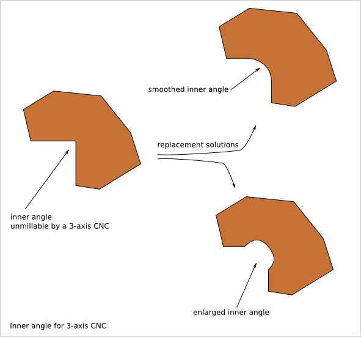
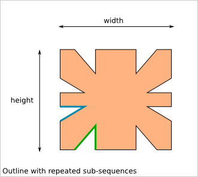
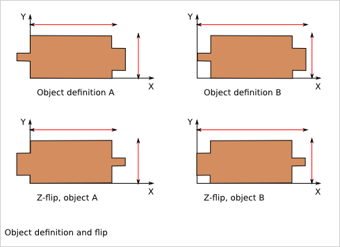
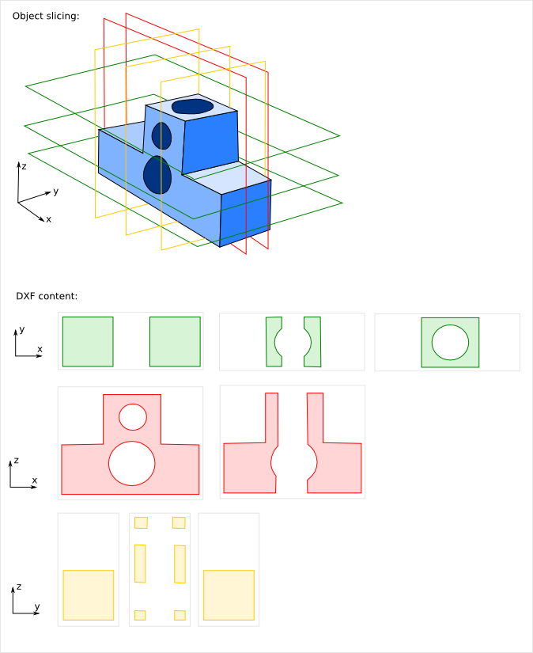

==========
Cnc25D API
==========

1. import FreeCAD
=================

| ``importing_freecad.`` **importing_freecad()**
|   Modify the global variable *sys.path*.

FreeCAD comes with Python modules. But these FreeCAD modules are not installed in one of the standard directories. You will find the Python FreeCAD modules in a directory such as */usr/lib/freecad/lib*. To use FreeCAD from a Python script, you need either to set the PYTHONPATH system environment variable or to extend the sys.path Python variable.

Because you need to import FreeCAD at each beginning of scripts, this task as been implemented in the module *importing_freecad.py* that is installed in a standard location. So, after installing Cnc25D, to use the FreeCAD modules, you only need to add those lines at the beginning of your Python script::
  
  from cnc25d import importing_freecad
  importing_freecad.importing_freecad()

The function *importing_freecad()* looks for the FreeCAD modules using a location list. If the function *importing_freecad()* doesn't manage to find FreeCAD on your system, you may need to edit the module *importing_freecad.py* and add the path to the FreeCAD modules to the *FREECADPATH* list.

2. cnc_cut_outline
==================

| ``cnc_cut_outline.`` **cnc_cut_outline(** *list* **)**
|   Return a *FreeCAD.Part.Shape*.

2.1. cnc_cut_outline purpose
----------------------------
If you work with 3-axis CNC, your free XY-path gets actually some constraints due to the reamer diameter. Real inner angle can not be manufacture and must be replaced either by a smoothed angle or an enlarged angle.

The *cnc_cut_outline* function aims at converting a polygon defined by a list of point into an outline with lines and circular arcs makable by a 3-axis CNC. For each point, you choose if you want to enlarge the angle, smooth it or leave it sharp.

Look at the :doc:`cnc_cut_outline` chapter to get more information on when you should enlarge and when you should smooth a polygon angle.

2.2. cnc_cut_outline usage
--------------------------

A point is defined by a list of three floats:

- the X coordinate
- the Y coordinate
- the reamer diameter.

If the reamer diameter is positive, the angle is smoothed. If the reamer diameter is negative, the angle is enlarged. If the reamer diameter is zero, the angle is unmodified.

A polygon is a list of points. The *cnc_cut_outline* function needs as argument a polygon and returns the outline as a FreeCAD Part Object, that can be after some conversion extruded::

  my_polygon = [
    [  0.0 ,  0.0,  0.0],   # this point will be sharp
    [ 20.0 ,  0.0,  5.0],   # this point will be smoothed
    [  0.0 , 20.0, -5.0]]   # this point will be enlarged
  my_part_face = Part.Face(Part.Wire(cnc_cut_outline.cnc_cut_outline(my_polygon).Edges))
  my_part_solid = my_part_face.extrude(Base.Vector(0,0,20))

Look at the script *cnc25d_api_example.py* that you can generate with the executable *cnc25d_example_generator.py* for a more complete example.

2.3. outline_shift
------------------

| ``cnc_cut_outline.`` **outline_shift_x(** *list, x-offset, x-factor* **)**
| ``cnc_cut_outline.`` **outline_shift_y(** *list, y-offset, y-factor* **)**
| ``cnc_cut_outline.`` **outline_shift_xy(** *list, x-offset, x-factor, y-offset, y-factor* **)**
|   Return a list that defines a sub-sequence of outline.

The definition a polygon can be quiet long and tedious. It might be useful to split a long list of points into several small sequences and concatenate them into one big list using the *.append()* and *.extend()* methods. Often it happens that sub-sequence patterns appear several times in one outline either shifted or mirrored. The functions *outline_shift_x*, *outline_shift_y* and outline_shift_xy can be use to help the reuse of outline sub sequences. Let's look at the following example.

If we want to define this outline brutally, we must create a list of 28 points. But we can also define first the blue and the green sub-sequences, which are each 3 points and create the complete outline out of them::

  # We follow the points in the counter clock wise (CCW)
  green_sequence = [
    [ 10,  0, 0],
    [ 20, 10, 0],
    [ 20,  0, 0]]
  blue_sequence = [
    [  0, 25, 0],
    [ 10, 25, 0],
    [  0, 20, 0]]
  width = 100
  height = 80
  my_outline = []
  my_outline.append([0, 0, 0])
  my_outline.extend(blue_sequence)
  my_outline.extend(outline_shift_x(blue_sequence, width, -1))
  my_outline.append([width, 0, 0])
  my_outline.extend(outline_shift_x(green_sequence, width, -1))
  my_outline.extend(outline_shift_xy(green_sequence, width, -1, height, -1))
  my_outline.append([width, height, 0])
  my_outline.extend(outline_shift_xy(blue_sequence, width, -1, height, -1))
  my_outline.extend(outline_shift_y(blue_sequence, height, -1))
  my_outline.append([0, height, 0])
  my_outline.extend(outline_shift_y(green_sequence, height, -1))
  my_outline.extend(green_sequence)

This code is easier to maintain.

3. place_plank
==============
| ``cnc_cut_outline.`` **place_plank(** *FreeCAD.Part.Object, x-size, y-size, z-size, flip, orientation, x-position, y-position, z-posistion* **)**
|   Return a *FreeCAD.Part.Object*

FreeCAD provides the usual *rotate* and *translate* methods to place an object in a construction-assembly. Even if those methods are mathematically straight forward, they might require many *tries and errors* to find out the correct rotation to apply to an object to place it correctly in an assembly. The *place_plank()* function provides an alternative to the *rotate* method when you want to place a object in a cuboid assembly.

To help positioning object we have the following conventions:

- The largest size of an object defines the *main axis* of the object.
- The second largest size of an object defines the *second axis* of the object.
- During the object construction, we choose the X axis as *main axis* and the Y axis as *second axis*.

A cuboid assembly is a construction where most of the objects have their *main axis* parallel to the X, Y or Z-axis.
To place an object, construed with the above conventions, in a cuboid assembly, you can define the rotation of the object with two natural parameters:

- the orientation of the *main and second axis*. There are just six possibilities: 'xy', 'xz', 'yx', 'yz', 'zx' and 'zy'. For example, 'yx' means that the *main axis* of the object is parallel to the Y-axis of the reference frame and the *second axis* of the object is parallel to the X-axis.
- the flip of the object. After defining the orientation of the *main axis* and *second axis*, there are still four possibilities called *flip*: 'identity', 'x-flip', 'y-flip' and 'z-flip'.

The *place_plank()* function uses this approach to place a object in an cuboid assembly. To realize flip and orientation, the *place_plank()* function needs to know the sizes along X, Y and Z of the object. Those sizes are virtual and you can play with them for your convenience.

A physical object can be defined in several ways respecting our *main and second axis* conventions. The choice of the definition influences the behavior of the *flip*. Knowing that, choose the most convenient definitions for your design.

Look at the :doc:`place_plank` chapter to get more explaination on rotation, orientation and flip transformations.

4. Drawing export
=================

4.1. Cut export as DXF
----------------------

| ``export_2d.`` **export_to_dxf(** *FreeCAD.Part.Object, FreeCAD.Base.Vector, depth, path* **)**
|   Write the DXF_ file *path*.

The *export_to_dxf()* function performs two successive operations:

- It cuts a slice of the *FreeCAD.Part.Object* according to the direction *FreeCAD.Base.Vector* and the *depth*.
- It writes the DXF_ file *path* containing the projection of the slice.

If you are designing a 2.5D part, this function is useful to get the DXF_ file that will be used by the CNC workflow.

Usage example::

  export_2d.export_to_dxf(my_part_solid, Base.Vector(0,0,1), 1.0, "my_part.dxf")

4.2. Cut export as SVG
----------------------

| ``export_2d.`` **export_to_svg(** *FreeCAD.Part.Object, FreeCAD.Base.Vector, depth, path* **)**
|   Write the SVG_ file *path*.

The *export_to_svg()* function performs the same operations as *export_to_dxf()* except it write a SVG_ file.

Usage example::

  export_2d.export_to_svg(my_part_solid, Base.Vector(0,0,1), 1.0, "my_part.svg")

**Warning:** The function *export_to_svg()* only works when it is used in a script run from the FreeCAD GUI. This is because of a current limitation of the FreeCAD library function *Drawing.projectToSVG()*.

4.3. XYZ scanning
-----------------

| ``export_2d.`` **export_xyz_to_dxf(** *FreeCAD.Part.Object, x-size, y-size, z-size, x-list, y-list, z-list, path* **)**
|   Write the DXF_ file *path*.

The *export_xyz_to_dxf()* function cuts in many slices the *FreeCAD.Part.Object* according to the three directions of the reference frame axis X, Y and Z. The depth of the slices are provided by the three argument lists *x-list*, *y-list* and *z-list*. All the slices are placed in the plan XY and are written in the DXF_ file *path*.

The result looks like a medical scan. This is a more comfortable and readable document than the CAD tradition 3 views projections. This helps to show up weaknesses of designs if you choose good slices.

Usage example::

  xy_slice_list = [ 0.1+20*i for i in range(12) ]
  xz_slice_list = [ 0.1+20*i for i in range(9) ]
  yz_slice_list = [ 0.1+20*i for i in range(9) ]
  export_2d.export_xyz_to_dxf(my_assembly, 180.0, 180.0, 240.0, xy_slice_list, xz_slice_list, yz_slice_list, "my_assembly.dxf")

.. _DXF : http://en.wikipedia.org/wiki/AutoCAD_DXF
.. _SVG : http://www.w3.org/Graphics/SVG/

