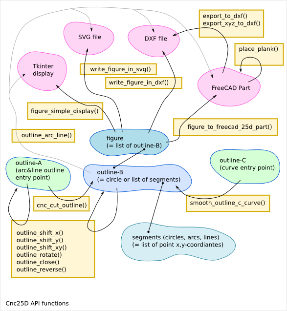

===================
Cnc25D API Overview
===================

Cnc25D Workflow
===============

**FreeCAD** provides many GUI and API functions to sculpt and assemble 3D designs. **Cnc25D** proposes a script methodology and an API on top of the `FreeCAD API`_ to design 2.5D parts.

.. _`FreeCAD API` : http://free-cad.sourceforge.net/api/index.html

.. image:: images/cnc25d_design_workflow.png
.. image:: images/cnc25d_workflow_data_evolution.png

The Cnc25D methodology
----------------------

1. Create a list of 2D points you want that your outline go through.
An outline is a list of lines and/or arcs. Other curve type must be generated by using multiple small lines.

2. Enlarge or Smooth the corners of the outline to do it makeable by a 3-axis CNC.
The cnc25d_api.cnc_cut_outline() function do it for you.
It returns a new list of 2D points defining the new lines and arcs of the new outline.

3. Exploit the 2D outline.
This new outline can already be export as SVG or DXF.
It can also be displayed using Tkinter.
Finally, it can be converted intor FreeCAD Part outline to be extruded in 3D part.

4. Create your 3D assembly.
After creating the 3D parts with the FreeCAD Part API, cnc25d_api.place_plank() provides a more natural way to place 3D parts in an assembly than the standard rotate() and translate() methods.

5. Export your design.
Export a cut of a 3D parts with cnc25d_api.export_2d().
Get a 3D scanning of your assembly with cnc25d_api.export_xyz_to_dxf()

Cnc25D API functions and class
==============================

::

  cnc25d_api.importing_freecad() => 0
  cnc25d_api.outline_shift_x(outline-AB, x-offset, x-coefficient) => outline-AB
  cnc25d_api.outline_shift_y(outline-AB, y-offset, y-coefficient) => outline-AB
  cnc25d_api.outline_shift_xy(outline-AB, x-offset, x-coefficient, y-offset, y-coefficient) => outline-AB
  cnc25d_api.outline_rotate(outline-AB, center-x, center-y, rotation_angle) => outline-AB
  cnc25d_api.outline_close(outline-AB) => outline-AB
  cnc25d_api.outline_reverse(outline-AB) => outline-AB
  cnc25d_api.cnc_cut_outline(outline-A, error_mark_string) => outline-B
  cnc25d_api.smooth_outline_c_curve(outline-C, precision, router_bit_radius, error_mark_string) => outline-B
  cnc25d_api.smooth_outline_b_curve(outline-B, precision, router_bit_radius, error_mark_string) => outline-B
  cnc25d_api.ideal_outline(outline-AC, error_mark_string) => outline-B
  cnc25d_api.outline_arc_line(outline-B, backend) => Tkinter or svgwrite or dxfwrite or FreeCAD stuff
  cnc25d_api.Two_Canvas(Tkinter.Tk()) # object constructor
  cnc25d_api.figure_simple_display(figure) => 0
  cnc25d_api.write_figure_in_svg(figure, filename) => 0
  cnc25d_api.write_figure_in_dxf(figure, filename) => 0
  cnc25d_api.figure_to_freecad_25d_part(figure, extrusion_height) => freecad_part_object
  cnc25d_api.place_plank(freecad_part_object, x-size, y-size, z-size, flip, orientation, x-position, y-position, z-position) => freecad_part_object
  cnc25d_api.export_to_dxf(freecad_part_object, direction_vector, depth, filename) => 0
  cnc25d_api.export_xyz_to_dxf(freecad_part_object, x-size, y-size, z-size, x-depth-list, y-depth-list, z-depth-list, filename) => 0
  cnc25d_api.mkdir_p(directory) => 0
  cnc25d_api.get_effective_args(default_args) => [args]
  cnc25d_api.generate_output_file_add_argument(argparse_parser) => argparse_parser
  cnc25d_api.generate_output_file(figure, filename, extrusion_height) => 0

