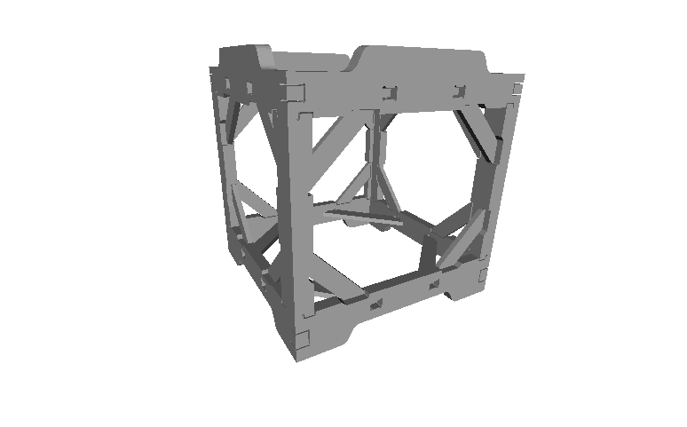
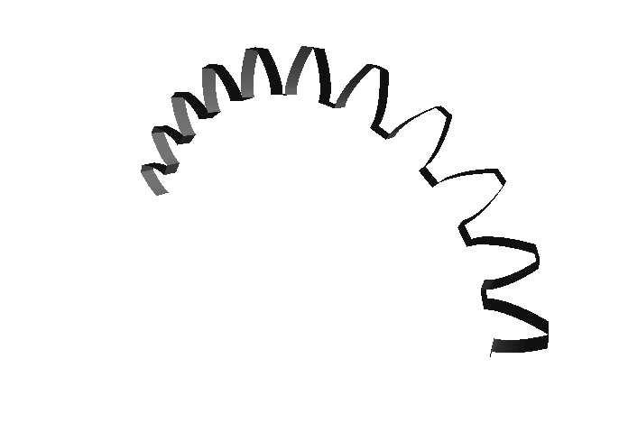
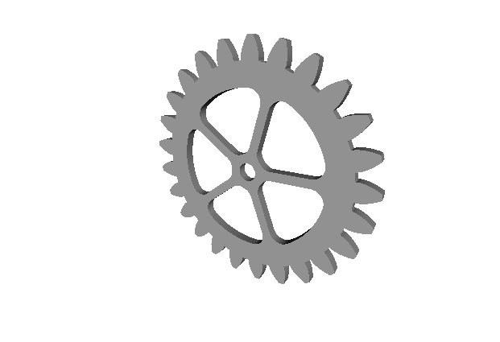
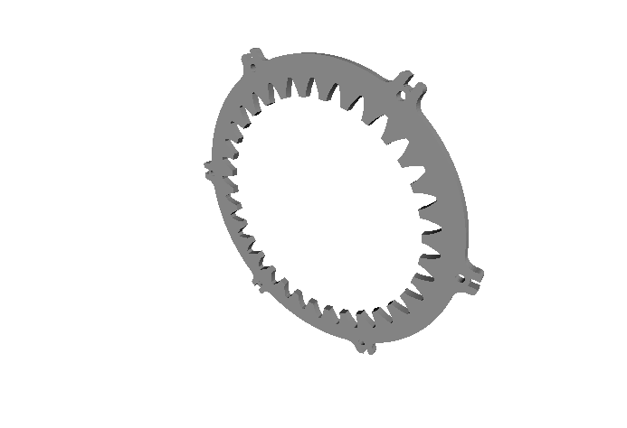
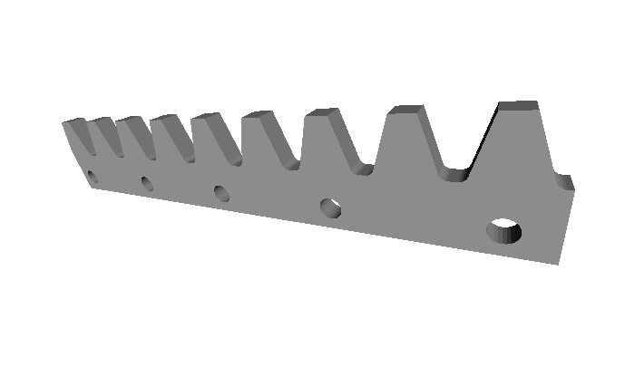

==============
Cnc25D Designs
==============

Cnc25D design introduction
==========================

In addition to the Cnc25D API functions, the *Cnc25D Python package* includes also several parametric designs. The design parameters are called *constraints* and are set via a dictionary. Most of the constraints are not mandatory and if you don't set some constraints, their default values are used. Use the files provided by the *cnc25d_example_generator.py* as template to generate one of the *Cnc25D designs*. Depending on the *constraints* *output_file_basename* and *return_type*,  you can generate *.dxf*, *.svg* or *.brep* files or include the *Cnc25D Design- as *Part-object* in your FreeCAD macro. For more information about *how to use the Cnc25D designs* read the section :doc:`cnc25d_design_details`.

Cnc25D design list
==================

Box_wood_frame
--------------

The :doc:`box_wood_frame_design` is a piece of furniture. Its particularity is that its top-shape and its bottom-shape are complementary. So, you can pile-up your boxes.

Gear_profile
------------

The :doc:`gear_profile_function` generates the gear-profile outline. You can also simulate this outline with a second gear-profile to make sure it works as you wish it. The gear-profile itself is not a 3D part but a simple outline. You can use this outline to create a complete 3D part.

Gearwheel
---------

The :doc:`gearwheel_design` is a complete gearwheel part (a.k.a. spur). You can specify the number of gear-teeth, the number of legs, the size of the axle and much more.

Gearring
--------

The :doc:`gearring_design` is a complete gearring part (a.k.a. annulus). You can use it to create your epicyclic gear system.

Gearbar
-------

The :doc:`gearbar_design` is a complete rack part.

Split_gearwheel
---------------

The :doc:`split_gearwheel_design` generates several 3D parts that can be assembled to create a complete gearwheel. The split gearwheel lets you make large gearwheel by making smaller sub parts and then assembling them.

.. image:: images/split_gearwheel_3d.png

Epicyclic Gearing
-----------------

The :doc:`epicyclic_gearing_design` is a complete epicyclic gearing system. You can use it to increase the torque (and decreasing the rotation speed).

.. image:: images/epicyclic_gearing_3d.png

