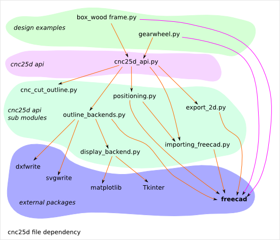
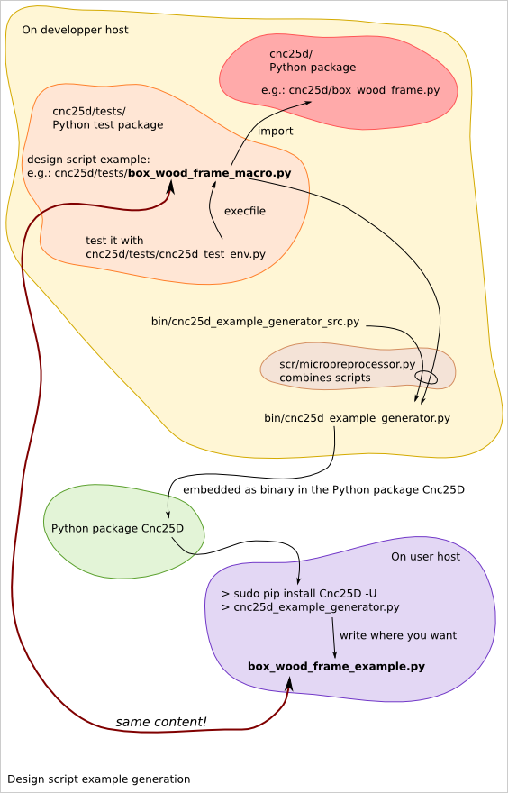
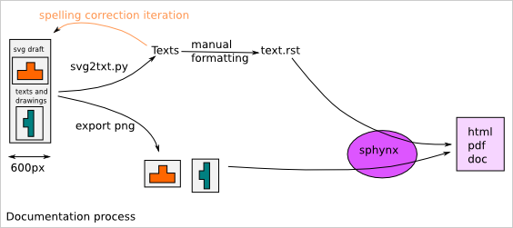

================
Cnc25D Internals
================

File layout
===========

::

  Cnc25D/
    .gitignore
    CHANGES.rst         # Release change notes. Required by PyPI
    LICENSE.txt         # Applicable license
    MANIFEST            # automatically generated by the Python package distribution setup tools
    MANIFEST.in         # include addition files to the Python package distribution
    README.rst          # README used by GitHUb and PyPI
    setup.py            # Python package distribution setup file
    bin/                                    # contains binaries to be installed on the host system during the Cnc25D package installation
      cnc25d_example_generator_src.py       # source code of the cnc25d_example_generator.py script
      cnc25d_example_generator.py           # generated by scr/micropreprocessor.py
    cnc25d/                             # the main package
      __init__.py
      importing_freecad.py              # lets import the FreeCAD libraries
      cnc_outline.py                    # cnc25d API to design parts
      export_2d.py                      # cnc25d API to export DXF or SVG
      box_wood_frame.py                 # box_wood_frame design example
      tests/                       # contains the test files of the cnc25d package
        __init__.py
        cnc25d_test_env.py          # modify sys.path to import the cnc25d library and then execute one of the following macro-scripts
        cnc25d_api_macro.py         # usage example of the cnc25d API. Reused by cnc25d_example_generator.py. Can not be executed directly.
        box_wood_frame_macro.py     # usage example of box_wood_frame. Reused by cnc25d_example_generator.py. Can not be executed directly.
    docs/                               # cnc25d package documentation sources
      box_wood_frame.svg                # SVG draft
      box_wood_frame.txt                # text autmatically extracted from the SVG draft
      cnc25d_api.rst                    # source of the Sphinx generated documentation
      index.rst                         # top file of the Sphinx documentation sources
      conf.py                           # Sphinx configuration
      Makefile                          # make clean html to rebuild the documentation
      images/                           # contains the images used by the Sphinx documentation
        3_axis_cnc.png
    scr/                                          # additional scripts for developers
      micropreprocessor.py                        # lets generate cnc25d_example_generator.py
      note_on_cnc25d_dev.txt                      # notes for developers 

Design example generation
=========================
The binary script *cnc25d_example_generator.py* just writes example scripts. These example scripts are actually the files *cnc25d/tests/cnc25d_api_macro.py* and *cnc25d/tests/box_wood_frame_macro.py*. To check these example scripts, you must run them with *cnc25d_test_env.py*::

  > cnc25d/tests/cnc25d_test_env.py  cnc25d/tests/box_wood_frame_macro.py

Because of the Python package workflow, the example scripts can not be copied after the installation and must be embedded in the binary script *cnc25d_example_generator.py* before the creation of the Python package distribution. This is the purpose of the script *scr/micropreprocessor.py*. The file *bin/cnc25d_example_generator_src.py* contains the skeleton of the script *bin/cnc25d_example_generator.py*. The following command include the example scripts to generate the final script *bin/cnc25d_example_generator.py*::

  > scr/micropreprocessor.py bin/cnc25d_example_generator_src.py

The purpose of this workflow is to help the maintenance of the generated example scripts and avoid bugs in their content.

To create a new design example, follow those steps:

- Create the new design example file in the directory *Cnc25D/cnc25d/tests/* with a file name such as *my_new_design_macro.py*
- Check by executing it with *cnc25d/tests/cnc25d_test_env.py*
- Add the few lines in the file *Cnc25D/bin/cnc25d_example_generator_src.py* that includes the new script *Cnc25D/cnc25d/tests/my_new_design_macro.py*
- Regenerate *Cnc25D/bin/cnc25d_example_generator.py* with the command::
  
  > scr/micropreprocessor.py bin/cnc25d_example_generator_src.py

Python package distribution release
===================================

Documentation process
=====================

*SVG* files are edited with Inkscape_ and are use as draft documents for pictures and texts. If you want to modify one of the *PNG* of the documentation, you can find the vectorial source in one of the *SVG* files. After modifying the *SVG*, save it and export the picture as *PNG* in the directory *docs/images/*.

A good practice is to use a *SVG* document with a width of 600 pixels. It helps creating not too large pictures for a nice fitting in *html* and *pdf* documents. Extend the height of the *SVG* document as much as you need it. 

Texts can be extracted from the *SVG* files with the command::

  > scr/svg2txt.py docs/*.svg

The generated *txt* files are used for checking spelling and are raw material for the *reStructuredText* files.

The sources of the Sphinx_ documentation are only the *reStructuredText* files (\*.rst) and the *PNG* files (\*.png).

.. _Inkscape : http://inkscape.org/
.. _Sphinx : http://sphinx-doc.org/

Design example recommendations
==============================

