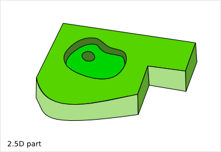

===================
Cnc25D Presentation
===================

Cnc25D is the contraction of "CNC" and "2.5D".

2.5D and cuboid assembly are good solutions for automated personal fabrication.
The Python package cnc25d proposes an API and design examples related to those technologies.

- CNC (Computer Numerical Control) and 3D-printers let move from design files to the physical objects.
- 2.5D parts are objects that can be described as a pile of free 2D path linearly extruded along the third dimension.
- Cuboid assembly is any assembly emphasizing an orthogonal reference frame.

1. Cnc25D Python package content
================================

1.1. Generic functions
----------------------

In the Cnc25D Python package, you find functions that help you design parts to be made by a 3-axis CNC, to assemble those parts and to create DXF 2D plans of your design. In particular you get those functions:

- **cnc_cut_outline** takes as input a 2D polygon defined by a list of points and a CNC reamer diameter and provides as output a millable 2D outline. Then, you just need to extrude this outline to get your 2.5D part.
- **place_plank** offers an alternative natural way to place a part in a cuboid assembly.
- **export_to_dxf** writes a DXF file with a projection of a cut of your design.
- **export_xyz_to_dxf** writes a DXF file with many projections of cuts of your design along the 3 axis, in a similar way as a medical 3D scanner.

DXF_ is 2D and is the most common design exchange file format. Usually, your CNC guy will need this file format to start his process flow. You can use LibreCAD_ to view and possibly to re-work your DXF_ files.

You can also output your design in the 3D STL_ format and use MeshLab_ to view and inspect your parts and design.

1.2. Design examples
--------------------

The Cnc25D Python package comes also with some design examples, which are probably for most of the users the most useful things.

One good thing with Designing with Python_ script is that you get a *100% open-hardware* design because all conception micro-steps are pieces of code and can be shared and hacked using the tools of the software development such as git_.

An other advantage of Designing with Python_ is that parametric design is natural. So you don't create an object but a family of objects with a set of parameters that individualize each manufactured object.

Designing with Python_ let you work in a similar way as software development. You write code, check the 3D result with the FreeCAD_ GUI, modify and expand the code and so on. This iterative work-flow is very efficient to capitalize work, reduce repetitive tasks, keep modification history, track bugs and co-work with people.

Currently, you can use those following design examples:

- The piece of furniture **box_wood_frame** to pile-up.

.. _cnc25d_installation :

2. Cnc25D Installation
======================

2.1. Install Cnc25D on your system
----------------------------------
This is the preferred method for most people.

* First, install FreeCAD_. You need the version 0.13 or newer.
* Then, install the Cnc25D package with the following command::

  > sudo pip install Cnc25D -U

* To create an design example, run the following commands::

  > cd directory/where/I/want/to/create/my/3D/parts
  > cnc25d_example_generator.py
  > python box_wood_frame_example.py

2.2. Install Cnc25D in a virtual environment
--------------------------------------------
This method has currently some issues because of PyQt4.

* First, install FreeCAD_ on your system (not in a *virtual environment*). You need the version 0.13 or newer.
* Then, create the virtual environment  and install the Cnc25D package within it::

  > cd directory/where/I/want/to/work
  > virtualenv env_for_cnc25d
  > source env_for_cnc25d/bin/activate
  > pip install Cnc25D -U
  > desactive

* To create an design example, run the following commands::

  > source env_for_cnc25d/bin/activate
  > cnc25d_example_generator.py
  > python box_wood_frame_example.py
  > deactivate

2.3. Work directly with the Cnc25D sources
------------------------------------------
Instead of installing the Cnc25D package, you clone the `Cnc25D GitHub repository`_ and work directly with it. This is the preferred method for the programmers::

  > cd directory/where/I/want/to/work
  > git clone https://github.com/charlyoleg/Cnc25D

Example of usage::

  > cd Cnc25D/cnc25d
  > python box_wood_frame.py

3. Cnc25D Usage
===============

3.1. Use a design example
-------------------------

After installing Cnc25D, you get the executable **cnc25d_example_generator.py**. When you run this script, it asks you for each design example if you want to generate the script example. Answer 'y' or 'yes' if you want to get the script example. **cnc25d_example_generator.py** can generates the following Python_ script examples:

- **box_wood_frame_example.py** : The piece of furniture to pile up.
- **cnc25d_api_example.py** : This is not a design example, this shows how to use the API.

These scripts are the design examples. Edit one of these scripts, modify the parameter values, run the script. You get plenty of DXF_ and STL_, that you can view with LibreCAD_ and MeshLab_. You also get a txt file, that provides you a kind of report of your design. In summary, we run the following commands::

  > cd directory/where/I/want/to/create/my/3D/parts
  > cnc25d_example_generator.py
  > vim box_wood_frame_example.py
  > python box_wood_frame_example.py
  > librecad bwf37_assembly_with_amplified_cut.dxf
  > meshlab # import bwf36_assembly_with_amplified_cut.stl
  > less bwf49_text_report.txt

This documentation contains one chapter per design examples that explains in particulary the parameter list.

3.2. Use a design example within FreeCAD
----------------------------------------
In the upper method, we have modified the design example script and then run it to get all the final design files. Even if we can iterate this method, this can be tedious as the generation of all the files requires time. So, probably we want to change a parameter value and just check the 3D result of the assembly. For this purpose, we use FreeCAD_ directly with one of those three methods:

3.2.1. Script as FreeCAD argument
^^^^^^^^^^^^^^^^^^^^^^^^^^^^^^^^^
Launch FreeCAD_ as following::

  > freecad box_wood_frame_example.py

The design appear in the main windows. Rotate and zoom on your design to inspect it and make sure it is as you want it.

3.2.2. Script as FreeCAD macro
^^^^^^^^^^^^^^^^^^^^^^^^^^^^^^
Launch FreeCAD_ and run the design example script from the macro menu::

  FreeCAD Top Menu Macro > Macros ...
  Within the pop-up window,
    in the field *Macro destination*, select the directory where is located your *design example script*.
    in the field *Macro name*, select your *design example script*.
    click on *Execute*

3.2.3. Script run from FreeCAD
^^^^^^^^^^^^^^^^^^^^^^^^^^^^^^
Launch FreeCAD_ and run the design example script from the Python_ console::

  Launch FreeCAD from the directory where is located your *design example script*.
  > cd directory/where/I/want/to/create/my/3D/parts
  > freecad

  Enable 'FreeCAD Top Menu View' > Views > 'Python Console'
  Within the FreeCAD Python console, type:
  > execfile("box_wood_frame_example.py")

3.3. Make your design script
----------------------------
If you are interested in the Cnc25D API and want to create your own design with, create a Python_ script with the following snippet::

  # import the FreeCAD library
  from cnc25d import importing_freecad
  importing_freecad.importing_freecad()
  import Part
  from FreeCAD import Base

  # import the Cnc25D API
  from cnc25d import cnc_cut_outline, export_2d

  # use the cnc_cut_outline function
  my_polygon = [
    [  0,  0,    5],
    [ 40,  0,    5],
    [ 40, 40,    5],
    [  0, 40,    5]]
  my_part_face = Part.Face(Part.Wire(cnc_cut_outline.cnc_cut_outline(my_part_outline).Edges))
  my_part_solid = my_part_face.extrude(Base.Vector(0,0,20)) 

  # use the place_plank function
  my_part_a = cnc_cut_outline.place_plank(my_part_solid.copy(), 40, 40, 20, 'i', 'xz', 0, 0, 0)

  # export your design as DXF
  export_2d.export_to_dxf(my_part_solid, Base.Vector(0,0,1), 1.0, "my_part.dxf")
  xy_slice_list = [ 0.1+4*i for i in range(9) ]
  xz_slice_list = [ 0.1+4*i for i in range(9) ]
  yz_slice_list = [ 0.1+2*i for i in range(9) ]
  export_2d.export_xyz_to_dxf(my_part_solid, 40, 40, 20, xy_slice_list, xz_slice_list, yz_slice_list, "my_part_scanned.dxf")
  
Further documentation at :doc:`cnc25d_api` . Also look at the script example **cnc25d_api_example.py** that you can generate with the executable **cnc25d_example_generator.py**.

4. Links
========

4.1. Underlying technologies
----------------------------
Cnc25D rely on those open-source technologies:

- OpenCASCADE_, the technology used by FreeCAD_. Cnc25D doesn't use directly OpenCASCADE.
- FreeCAD_, the new open-source CAD tool.
- Python_, the popular programming language.

4.2. Source
-----------
The source code is available at https://github.com/charlyoleg/Cnc25D. Feel free to clone and hack it!

4.3. Python package
-------------------
The Cnc25D package is available on PyPI_.

4.4. Documentation
------------------
The `Cnc25D release documentation`_ is associated to the latest Cnc25D Python package release.
The `Cnc25D daily built documentation`_ provides you the latest documentation updates.

If you have Sphinx_ installed on your system and you have downloaded the `Cnc25D Github repository`_, you can generate locally the Html documentation with the following commands::

  > cd Cnc25D/docs
  > make html

With your browser open the local directory file:///.../Cnc25D/docs/_build/html.

5. License
==========

The Cnc25D Python package is under the `Creative Commons Attribution-ShareAlike 3.0`_ License (`CC BY-SA 3.0`_) by charlyoleg.

6. Feedback and contact
=======================

If you find bugs, will suggest fix or want new features report it in the `GitHub issue tracker`_ or clone the `Cnc25D GitHub repository`_.

For any other feedback, send me a message to "charlyoleg at fabfolk dot com".

7. Releases
===========

Release 0.1.2
-------------
Released on 2013-06-18

* Box wood frame design example

Release 0.1.1
-------------
Released on 2013-06-05

* Experimenting distribute

Release 0.1.0
-------------
Released on 2013-06-04

* Initial release

.. _Python : http://www.python.org
.. _FreeCAD : http://www.freecadweb.org
.. _OpenCASCADE : http://www.opencascade.org
.. _Sphinx : http://sphinx-doc.org/

.. _`Cnc25D Github repository` : https://github.com/charlyoleg/Cnc25D
.. _`GitHub issue tracker` : https://github.com/charlyoleg/Cnc25D/issues
.. _`Cnc25D release documentation` : http://pythonhosted.org/Cnc25D/
.. _`Cnc25D daily built documentation` : https://cnc25d.readthedocs.org
.. _PyPI : https://pypi.python.org/pypi/Cnc25D

.. _`CC BY-SA 3.0` : http://creativecommons.org/licenses/by-sa/3.0/
.. _`Creative Commons Attribution-ShareAlike 3.0` : http://creativecommons.org/licenses/by-sa/3.0/

.. _DXF : http://en.wikipedia.org/wiki/AutoCAD_DXF
.. _STL : http://en.wikipedia.org/wiki/STL_%28file_format%29
.. _LibreCAD :  http://librecad.org
.. _MeshLab : http://meshlab.sourceforge.net/
.. _git : http://git-scm.com/

