===============
CNC Cut Outline
===============

:date: 2013-06-03
:author: charlyoleg

1. Introduction to the automated cutting technology
===================================================
    
Computer numerical control (a.k.a. CNC) lets cut material directly from computer design file (dxf, stl, g-code ...). This ensures precision, reproducibility, shape-complexity and automation.

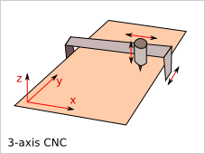

The 3-axis CNC can process:
  - 2.5D : xy-path at z constant
  - 3D: xyz-path in case of well adapted reamer and path
  
Cutting technology:
  - laser cutter (Only 2D: cutting and engraving)
  - water jet (Only 2D with a 3-axis machine)
  - mechanical reamer (2.5D and 3D depending on shape and reamer shape)

2. 2D path constraints
======================

.. image:: images/2d_path.png

Minimal curve radius constraint:
  - laser and water-jet requests no specific constraint
  - For mechanical reamer, inner curve must have a curve radius bigger than the reamer radius.    

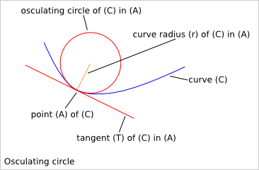

So inner corner can not be cut with reamer. They must be replaced by inner curve. Tight inner curve must be smoothed to respect the minimal curve radius constraint.

.. image:: images/possible_2d_shape_with_a_reamer_of_radius_r.png

2.1. Coplanar fitting
---------------------

If you want a perfect fitting between two coplanar shapes, then outer corners and outer curves must be rounded to get a minimum curve radius bigger than the reamer radius. For a perfect fitting, two coplanar shapes must be complementary.

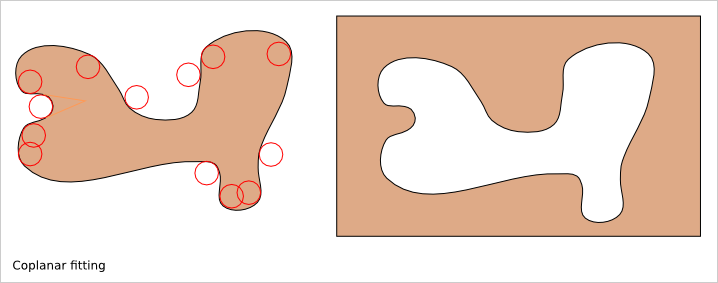

2.2. Incoplanar fitting
-----------------------

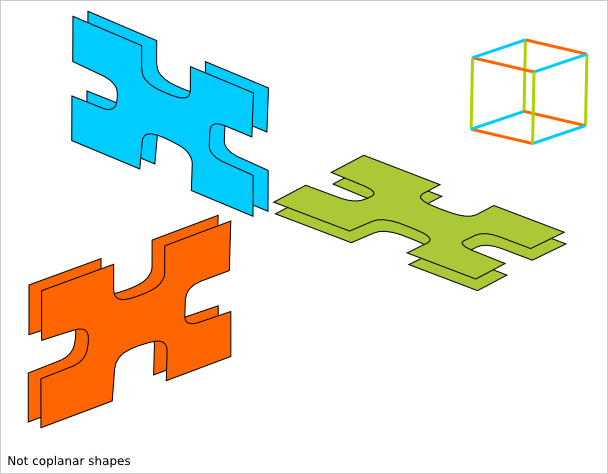

If two parts, made out of 2D shape cut in a plan, are not coplanar, then rounding corner doesn't help the fitting of the two parts.

For fitting not coplanar shapes, we need to enlarge inner corners.

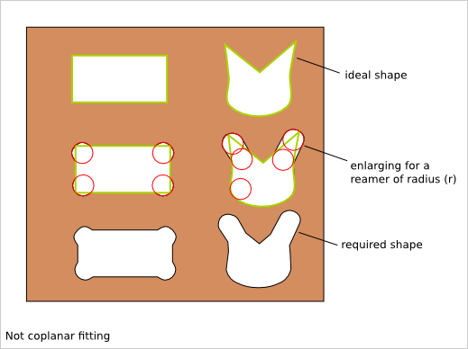

3. Coplanar fitting details
===========================

For fitting two coplanar shapes, the inner and outer corners must be smoothed.

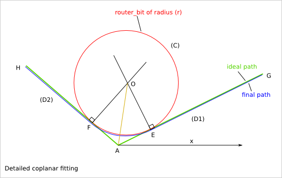

.. code-block::

  (D1), (D2) : two straight lines
  A : intersection of (D1) and (D2)
  (C) : circle or radius (r) tangent to (D1) and (D2)
  E : intersection of (C) and (D1)
  F : intersection of (C) and (D2)
  O : the center of (C)
  (EAF)=a is the angle between (D1) and (D2)

  (C) is tangent to (D1), so (D1) is perpendicular to (EO)
  (C) is tangent to (D2), so (D2) is perpendicular to (FO)
  FO=EO=r, so O belongs to the bisector of (EAF)
  We have AF=AE and (FA0)=(EAO)=a/2
  AEO is right triangle in E
  tan(EAO) = OE/AE
  AE = r/tan(a/2)
  sin(EAO) = OE/AO
  AO = r/sin(a/2)

  Knowing Gx,Gy,Ax,Ay,Hx,Hy, we want to calculate: a
  (xAG) = atan((Gy-Ay)/(Gx-Ax))
  (xAH) = atan((Hy-Ay)/(Hx-Ax))
  a=(EAF)=(GAH)=(xAH)-(aAG)
  a=atan((Hy-Ay)/(Hx-Ax))-atan((Gy-Ay)/(Gx-Ax))
  
Other method with the law of cosines c²=a²+b²-2*a*b*cos(C)

.. code-block::

  In the triangle GHA:
  h=AG=sqrt((Gx-Ax)²+(Gy-Ay)²)
  g=AH=sqrt((Hx-Ax)²+(Hy-Ay)²)
  a=GH=sqrt((Hx-Gx)²+(Hy-Gy)²)
  a=(GAH)=acos((h²+g²-a²)/(2*g*h))
  
  Knowing Gx,Gy,Ax,Ay,Hx,Hy,a we want to calculate: Ex,Ey,Fx,Fy
  Ex=Ax+(Gx-Ax)*AE/AG
  =Ax+(Gx-Ax)*r/(tan(a/2)*sqrt((Gx-Ax)²+(Gy-Ay)²)) 
  
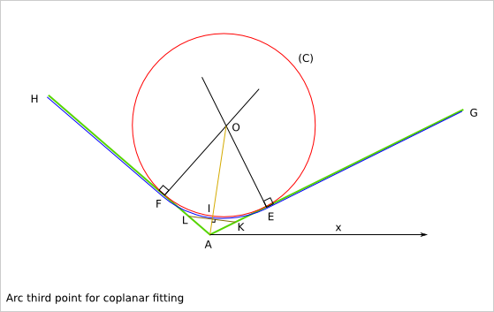

.. code-block::

  I is the intersection of (C) and (AO)
  (D3) is the straight line perpendicular to (AO) and including I
  K is the intersection of (D3) and (D1)
  L is the intersection of (D3) and (D1)
  
  
  The triangles KAI and IAL are similar so AL=AK
  (LAI)=(IAK)=a/2AI=AO-IO
  =r/sin(a/2)-r
  =r*(1-sin(a/2))/sin(a/2)AK
  =AI/cos(a/2)
  =r*(1-sin(a/2))/(sin(a/2)*cos(a/2))
  =r*(1-sin(a/2))*2/sin(a)
  AJ=AK+AL=(AI+IL)+(AI+IK)
  =2*AIAI
  =(AK+AL)/2Kx
  =Ax+(Gx-Ax)*AK/AG
  
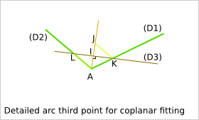

.. code-block::

  Knowing Gx,Gy,Ax,Ay,Hx,Hy,a we want to calculate: Ix, Iy
  With E,I and F, we define the arc than can be build with a reamer of radius r.
  
4. Incoplanar fitting details
=============================

For fitting two not-coplanar shapes, the inner corners must be enlarged.

4.1.1. Case of an inner obtuse angle
------------------------------------
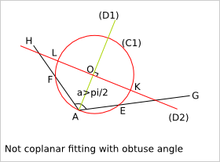

4.1.2. Border case of an inner right angle
------------------------------------------
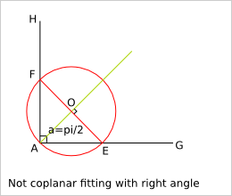

4.1.3. Case of an inner acute angle
-----------------------------------
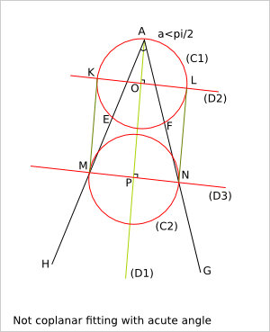
      
4.2. Calculation
----------------
  

.. code-block::

  Let's consider three points A, G and H.
  (D1) is the bisector of (GAH).
  O is a point of (D1) such as AO=r
  (C1) is the circle of center O and radius r
  E is the intersection of (C1) and (AG)
  F is the intersection of (C1) and (AH)
  (D2) is the straight line perpendicular to (D1) and including O
  K and L are the intersection of (D2) with (C1)
     
  
  Let's calculate AE:
  OA=OE=r
  We define I, the orthogonal projection of O on (AE)
  AI=EI because AEO is isosceles in O
  AI=AO/cos(a/2)=r*cos(a/2)
  AE=2*r*cos(a/2)
  
.. image:: images/detailed_not_coplanar_fitting_with_acute_angle.png

.. code-block::

  (D3) is the straight line perpendicular to (D1) and such that the length MN is equal to 2*r with M the intersection of (D3) and (AG) and N the intersection of (D3) and (AH).
  P is the intersection of (D3) and (D1).
  AM=r/sin(a/2)    
  
  R is the middle of [AM]
  S is the middle of [AN]
  V is the intersection of (D2) and (AH)
  W is the intersection of (D) and (AG)
  AK=AR-AS+(AV+AW)/2
  AR=AS=r/(2*sin(a/2))
  AV=AW=r/cos(a/2)

