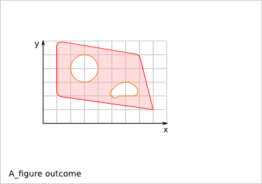

========================
Creating a Cnc25D Design
========================

You can use one of the existing :doc:`Cnc25D Designs<cnc25d_designs>` or create your own *Cnc25D design* using the :doc:`Cnc25D API<cnc25d_api_overview>`. To create your own *Cnc25D design*, you can use your own *ad-hoc* way like in the :doc:`box_wood_frame_design` variant *box_wood_frame_ng.py* or use the *recommended* way using the *class bare_design* as explained in this page.

Design Script Example
=====================

*ABC* is the name of our *Cnc25D design* example.

.. code-block:: python

  import cnc25d_api
  cnc25d_api.importing_freecad()
  import Part           # to show-up 3D in FreeCAD
  import sys            # to exit on error
  import argparse       # to define the ABC_design constraint
  import math           # usually useful to calcule point coordinates

  def ABC_constraint_constructor(parser):
    """ define the ABC constraint constructor using the argparse description
    """
    parser.add_argument('--length_A', '-a', action='store', type=float, default=10.0,
      help="set the length_A of ABC. Default: 10.0")
    parser.add_argument('--length_B', '-b', action='store', type=float, default=0.0,
      help="set the length_B of ABC. If equal 0.0, set to length_A. Default: 0.0")
    parser.add_argument('--smooth_radius', '--sr', action='store', type=float, default=0.0,
      help="set the smooth-radius of the corners of ABC. Default: 0.0")
    return(parser) # return an argparse object

  def ABC_constraint_check(c):
    """ check the ABC constraint c and set the dynamic default values
    """
    # dynamic default values
    if(c['length_B']==0):
      c['length_B'] = c['length_A']
    # check the constraint
    if(c['length_B']<c['length_A']*0.1):
      print("ERR129: Error, length_B {:0.3f} is too small compare to length_A {:0.3f}".format(c['length_B'], c['length_A']))
      sys.exit(2)
    return(c) # return a dictionary

  def ABC_figures(c):
    """ construct the ABC 2D-figure-outlines at the A-format from the constraint c
        It returns a dictionary of figures with outlines in the A-format
    """
    r_figures = {}
    r_height = {}
    #
    ABC_base_figure = []
    ABC_external_outline_A = [] # the square
    ABC_external_outline_A.append((0.0,0.0, c['smooth_radius']))
    ABC_external_outline_A.append((0.0+c['length_A'], 0.0, c['smooth_radius']))
    ABC_external_outline_A.append((0.0+c['length_A'], 0.0+c['length_B'], c['smooth_radius']))
    ABC_external_outline_A.append((0.0, 0.0+c['length_B'], c['smooth_radius']))
    cnc25d_api.outline_close(ABC_external_outline_A)
    ABC_base_figure.append(ABC_external_outline_A)
    #
    r_figures['ABC_base'] = ABC_base_figure
    r_height['ABC_base'] = c['length_A']
    return((r_figures, r_height)) # return a tuple of two dictionaries

  def ABC_3d(c):
    """ construct the ABC-assembly-configuration for 3D-freecad-object from the constraint c
        It returns a dictionary of assembly-configurations
    """
    r_assembly = {}
    r_slice = {}
    #
    simple_abc_assembly = []
    simple_abc_assembly.append(('ABC_base', 0.0, 0.0, c['length_A'], c['length_B'], c['length_A'], 'i', 'xy', 0, 0, 0))
    #
    size_xyz = (c['length_A'], c['length_B'], c['length_A'])
    zero_xyz = (0.0, 0.0, 0.0)
    slice_x = [ (i+1)/12.0*size_xyz[0] for i in range(10) ]
    slice_y = [ (i+1)/12.0*size_xyz[1] for i in range(10) ]
    slice_z = [ (i+0.1)/12.0*size_xyz[2] for i in range(10) ]
    slice_xyz = (size_xyz[0], size_xyz[1], size_xyz[2], zero_xyz[0], zero_xyz[1], zero_xyz[2], slice_z, slice_y, slice_x)
    #
    r_assembly['abc_assembly_conf1'] = simple_abc_assembly
    r_slice['abc_assembly_conf1'] = slice_xyz
    return((r_assembly, r_slice)) # return a tuple of two dictionaries

  def ABC_info(c):
    """ create the text info related to the ABC from the constraint c
    """
    r_txt = """
  length_A: \t{:0.3f}
  length_B:  \t{:0.3f}
  smooth_radius: \t{:0.3f}
  """.format(c['length_A'], c['length_B'], c['smooth_radius'])
    return(r_txt) # return a string-text

  def ABC_self_test():
    """ set the self_tests for the ABC-design
    """
    r_tests = [
      ('default abc', ''),
      ('unregular abc', '--length_A 30.0 --length_B 20.0 --smooth_radius 8.0'),
      ('heigh abc', '--length_A 5.0 --length_B 5.0 --smooth_radius 2.0 --output_file_basename test_output/height_abc.dxf')]
    return(r_tests) # return a list of 2-tuples
      
  class ABC(bare_design):
    """ ABC design
    """
    def __init__(self, constraint={}):
      """ configuration of the ABC design
      """
      self.design_setup(
        s_design_name             = "ABC_design",
        f_constraint_constructor  = ABC_constraint_constructor,
        f_constraint_check        = ABC_constraint_check,
        f_2d_constructor          = ABC_figures,
        d_2d_simulation           = {},
        f_3d_constructor          = ABC_3d,
        f_3d_freecad_constructor  = None,
        f_info                    = cube_info,
        l_display_figure_list     = [],
        s_default_simulation      = "",
        l_2d_figure_file_list     = [],
        l_3d_figure_file_list     = [],
        l_3d_conf_file_list       = [],
        l_3d_freecad_file_list    = None,
        f_cli_return_type         = None,
        l_self_test_list          = ABC_self_test())
      self.apply_constraint(constraint)

  if __name__ == "__main__":
    my_abc = ABC()
    my_abc.cli("--length_A 50.0 --length_B 30.0 --output_file_basename test_output/abc.dxf")
    if(cnc25d_api.interpretor_is_freecad()):
      Part.show(my_abc.get_fc_obj_3dconf('abc_assembly_conf1'))

Design Functions
================

A design is built via several mandatory and optional functions. After defining theses functions, they are bound to a design during the *design setup* phase. The name of the function is irrelevant but their argument list and their returned values are specified in this section. The argument list can be extended with optional arguments if you want to reuse this function in an other context.

ABC_constraint_constructor()
____________________________

.. code-block:: python
  
  # parser = argparse.ArgumentParser()

  def ABC_constraint_constructor(parser):
    parser.add_argument('--my_constraint', '--mc', action='store', type=float, default=10.0,
      help="my_constraint to parametrize the design. Default: 10.0")
    return(parser)

The *ABC_constraint_constructor()* function defines the constraint list of the design. Each constraint is declared with the method *argparse.ArgumentParser().add_argument()*. For one constraint, you can specigy the type (*float*, *integer*, *string* ..), the default value and some explanation. Out of this *parser argument list*, a dictionary of the *design constraint* is created using the longest name of each *ârser argument*.

ABC_constraint_check()
______________________

.. code-block:: python

  # c = { 'constraint_A' : 3.0, 'constraint_B' : 3.0 }

  def ABC_constraint_check(c):
    c['constraint_C'] = c['constraint_A'] + c['constraint_B']   # create a new entry in the constraint dictionary
    if(c['constraint_A']<2):  # a dummy design rule check
      print("Error: constraint_A {:0.3f} must be bigger than 2".format(c['constraint_A']))
      sys.exit(2)
    return(c)

The *ABC_constraint_check()* checks the coherence of the values set to the design constraint, completes the constraint dictionary with new values or even modifies the constraint values. Most of the design rule check must occur inside this function. To avoid headache to the users of you design, make sure the constraint default values pass the design rule check.

ABC_figures()
_____________

.. image:: images/a_figure_definition.png

.. code-block:: python
  
  def ABC_figures(c)
    r_figures = {}
    r_height = {}
    #
    A_fig = [] # start the figure A_fig. A figure is list of outlines. The first outline is the external-outline. The other outlines are the hole-outlines.
    quadrilateral = [] # start the outline quadrilateral. An outline can be a circle or a chain of lines and arcs.
    quadrilateral.append((10, 20, 5)) # set the first point of the quadrilateral outline. A positive router_bit_radius of 5 is requested.
    quadrilateral.append((80, 10, 0)) # set a line to the second point. The router_bit_radius request is set to 0. The corner will remain sharp.
    quadrilateral.append((70, 50, 5)) # set a line to the third point. A positive router_bit_radius of 5 is requested. The corner will be smoothed with a radius of 5.
    quadrilateral.append((10, 60, 5)) # set a line to the fourth point.
    quadrilateral.append((10, 20, 0)) # set a line to the first point. The router_bit_radius request must be 0 because this is the last segment.
    A_fig.append(quadrilateral) # the outline quadrilateral is added to the figure A_fig. quadrilateral is the external-outline because it is the first outline of A_fig.
    hole_circle = (30, 40, 10) # define the outline hole_circle. A circle is an outline exception defined only by the tuple (center-x, center-y, radius).
    A_fig.append(hole_circle) # the outline hole_circle is added to the figure A_fig. hole_circle is a hole because this is not the first outline of A_fig.
    other_hole = [] # start the outline other_hole, consisting of a line and an arc.
    other_hole.append((50, 10, -5)) # set the first point of the outline other_hole. A negative router_bit_radius of -5 is requested, so the corner will be enlarged.
    other_hole.append((70, 10, 5)) # set a line to the second point. A positive router_bit_radius of 5 is requested.
    other_hole.append((60, 20, 50, 10, 0)) # set an arc passing through an intermediate point and going back to the first point. The router_bit_radius request must be 0 because this is the last segment.
    A_fig.append(other_hole) # the outline other_hole is added to the figure A_fig. other_hole is a hole because this is not the first outline of A_fig.
    #
    r_figures['A_figure'] = A_fig
    r_height['A_figure'] = 10.0
    return((r_figures, r_height))
  
The *ABC_figures()* defines the 2D-figures of the design. As we are focusing on 2.5D designs, it is probably the heart of your design. The function must use as argument the *constraint dictionary*, that has already by processed by the previous function *ABC_constraint_check()*. The function must return a tuple of to dictionaries containing the same keys.

The first dictionary contains the 2D-figures, that are from a *Python* point of view a list of list of list.

The second dictionary contains the extrusion height of each figure. These heights are used by the function *write_figure_brep()*. For some figures, like assembly figures, the height might not make any sense. In those cases, set the height to the conventional value 1.0.

To generate the figures and outlines, you can use some function of the Cnc25D API:

  - cnc25d_api.outline_shift_x(outline, x_offset, x_coefficient)
  - cnc25d_api.outline_shift_y(outline, y_offset, y_coefficient)
  - cnc25d_api.outline_shift_xy(outline, x_offset, x_coefficient, y_offset, y_coefficient)
  - cnc25d_api.outline_rotate(outline, rotation_center_x, rotation_center_y, rotation_angle)
  - cnc25d_api.outline_close(outline)
  - cnc25d_api.outline_reverse(outline)
  - cnc25d_api.rotate_and_translate_figure(figure, rotation_center_x, rotation_center_y, rotation_angle, translate_x, translate_y)
  - cnc25d_api.flip_rotate_and_translate_figure(figure, zero_x, zero_y, size_x, size_y, x_flip, y_flip, rotation_angle, translate_x, translate_y)

For more details, read the chapter :doc:`cnc25d_api_outline_creation`.

ABC_3d()
________

.. code-block:: python

  def ABC_3d(c)
    r_assembly = {}
    r_slice = {}
    #
    r_assembly['A_3dconf'] = [('A_figure', 0.0, 0.0, 70, 50, 30, 'i', 'xy', 0, 0, 0)]
    r_slice['A_3dconf'] = (70, 50, 30, 10, 10, 0, [5, 15, 25], [20, 30, 40], [20, 30, 40])
    #
    return((r_assembly, r_slice))
  
The function *ABC_3d()* defines the 3D assembly generated from the extruded 2D-figures. The function must use as argument the *constraint dictionary*, that has already by processed by the previous function *ABC_constraint_check()*. The function must return a tuple of to dictionaries containing the same keys. The first dictionary contains *assembly-3D-configurations*. The second dictionary contains the *slice-configurations*.

An *assembly-3D-configurations* is a list of extruded and placed figures. Each item of the list contains:
  
  - 2D-figure label: defined by the function ABC_figures()
  - zero_x, zero_y: the reference coordinates of the 2D-figure
  - size_x, size_y: the reference sizes of the 2D-figure
  - size-z: the height of extrusion
  - i,x,y,z-flip: the flip of the extruded part
  - xy,yx,xz,zx,yz,zy-orientation: the orientation of the extruded part
  - translation-xyz: the final translation

For more details, read the chapter :doc:`place_plank_details`.

The *slice-configurations* is used by write_assembly_brep() to generate several 2D-cuts of the 3D-assembly. A *slice-configurations* is defined by:

  - size-x, size-y, size-z: the reference dimension of the 3D-assembly
  - zero-x, zero-y, zero-z: the reference coordinates of the 3D assembly
  - slice-xy-list: the list of z-coordinates to cut the assembly in the xy-plan
  - slice-xz-list: the list of y-coordinates to cut the assembly in the xz-plan
  - slice-yz-list: the list of x-coordinates to cut the assembly in the yz-plan

ABC_3d_freecad_construction(c)
______________________________

.. code-block:: python

  def A_freecad_construction(c):
    r_3dobj = Part.makeCompound()
    return(r_3dobj)

  def ABC_3d_freecad_construction(c):
    r_fc_obj_f = {}
    r_slice = {}
    #
    r_fc_obj_f['A_3dobj'] = A_freecad_construction
    r_slice['A_3dobj'] = []
    ###
    return((r_fc_obj_f, r_slice))

The function *ABC_3d_freecad_construction()* is similar to the function *ABC_3d()* but instead of recording *assembly-3D-configurations*, it points to freecad_construction functions. These functions can access directly to the FreeCAD API. They provide more possibilities than the compact but restricted format *assembly-3D-configurations*.

The function *freecad_construction()* must use as argument the *constraint dictionary* and must return a FreeCAD object.

ABC_info()
__________

.. code-block:: python

  def ABC_info(c):
    r_txt = """
    constraint_A: {:0.3f}
    """.format(c['constraint_A'])
    return(r_txt)

The function *ABC_info()* generates a string that is used as log during the design construction. The function must use as argument the *constraint dictionary* and must return a *string*.

ABC_simulations()
_________________

.. code-block:: python

  def simulation_A(c):
    print("use the cnc25d_api to test what you want")
    return(1)

  def ABC_simulations():
    r_sim = {}
    r_sim['sim_A'] = simulation_A
    return(r_sim)
    
The function *ABC_simulations()* generates a dictionary containing pointers to simulation functions. The function doesn't need any argument and return the function pointer dictionary. Actually, the function could be replaced by a function pointer dictionary. For aesthetic, I prefer using a function without argument.

The simulation function must use as argument the *constraint dictionary*. The return value of this function is irrelevant.

ABC_self_test()
_______________

.. code-block:: python
  
  def ABC_self_test():
    r_tests = [
    ('test_A', '--constraint_A 7.0 --constraint_B 5.0'),
    ('test_B', '--constraint_A 3.0 --constraint_B 9.0')]
    return(r_tests)

The function *ABC_self_test()* generates a list of 2-tuple containing sets of constraint used to test the design in general or corner cases. The function doesn't need any argument and could be replaced by a simple list. Each item of the list is a test case. The two strings of a test-case are the *test-name* and the *constraint-values* at the *CLI (command-line-interface)* format.

ABC_cli_return_type()
_____________________

.. code-block:: python
  
  def ABC_cli_return_type(c):
    return(r_cli)

The function *ABC_cli_return_type()* generates the value returned by the method *cli()*. The function must use as argument the *constraint dictionary*. It returns what you want the method *cli()* must return. This function is obsolete and should not be used anymore.

Design Setup
============

.. code-block:: python

  class ABC(bare_design):
    def __init__(self, constraint={}):
      self.design_setup( # function to setup a cnc25d design
        s_design_name             = "ABC_design", # mandatory string, used to enhance information and error messages
        f_constraint_constructor  = ABC_constraint_constructor, # mandatory function, set the design constraint
        f_constraint_check        = ABC_constraint_check, # highly recommended function to check the design constraint
        f_2d_constructor          = ABC_figures, # function that generates a dictionary that contains 2D-figures
        d_2d_simulation           = ABC_simulations(), # dictionary to functions running simulations
        f_3d_constructor          = ABC_3d, # function that generates a dictionary that contains 3D-assembly
        f_3d_freecad_constructor  = ABC_3d_freecad_construction, # function that generates a dictionary that contains 3D-freecad-functions
        f_info                    = ABC_info, # function that generates a string
        l_display_figure_list     = [], # list of the 2D-figures to be displayed in a Tk-window
        s_default_simulation      = "", # simulation string name, set the default action to simulation instead of 2D-figure-display
        l_2d_figure_file_list     = [], # 2D-figures to be written in SVG or DXF files
        l_3d_figure_file_list     = [], # 2D-figures to be written in Brep files
        l_3d_conf_file_list       = [], # 3D-assembly-configurations to be written in Brep files
        l_3d_freecad_file_list    = [], # 3D-freecad-construction to be written in Brep files
        f_cli_return_type         = [], # obsolete function that defines the return value of the method cli()
        l_self_test_list          = ABC_self_test()) # list of tests to be run to check the design
      self.apply_constraint(constraint) # optional but quiet convenient 

If you don't want to use one or several settings, set them to *None* or comment the line. Concerning the list, usually an empty list means all available 2D-figures or 3D-assembly. *None* means nothing.

Design Usage
============

.. code-block:: python

  my_abc = ABC(ABC_constraint)
  my_abc.outline_display() # display the 2D-figures of the list l_display_figure_list in Tk-windows
  my_abc.write_figure_svg("test_output/abc_macro") # write in SVG files the 2D-figures of the list l_2d_figure_file_list
  my_abc.write_figure_dxf("test_output/abc_macro") # write in DXF files the 2D-figures of the list l_2d_figure_file_list
  my_abc.write_figure_brep("test_output/abc_macro") # write in Brep files the extruded 2D-figures of the list l_3d_figure_file_list
  my_abc.write_assembly_brep("test_output/abc_macro") # write in Brep files the 3D-assembly of the list l_3d_conf_file_list
  my_abc.write_freecad_brep("test_output/abc_macro") # write in Brep files the 3D-assembly of the list l_3d_freecad_file_list
  #my_abc.run_simulation("sim_A") # run the simulation 
  my_abc.view_design_configuration() # display information of the design setup. Useful when you want to reuse an old design
  my_abc.run_self_test("") # run the test case of the list l_self_test_list
  my_abc.cli("--output_file_basename test_output/my_abc.dxf") # Warning: all constraint values are reset to their default values
  
  if(cnc25d_api.interpretor_is_freecad()): # check if the interpretor is freecad
    Part.show(my_abc.get_fc_obj_3dconf('A_3dconf')) # display the 3D object corresponding to the 3D-assembly-configuration abc_3dconf1

  my_fig = my_abc.get_A_figure('A_figure') # get the figure A_figure at the A-format
  my_fig = my_abc.get_B_figure('A_figure') # get the figure A_figure at the B-format
  my_fc_obj = my_abc.get_fc_obj_3dconf('A_3dconf') # get the FreeCAD object generated by the 3D-assembly-configuration A_3dconf
  my_fc_obj = my_abc.get_fc_obj_function('A_3dobj') # get the FreeCAD object generated by the 3D-freecad-construction A_3dobj
  my_txt = my_abc.info() # get text information about the design ABC
  my_constraint = my_abc.get_constraint() # get a dictionary containing all set and internal constraint of the ABC design
  my_abc.apply_constraint(my_constraint) # change the constraint of the ABC design my_abc with checking the dictionary set as argument
  my_abc.apply_external_constraint(my_constraint) # change the constraint of the ABC design my_abc without checking the dictionary set as argument

Internal Methods
================

The internal methods can be used in some advanced cases.

.. code-block:: python
  
  (figs, heights) = my_abc.apply_2d_constructor() # generates and returns the 2D-figures according to the current constraint
  (assembly_3dconfs, slice_confs) = my_abc.apply_3d_constructor() # generates and returns the 3D-assembly-configurations according to the current constraint
  (freecad_function_pts, slice_confs) = my_abc.apply_3d_freecad_constructor()  # generates and returns the 3D-freecad-function-pointers according to the current constraint

  my_abc.set_design_name(s_design_name) # overwrite the design name
  my_abc.set_constraint_constructor(f_constraint_constructor) # overwrite the function that defines the design constraint
  my_abc.set_constraint_check(f_constraint_check) # overwrite the function that checks the design constraint
  my_abc.set_2d_constructor(f_2d_constructor) # overwrite the function that generates the 2D-figures
  my_abc.set_2d_simulation(d_2d_simulation) # overwrite the dictionary that points to the simulation functions
  my_abc.set_3d_constructor(f_3d_constructor) # overwrite the function that generates the 3D-assembly-configurations
  my_abc.set_3d_freecad_constructor(f_3d_freecad_constructor) # overwrite the function that points to the freecad-3d-construction functions
  my_abc.set_info(f_info) # overwrite the function that generates the information string
  my_abc.set_display_figure_list(l_display_figure_list) # overwrite the list of the displayed 2D-figures
  my_abc.set_default_simulation(s_default_simulation) # overwrite the default action as simulation. If set to the empty string, display 2D-figures is the default action.
  my_abc.set_2d_figure_file_list(l_2d_figure_file_list) # overwrite the list of the 2D-figures to be written in SVG or DXF files
  my_abc.set_3d_figure_file_list(l_3d_figure_file_list) # overwrite the list of the 2D-figures to be written in Brep files
  my_abc.set_3d_conf_file_list(l_3d_conf_file_list) # overwrite the list of the 3D-assembly-configurations to be written in Brep files
  my_abc.set_3d_freecad_file_list(l_3d_freecad_file_list) # overwrite the list of the 3D-freecad-function-construction to be written in Brep files
  my_abc.set_cli_return_type(f_cli_return_type) # overwrite the function to generate the return value of the cli() method
  my_abc.set_self_test(l_self_test_list) # overwrite the list of tests

