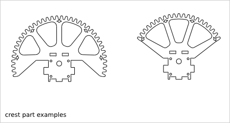
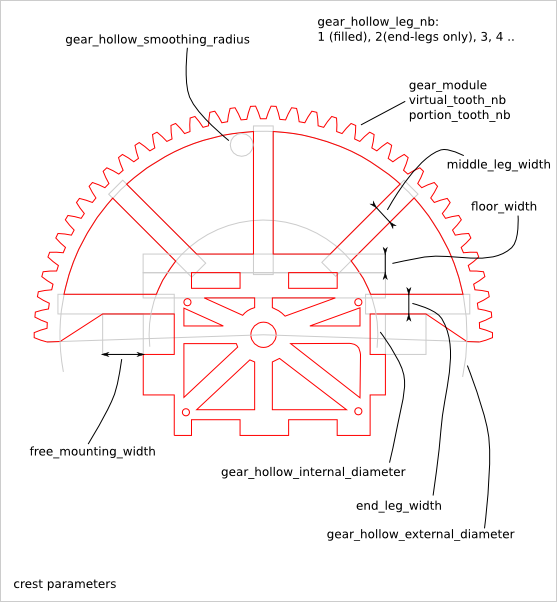
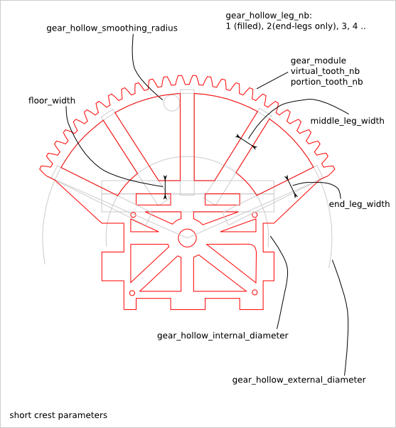
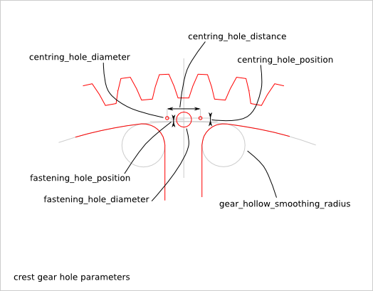

============
Crest Design
============

Ready-to-use parametric *crest* design. It is an optional part of the *cross_cube* assembly to get a motorized *gimbal* system.

To get an overview of the possible *crest* designs that can be generated by *crest()*, run::

  > python crest.py --run_self_test

Crest Parameters
================

The *crest* part inherit several parameters from :doc:`cross_cube_design`.

Crest Parameter Dependency
==========================

crest_cnc_router_bit_radius
---------------------------

The following parameter are related to the *router_bit radius*:

* crest_cnc_router_bit_radius
* gear_cnc_router_bit_radius
* gear_hollow_smoothing_radius
* cross_cube_cnc_router_bit_radius
* face_hollow_smoothing_radius
* top_hollow_smoothing_radius

The *crest_cnc_router_bit_radius* parameter guarantees the smallest value for all related *router_bit radius* parameters.

