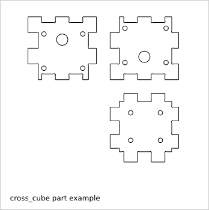
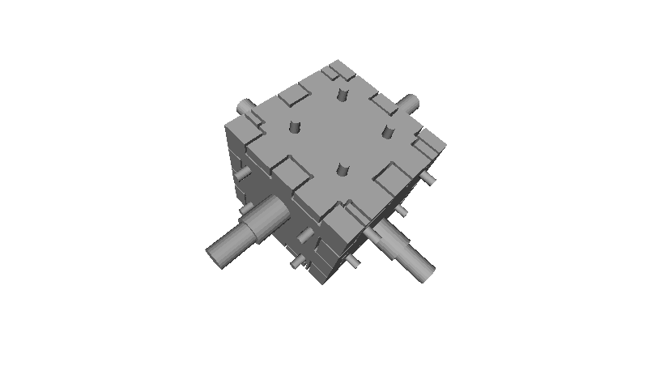
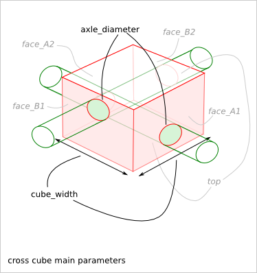
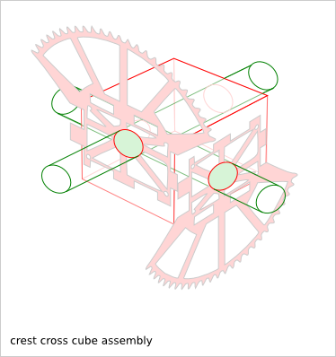
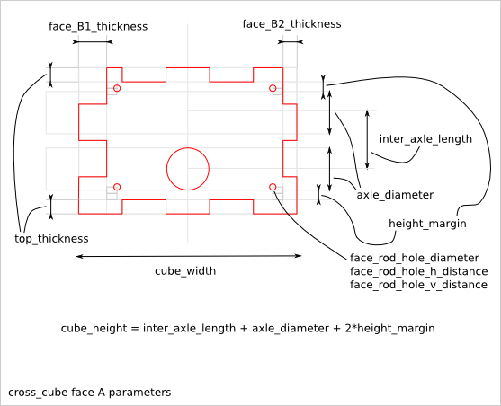
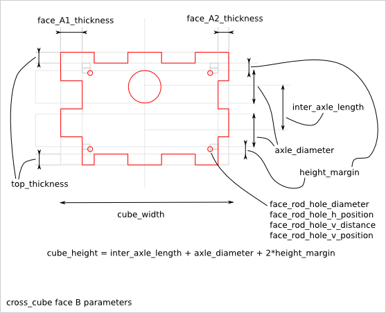
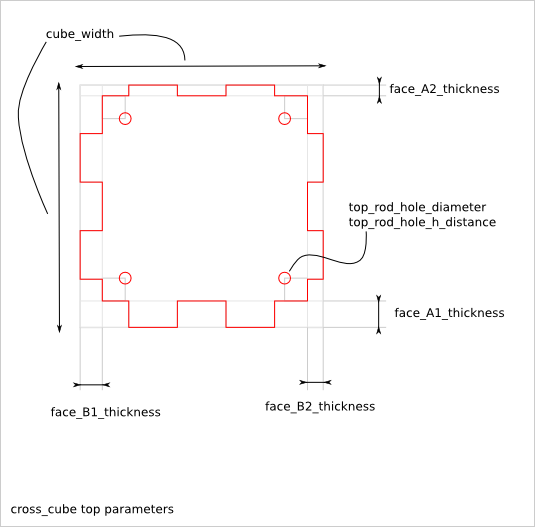
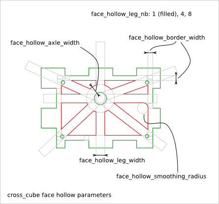
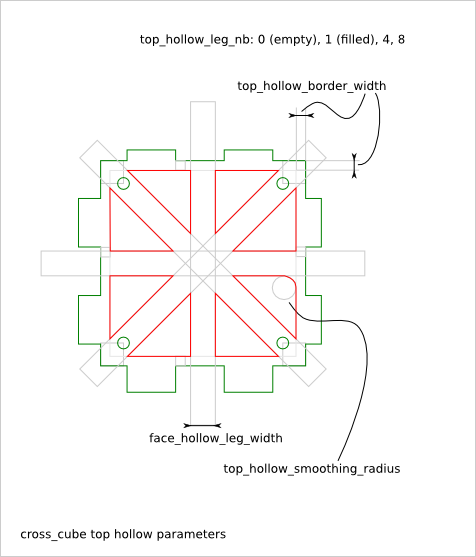
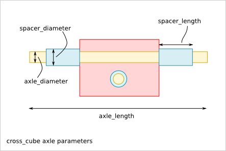

=================
Cross_Cube Design
=================

Ready-to-use parametric *cross_cube* design. It is a cross axle holder for gimbal.

.. image:: images/cross_cube_bare_3d.png

To get an overview of the possible *cross_cube* designs that can be generated by *cross_cube()*, run::

  > python cross_cube.py --run_self_test

Cross_Cube Parts and Parameters
===============================

The *cross_cube* piece is composed out of the following flat parts:

* face_A1
* face_A2
* face_B1
* face_B2
* top

Cross_Cube Parameter Dependency
===============================

cross_cube_extra_cut_thickness
------------------------------

The *cross_cube_extra_cut_thickness* parameter can be used to compensate the manufacturing process or to check the 3D assembly with FreeCAD. The default value is 0.0.

