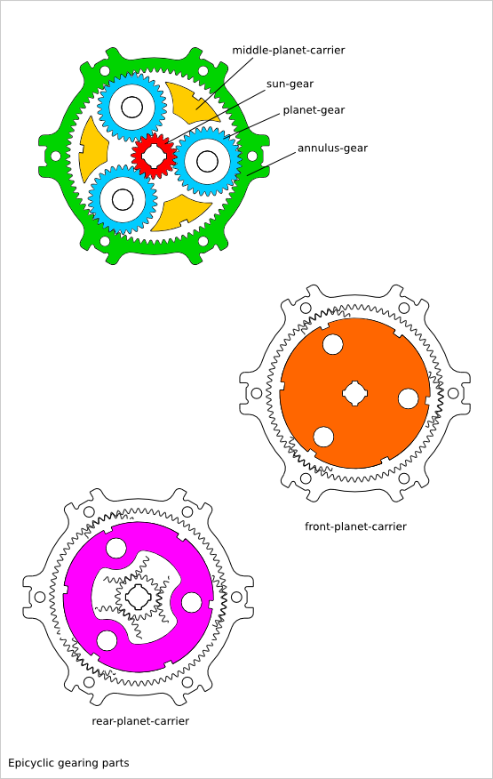
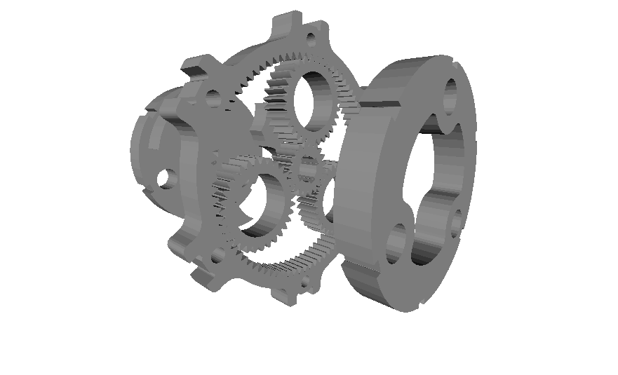
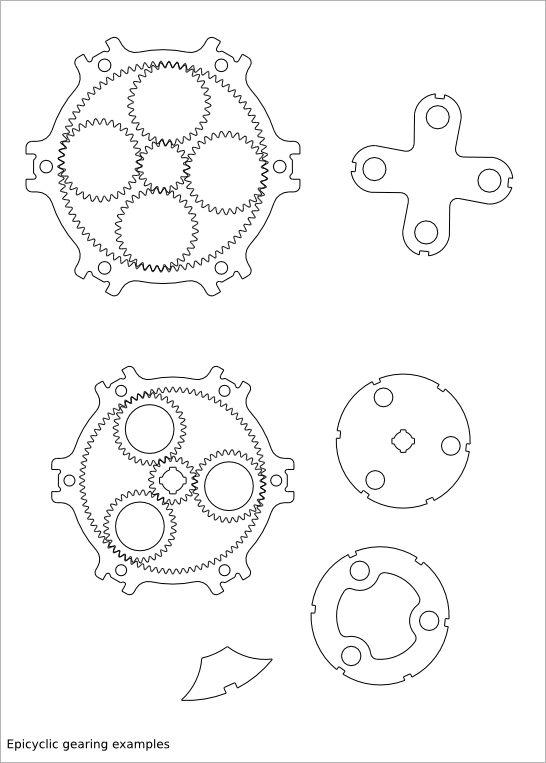
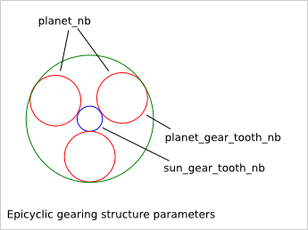
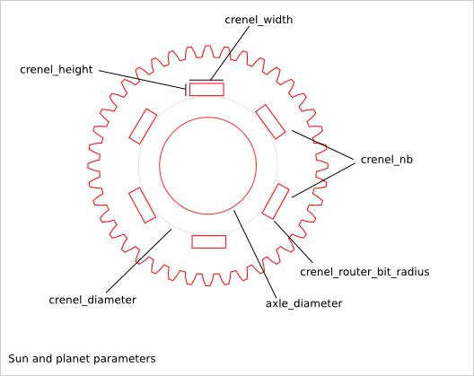
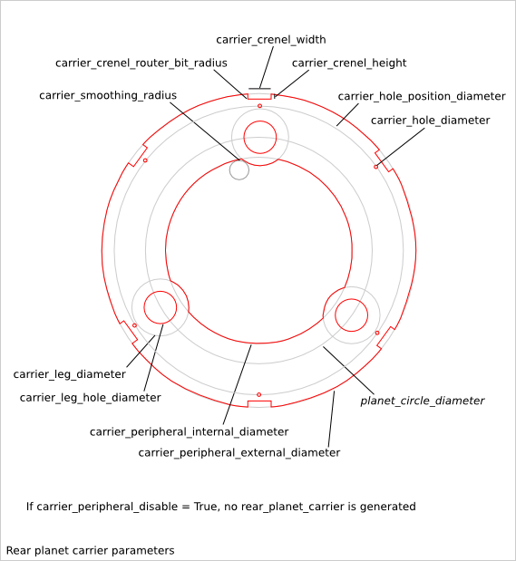
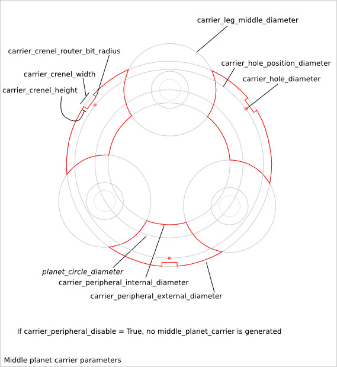
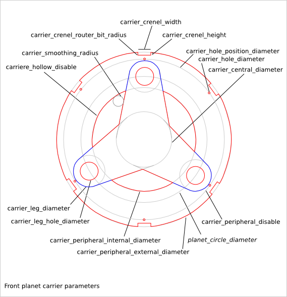
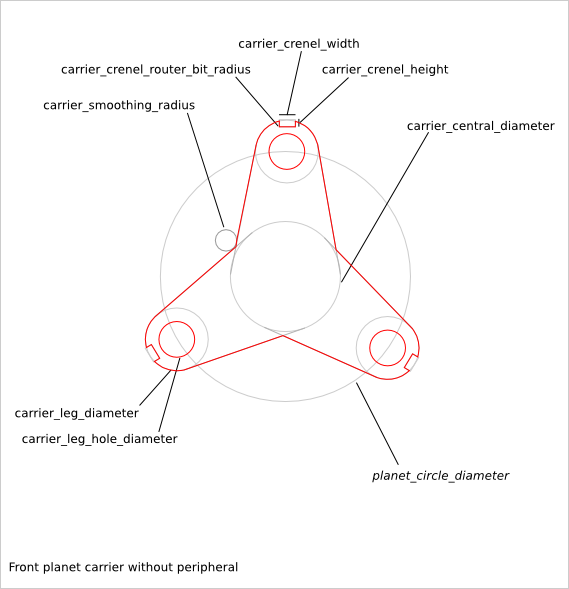
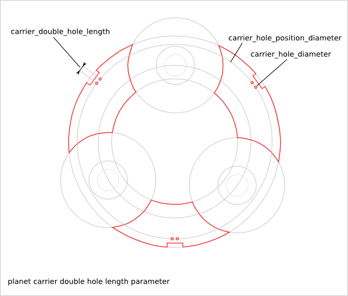

========================
Epicyclic Gearing Design
========================

Ready-to-use parametric *epicyclic-gearing* design. The *epicyclic gearing* is a system made out of several parts:

  - sun-gear
  - planet-gear
  - annulus-gear
  - planet-carrier (rear, middle and front)

You can generate several configuration of *epicyclic gearing system*:

To get an overview of the possible epicyclic-gearing designs that can be generated by *epicyclic_gearing()*, run::

  > python epicyclic_gearing.py --run_self_test

Epicyclic Gearing Parameter List
================================

The parameter relative to the gearring are inherit from the :doc:`gearring_design`.

Epicyclic Gearring Parameter Dependency
=======================================

router_bit_radius
-----------------

Six router_bit radius are defined: *gear_router_bit_radius*, *sun_crenel_router_bit_radius*, *planet_crenel_router_bit_radius*, *carrier_crenel_router_bit_radius*, *carrier_smoothing_radius* and *cnc_router_bit_radius*. Each set the router_bit radius for different areas except *cnc_router_bit_radius* that set the minimum value for the five other router_bit radius. If an other router_bit radius is smaller than *cnc_router_bit_radius*, it is set to *cnc_router_bit_radius*. So, we have the relations::

  cnc_router_bit_radius < gear_router_bit_radius
  cnc_router_bit_radius < sun_crenel_router_bit_radius
  cnc_router_bit_radius < planet_crenel_router_bit_radius
  cnc_router_bit_radius < carrier_crenel_router_bit_radius
  cnc_router_bit_radius < carrier_smoothing_radius

If you leave *carrier_smoothing_radius* to 0.0, it will be changed automatically to a default larger value.

sun_gear_tooth_nb and planet_gear_tooth_nb
------------------------------------------

*sun_gear_tooth_nb* and *planet_gear_tooth_nb* set the number of teeth of the sun-gear and planet-gears. The number of teeth of the annulus-gear is set to::
  
  annulus_gear_tooth_nb = sun_gear_tooth_nb + 2 * planet_gear_tooth_nb

To get a working epicyclic-gearing, the sum of sun_gear_tooth_nb and annulus_gear_tooth_nb must be divisible by the number of planet-gears::

  (annulus_gear_tooth_nb + sun_gear_tooth_nb) % planet_nb = 0
  equivalent to:
  (2*(sun_gear_tooth_nb + planet_gear_tooth_nb)) % planet_nb = 0

The transmission ration is equal to::

  sun_gear_tooth_nb/(sun_gear_tooth_nb + annulus_gear_tooth_nb)

planet_nb
---------

*planet_nb* sets the number of planet-gears. If *planet_nb* is set to 0, the maximal number of planet-gears is chosen.

carrier_peripheral_disable
--------------------------

If *carrier_peripheral_disable* is *True*, no rear-planet-carrier and no middle-planet-carrier are generated. The front-planet-carrier has also an alternative design.

carrier_hollow_disable
----------------------

If *carrier_hollow_disable* is *True*, hollows are created in the front-planet-carrier. This remove some material to get a lighter system. This option is available only when *carrier_peripheral_disable* is *False*.

carrier_crenel_height
---------------------

*carrier_crenel_height* sets the height of the carrier-crenels. If *carrier_crenel_height* is set to 0, the carrier-crenel are not created. The number of carrier-crenels is 2*planet_nb.

planet_axle_diameter and carrier_leg_hole_diameter
--------------------------------------------------

*planet_axle_diameter* and *carrier_leg_hole_diameter* are both related to the diameters of the planet-gear axle. *planet_axle_diameter* sets the diameter of the axle of the planet-gears. *carrier_leg_hole_diameter* sets the diameter of the corresponding coaxial holes in the rear and front planet-carrier. Using two different values for these two parameters can be useful when you want to use a ball bearing system.

sun axle and carrier axle design
--------------------------------

The sun axle design is defined with several parameters such as *sun_axle_diameter*, *sun_crenel_diameter*, *sun_crenel_nb*, *sun_crenel_width*, *sun_crenel_height* and *sun_crenel_router_bit_radius*. The design of the axle of the plant-carrier is copied from the sun axle design. So there is no parameters directly related to the planet-carrier axle design. Notice that in case of cascade epicyclic gearing, the planet-carrier of a stage intends to be jammed to the sun-gear of the next stage.

carrier_double_hole_length
--------------------------

The crenel-hole can is replaced by a double-crenel-hole when *carrier_double_hole_length* is set to a float bigger than zero. In this case, two holes are created with a distance of *carrier_double_hole_length*. Double-hole are useful to increase the stability of the planet-carrier.

top_lid parameters
------------------

Those parameters are inherit from :doc:`axle_lid_design`

input and output gearwheels
---------------------------

The *epicyclic-gearing* design can generate the input and the output gearwheels. It is recommended to re-generate those gearwheels with the *gearwheel.py* script to get access to the complete :doc:`gearwheel_design` parameter list.

Epicyclic Gearing Recommendations
=================================

For laser-cutter
----------------

The laser-cutter remove usually more material than the ideal line. This is because of the lase beam width. To get a well adjusted gear system without too much play, we need to compensate this excess of removed material. The parameter *gear_skin_thickness* lets you move the gear-profile-outline in order to compensate the laser beam width. Because the laser remove too much material, you should set *gear_skin_thickness* to a positive values (e.g: 0.75 mm).

If you set a quiet large value to  *gear_skin_thickness*, it may happens that the gear-ring (a.k.a. annulus) can not be generated any more because its bottom-land is too small or even negative. In this case, there is a small workaround: modify slightly the lowest part of the dedendum of the gear-ring to make this gear-hollow feasible by using the parameter *gearring_dedendum_to_hollow_pourcentage*. For example, if *gearring_dedendum_to_hollow_pourcentage* is set to 10, 10% of the gear-ring dedendum is changed into the gear-hollow.

*gear_skin_thickness* does not compensate the height of the gear-teeth. If you think the laser-cutter make the gear-teeth too small, you can increase the value of the parameter *gear_addendum_height_pourcentage*. For example, if you set *gear_addendum_height_pourcentage* to 110, the theoretical (before laser-cutting) gear-tooth-addendum height is set to 1.1*gear_module.

For 3D printing
---------------

Usually 3D printed parts are a bit larger than the CAD design. This is because of the extruded wire width. This extra thickness can be compensated with a negative value sets to the parameter *gear_skin_thickness*.

If you set a too large negative value to *gear_skin_thickness*, the top the gear-tooth might not be designable anymore because the top-land will be negative. In this case, you can reduce the height of the gear-tooth addendum with the parameter *gear_addendum_height_pourcentage*. For example, if you set *gear_addendum_height_pourcentage* to 90, the theoretical (without the extra extruded wire width) gear-tooth-addendum height is set to 0.9*gear_module.

For CNC milling
---------------

With CNC, the biggest challenge is the size to the router-bit. *cnc_router_bit_radius* must be equal or bigger than the effective used router-bit radius. If *gear_router_bit_radius* is smaller than *cnc_router_bit_radius*, it is automatically sets to the value of *cnc_router_bit_radius*.

If *gear_router_bit_radius* is too large, it may happens that the gear-ring can not be generated anymore because the gear_router_bit_radius is too large compare to the gear-hollow width. In this case, there is a small workaround: modify slightly the lowest part of the dedendum of the gear-ring to make this gear-hollow feasible by using the parameter *gearring_dedendum_to_hollow_pourcentage*. For example, if *gearring_dedendum_to_hollow_pourcentage* is set to 10, 10% of the gear-ring dedendum is changed into the gear-hollow.

