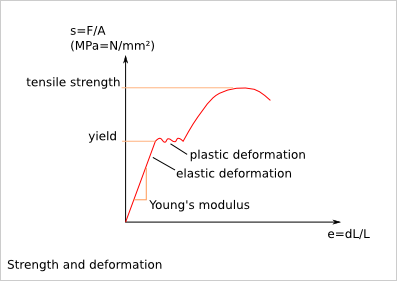

===============
Gear Guidelines
===============

Strength and deformation
========================

Gear module
===========

The *gear module* defines the size of a gear tooth. Two gearwheels working together must have the same *gear module*::

  circular_pitch = Pi * gear_module

Per default, the *tooth height* is defined with the *gear module*::

  addendum_height = gear_module
  dedendum_height = gear_module
  tooth_height = 2 * gear_module

A small *gear module* generates less friction and then provides a better energy transmission efficiency.
A large *gear module* supports higher efforts::

  Module sizing formula in the literaure:
  m>2.34*sqrt(T/(k*Rpe))
  with:
  T = tangential effort on the tooth = F*cos(a)
  torque = C = d*F
  d = R*cos(a) (R = primitive radius = Z*m/2)
  T = F*cos(a) = C/d*cos(a) = C/R
  k = tooth width coefficient (usually k=8 or 10)
  tooth width = b = k*m
  Rpe = Re/s
  Re = Yield = elasticity limit 
  s = security coefficient

