====================
Gear Profile Details
====================

Involute of circle
==================

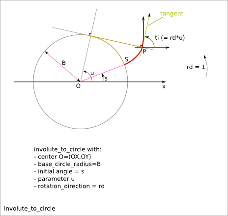
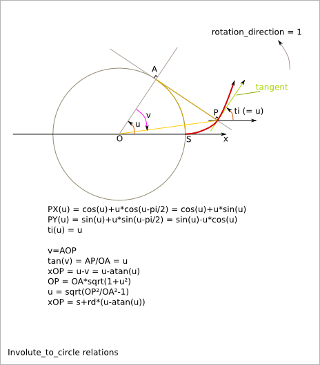
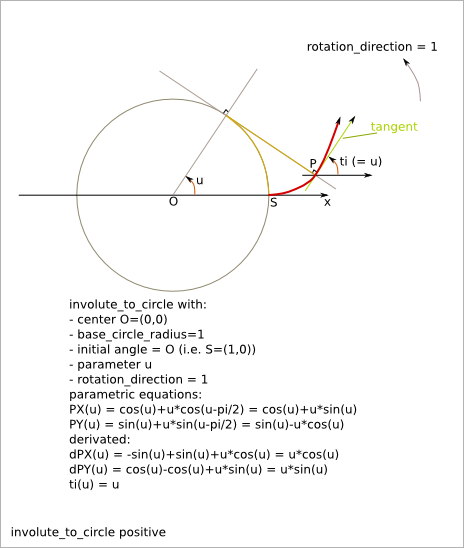
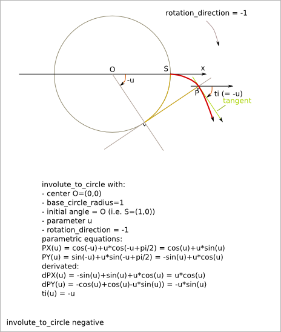

Gear outline
============

Gearwheel
---------

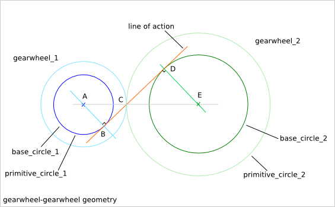
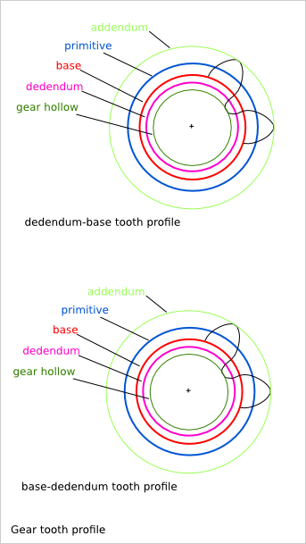
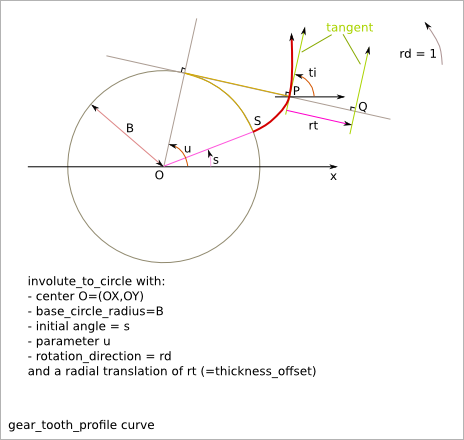

Gearring
--------

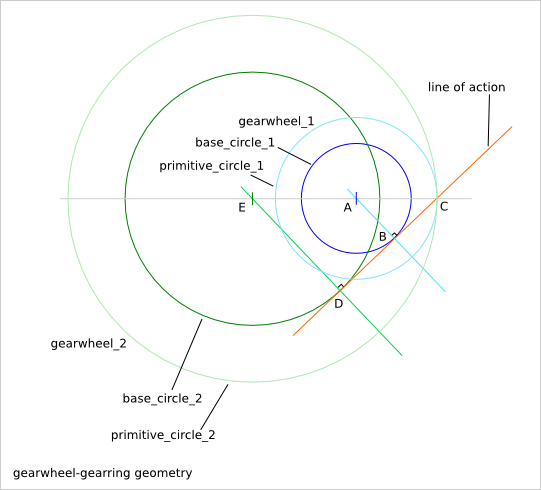

Gearbar
-------

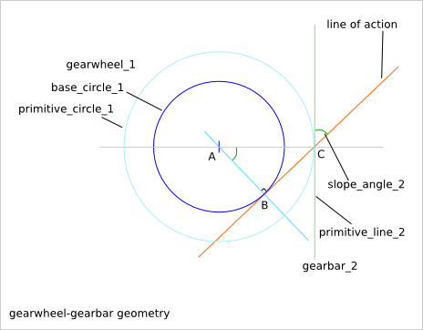
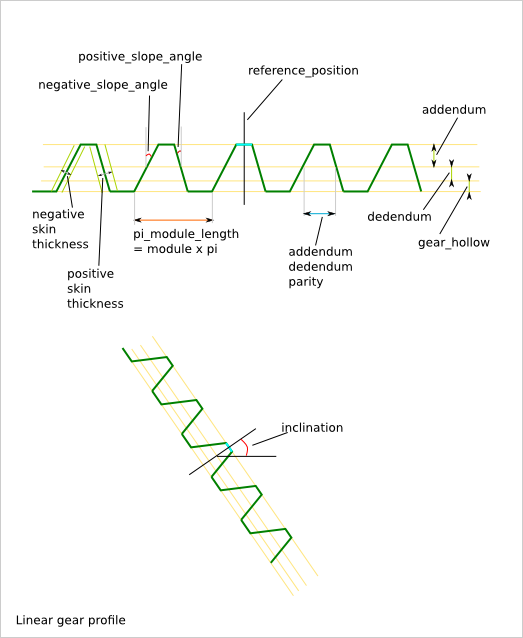

Gear hollow
-----------

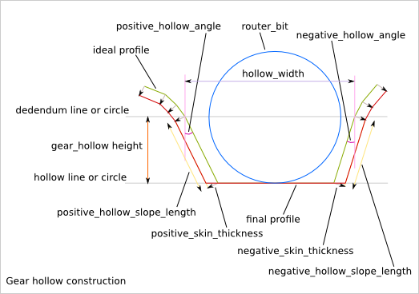
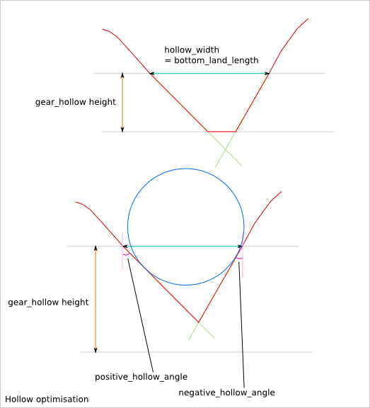
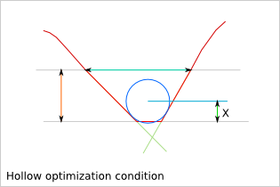
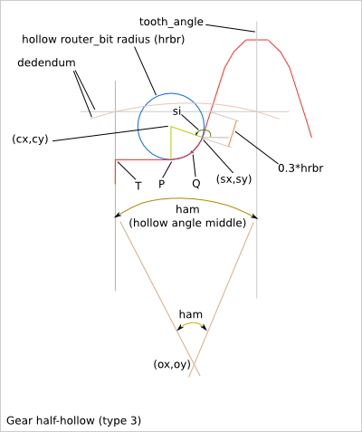

Gear position
=============

Gearwheel
---------

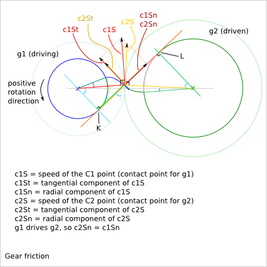

Gearbar
-------

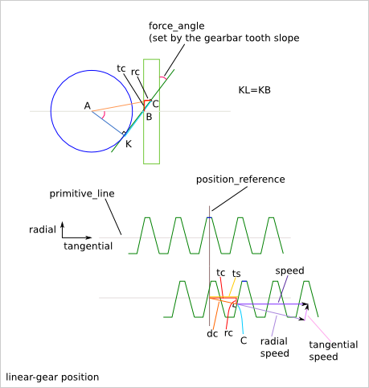

Position with additional inter-axis length
------------------------------------------

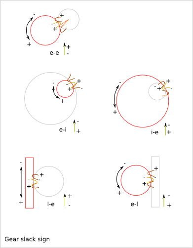
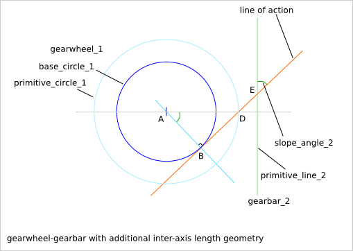
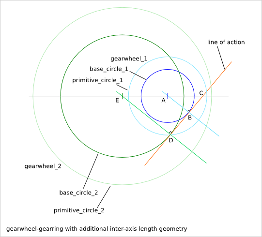
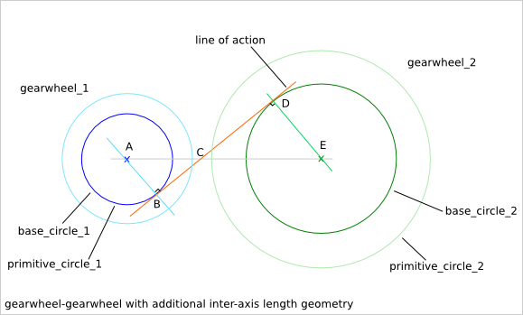
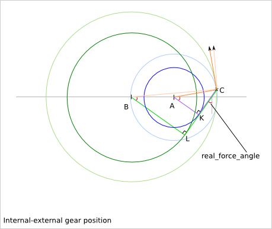
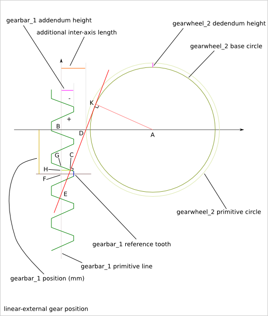

