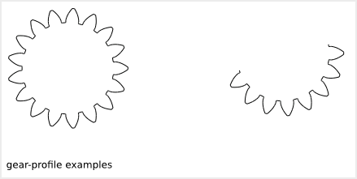

=====================
Gear Profile Function
=====================

The *gear_profile()* function generates a format-B outline of a gear profile with the following features:
  
  - the gear-profile (including the gear hollow) is makable by a 3-axis CNC
  - a gear system with two parts can be simulated with the Tkinter GUI
  - very configurable: asymmetrical teeth are possible
  - active tooth profile made out of arcs and with a continuous tangent inclination
  - optional portion of gear to make split gearwheel

To get an overview of the possible gear_profiles that can be generated by *gear_profile()*, run::

  > python gear_profile.py --run_self_test

Gear High-Level Parameters
==========================

The gear *high-level* parameters let describe with a reduce number of integers and floats a complete gear system. Some of these *high-level* are depending on each others.

gear_profile() Function Arguments List
======================================

The arguments of the function *gear_profile()* are not directly the *high-level* gear parameters but *constraints* used to deduce the *high-level* gear parameters.

The switches of the module *gear_profile.py* are directly connected to the function *gear_profile()*. Use the module *gear_profile.py* to experiment the *gear_profile()* arguments. Notice that *-h* and *--run_self_test* are not arguments of *gear_profile()*.

::
  
  usage: gear_profile.py [-h] [--gear_type SW_GEAR_TYPE]
                       [--gear_tooth_nb SW_GEAR_TOOTH_NB]
                       [--gear_module SW_GEAR_MODULE]
                       [--gear_primitive_diameter SW_GEAR_PRIMITIVE_DIAMETER]
                       [--gear_addendum_dedendum_parity SW_GEAR_ADDENDUM_DEDENDUM_PARITY]
                       [--gear_tooth_half_height SW_GEAR_TOOTH_HALF_HEIGHT]
                       [--gear_addendum_height_pourcentage SW_GEAR_ADDENDUM_HEIGHT_POURCENTAGE]
                       [--gear_dedendum_height_pourcentage SW_GEAR_DEDENDUM_HEIGHT_POURCENTAGE]
                       [--gear_hollow_height_pourcentage SW_GEAR_HOLLOW_HEIGHT_POURCENTAGE]
                       [--gear_router_bit_radius SW_GEAR_ROUTER_BIT_RADIUS]
                       [--gear_base_diameter SW_GEAR_BASE_DIAMETER]
                       [--gear_force_angle SW_GEAR_FORCE_ANGLE]
                       [--gear_tooth_resolution SW_GEAR_TOOTH_RESOLUTION]
                       [--gear_skin_thickness SW_GEAR_SKIN_THICKNESS]
                       [--gear_base_diameter_n SW_GEAR_BASE_DIAMETER_N]
                       [--gear_force_angle_n SW_GEAR_FORCE_ANGLE_N]
                       [--gear_tooth_resolution_n SW_GEAR_TOOTH_RESOLUTION_N]
                       [--gear_skin_thickness_n SW_GEAR_SKIN_THICKNESS_N]
                       [--second_gear_type SW_SECOND_GEAR_TYPE]
                       [--second_gear_tooth_nb SW_SECOND_GEAR_TOOTH_NB]
                       [--second_gear_primitive_diameter SW_SECOND_GEAR_PRIMITIVE_DIAMETER]
                       [--second_gear_addendum_dedendum_parity SW_SECOND_GEAR_ADDENDUM_DEDENDUM_PARITY]
                       [--second_gear_tooth_half_height SW_SECOND_GEAR_TOOTH_HALF_HEIGHT]
                       [--second_gear_addendum_height_pourcentage SW_SECOND_GEAR_ADDENDUM_HEIGHT_POURCENTAGE]
                       [--second_gear_dedendum_height_pourcentage SW_SECOND_GEAR_DEDENDUM_HEIGHT_POURCENTAGE]
                       [--second_gear_hollow_height_pourcentage SW_SECOND_GEAR_HOLLOW_HEIGHT_POURCENTAGE]
                       [--second_gear_router_bit_radius SW_SECOND_GEAR_ROUTER_BIT_RADIUS]
                       [--second_gear_base_diameter SW_SECOND_GEAR_BASE_DIAMETER]
                       [--second_gear_tooth_resolution SW_SECOND_GEAR_TOOTH_RESOLUTION]
                       [--second_gear_skin_thickness SW_SECOND_GEAR_SKIN_THICKNESS]
                       [--second_gear_base_diameter_n SW_SECOND_GEAR_BASE_DIAMETER_N]
                       [--second_gear_tooth_resolution_n SW_SECOND_GEAR_TOOTH_RESOLUTION_N]
                       [--second_gear_skin_thickness_n SW_SECOND_GEAR_SKIN_THICKNESS_N]
                       [--gearbar_slope SW_GEARBAR_SLOPE]
                       [--gearbar_slope_n SW_GEARBAR_SLOPE_N]
                       [--center_position_x SW_CENTER_POSITION_X]
                       [--center_position_y SW_CENTER_POSITION_Y]
                       [--gear_initial_angle SW_GEAR_INITIAL_ANGLE]
                       [--second_gear_position_angle SW_SECOND_GEAR_POSITION_ANGLE]
                       [--second_gear_additional_axis_length SW_SECOND_GEAR_ADDITIONAL_AXIS_LENGTH]
                       [--cut_portion SW_CUT_PORTION SW_CUT_PORTION SW_CUT_PORTION]
                       [--gear_profile_height SW_GEAR_PROFILE_HEIGHT]
                       [--simulation_enable]
                       [--output_file_basename SW_OUTPUT_FILE_BASENAME]
                       [--run_self_test]

  Command line interface for the function gear_profile().

  optional arguments:
  -h, --help            show this help message and exit
  --gear_type SW_GEAR_TYPE, --gt SW_GEAR_TYPE
                        Select the type of gear. Possible values: 'e', 'i',
                        'l'. Default: 'e'
  --gear_tooth_nb SW_GEAR_TOOTH_NB, --gtn SW_GEAR_TOOTH_NB
                        Set the number of teeth of the first gear_profile.
  --gear_module SW_GEAR_MODULE, --gm SW_GEAR_MODULE
                        Set the module of the gear. It influences the
                        gear_profile diameters.
  --gear_primitive_diameter SW_GEAR_PRIMITIVE_DIAMETER, --gpd SW_GEAR_PRIMITIVE_DIAMETER
                        If not zero, redefine the gear module to get this
                        primitive diameter of the first gear_profile. Default:
                        0. If gearbar, it redefines the length.
  --gear_addendum_dedendum_parity SW_GEAR_ADDENDUM_DEDENDUM_PARITY, --gadp SW_GEAR_ADDENDUM_DEDENDUM_PARITY
                        Set the addendum / dedendum parity of the first
                        gear_profile. Default: 50.0%
  --gear_tooth_half_height SW_GEAR_TOOTH_HALF_HEIGHT, --gthh SW_GEAR_TOOTH_HALF_HEIGHT
                        If not zero, redefine the tooth half height of the
                        first gear_profile. Default: 0.0
  --gear_addendum_height_pourcentage SW_GEAR_ADDENDUM_HEIGHT_POURCENTAGE, --gahp SW_GEAR_ADDENDUM_HEIGHT_POURCENTAGE
                        Set the addendum height of the first gear_profile in
                        pourcentage of the tooth half height. Default: 100.0%
  --gear_dedendum_height_pourcentage SW_GEAR_DEDENDUM_HEIGHT_POURCENTAGE, --gdhp SW_GEAR_DEDENDUM_HEIGHT_POURCENTAGE
                        Set the dedendum height of the first gear_profile in
                        pourcentage of the tooth half height. Default: 100.0%
  --gear_hollow_height_pourcentage SW_GEAR_HOLLOW_HEIGHT_POURCENTAGE, --ghhp SW_GEAR_HOLLOW_HEIGHT_POURCENTAGE
                        Set the hollow height of the first gear_profile in
                        pourcentage of the tooth half height. The hollow is a
                        clear space for the top of the teeth of the other
                        gearwheel. Default: 25.0%
  --gear_router_bit_radius SW_GEAR_ROUTER_BIT_RADIUS, --grr SW_GEAR_ROUTER_BIT_RADIUS
                        Set the router_bit radius used to create the gear
                        hollow of the first gear_profile. Default: 0.1
  --gear_base_diameter SW_GEAR_BASE_DIAMETER, --gbd SW_GEAR_BASE_DIAMETER
                        If not zero, redefine the base diameter of the first
                        gear involute. Default: 0
  --gear_force_angle SW_GEAR_FORCE_ANGLE, --gfa SW_GEAR_FORCE_ANGLE
                        If not zero, redefine the gear_base_diameter to get
                        this force angle at the gear contact. Default: 0.0
  --gear_tooth_resolution SW_GEAR_TOOTH_RESOLUTION, --gtr SW_GEAR_TOOTH_RESOLUTION
                        It sets the number of segments of the gear involute.
                        Default: 2
  --gear_skin_thickness SW_GEAR_SKIN_THICKNESS, --gst SW_GEAR_SKIN_THICKNESS
                        Add or remove radial thickness on the gear involute.
                        Default: 0.0
  --gear_base_diameter_n SW_GEAR_BASE_DIAMETER_N, --gbdn SW_GEAR_BASE_DIAMETER_N
                        If not zero, redefine the base diameter of the first
                        gear negative involute. Default: 0
  --gear_force_angle_n SW_GEAR_FORCE_ANGLE_N, --gfan SW_GEAR_FORCE_ANGLE_N
                        If not zero, redefine the negative_gear_base_diameter
                        to get this force angle at the gear contact. Default:
                        0.0
  --gear_tooth_resolution_n SW_GEAR_TOOTH_RESOLUTION_N, --gtrn SW_GEAR_TOOTH_RESOLUTION_N
                        If not zero, it sets the number of segments of the
                        gear negative involute. Default: 0
  --gear_skin_thickness_n SW_GEAR_SKIN_THICKNESS_N, --gstn SW_GEAR_SKIN_THICKNESS_N
                        If not zero, add or remove radial thickness on the
                        gear negative involute. Default: 0.0
  --second_gear_type SW_SECOND_GEAR_TYPE, --sgt SW_SECOND_GEAR_TYPE
                        Select the type of gear. Possible values: 'e', 'i',
                        'l'. Default: 'e'
  --second_gear_tooth_nb SW_SECOND_GEAR_TOOTH_NB, --sgtn SW_SECOND_GEAR_TOOTH_NB
                        Set the number of teeth of the second gear_profile.
  --second_gear_primitive_diameter SW_SECOND_GEAR_PRIMITIVE_DIAMETER, --sgpd SW_SECOND_GEAR_PRIMITIVE_DIAMETER
                        If not zero, redefine the gear module to get this
                        primitive diameter of the second gear_profile.
                        Default: 0.0. If gearbar, it redefines the length.
  --second_gear_addendum_dedendum_parity SW_SECOND_GEAR_ADDENDUM_DEDENDUM_PARITY, --sgadp SW_SECOND_GEAR_ADDENDUM_DEDENDUM_PARITY
                        Overwrite the addendum / dedendum parity of the second
                        gear_profile if different from 0.0. Default: 0.0%
  --second_gear_tooth_half_height SW_SECOND_GEAR_TOOTH_HALF_HEIGHT, --sgthh SW_SECOND_GEAR_TOOTH_HALF_HEIGHT
                        If not zero, redefine the tooth half height of the
                        second gear_profile. Default: 0.0
  --second_gear_addendum_height_pourcentage SW_SECOND_GEAR_ADDENDUM_HEIGHT_POURCENTAGE, --sgahp SW_SECOND_GEAR_ADDENDUM_HEIGHT_POURCENTAGE
                        Set the addendum height of the second gear_profile in
                        pourcentage of the tooth half height. Default: 100.0%
  --second_gear_dedendum_height_pourcentage SW_SECOND_GEAR_DEDENDUM_HEIGHT_POURCENTAGE, --sgdhp SW_SECOND_GEAR_DEDENDUM_HEIGHT_POURCENTAGE
                        Set the dedendum height of the second gear_profile in
                        pourcentage of the tooth half height. Default: 100.0%
  --second_gear_hollow_height_pourcentage SW_SECOND_GEAR_HOLLOW_HEIGHT_POURCENTAGE, --sghhp SW_SECOND_GEAR_HOLLOW_HEIGHT_POURCENTAGE
                        Set the hollow height of the second gear_profile in
                        pourcentage of the tooth half height. The hollow is a
                        clear space for the top of the teeth of the other
                        gearwheel. Default: 25.0%
  --second_gear_router_bit_radius SW_SECOND_GEAR_ROUTER_BIT_RADIUS, --sgrr SW_SECOND_GEAR_ROUTER_BIT_RADIUS
                        If not zero, overwrite the router_bit radius used to
                        create the gear hollow of the second gear_profile.
                        Default: 0.0
  --second_gear_base_diameter SW_SECOND_GEAR_BASE_DIAMETER, --sgbd SW_SECOND_GEAR_BASE_DIAMETER
                        If not zero, redefine the base diameter of the second
                        gear involute. Default: 0.0
  --second_gear_tooth_resolution SW_SECOND_GEAR_TOOTH_RESOLUTION, --sgtr SW_SECOND_GEAR_TOOTH_RESOLUTION
                        If not zero, it sets the number of segments of the
                        second gear involute. Default: 0
  --second_gear_skin_thickness SW_SECOND_GEAR_SKIN_THICKNESS, --sgst SW_SECOND_GEAR_SKIN_THICKNESS
                        Add or remove radial thickness on the gear involute.
                        Default: 0.0
  --second_gear_base_diameter_n SW_SECOND_GEAR_BASE_DIAMETER_N, --sgbdn SW_SECOND_GEAR_BASE_DIAMETER_N
                        If not zero, redefine the base diameter of the second
                        gear negative involute. Default: 0.0
  --second_gear_tooth_resolution_n SW_SECOND_GEAR_TOOTH_RESOLUTION_N, --sgtrn SW_SECOND_GEAR_TOOTH_RESOLUTION_N
                        If not zero, it sets the number of segments of the
                        second gear negative involute. Default: 0
  --second_gear_skin_thickness_n SW_SECOND_GEAR_SKIN_THICKNESS_N, --sgstn SW_SECOND_GEAR_SKIN_THICKNESS_N
                        If not zero, add or remove radial thickness on the
                        gear negative involute. Default: 0.0
  --gearbar_slope SW_GEARBAR_SLOPE, --gbs SW_GEARBAR_SLOPE
                        if not zero, set the tooth slope angle for the
                        gearbar. Default 0.0
  --gearbar_slope_n SW_GEARBAR_SLOPE_N, --gbsn SW_GEARBAR_SLOPE_N
                        if not zero, set the tooth negative slope angle for
                        the gearbar. Default 0.0
  --center_position_x SW_CENTER_POSITION_X, --cpx SW_CENTER_POSITION_X
                        Set the x-position of the first gear_profile center.
                        Default: 0.0
  --center_position_y SW_CENTER_POSITION_Y, --cpy SW_CENTER_POSITION_Y
                        Set the y-position of the first gear_profile center.
                        Default: 0.0
  --gear_initial_angle SW_GEAR_INITIAL_ANGLE, --gia SW_GEAR_INITIAL_ANGLE
                        Set the gear reference angle (in Radian). Default: 0.0
  --second_gear_position_angle SW_SECOND_GEAR_POSITION_ANGLE, --sgpa SW_SECOND_GEAR_POSITION_ANGLE
                        Angle in Radian that sets the postion on the second
                        gear_profile. Default: 0.0
  --second_gear_additional_axis_length SW_SECOND_GEAR_ADDITIONAL_AXIS_LENGTH, --sgaal SW_SECOND_GEAR_ADDITIONAL_AXIS_LENGTH
                        Set an additional value for the inter-axis length
                        between the first and the second gear_profiles.
                        Default: 0.0
  --cut_portion SW_CUT_PORTION SW_CUT_PORTION SW_CUT_PORTION, --cp SW_CUT_PORTION SW_CUT_PORTION SW_CUT_PORTION
                        (N, first_end, last_end) If N>1, cut a portion of N
                        tooth ofthe gear_profile. first_end and last_end
                        defines in details where the profile stop (0: slope-
                        top, 1: top-middle, 2: slope-bottom, 3: hollow-
                        middle). Default: (0,0,0)
  --gear_profile_height SW_GEAR_PROFILE_HEIGHT, --gwh SW_GEAR_PROFILE_HEIGHT
                        Set the height of the linear extrusion of the first
                        gear_profile. Default: 1.0
  --simulation_enable, --se
                        It display a Tk window where you can observe the gear
                        running. Check with your eyes if the geometry is
                        working.
  --output_file_basename SW_OUTPUT_FILE_BASENAME, --ofb SW_OUTPUT_FILE_BASENAME
                        If not the empty_string (the default value), it
                        outputs the (first) gear in file(s) depending on your
                        argument file_extension: .dxf uses mozman dxfwrite,
                        .svg uses mozman svgwrite, no-extension uses FreeCAD
                        and you get .brep and .dxf
  --run_self_test, --rst
                        Generate several corner cases of parameter sets and
                        display the Tk window where you should check the gear
                        running.

From gear_profile() arguments to high-level parameters
======================================================

