===================
Gear Profile Theory
===================

Transmission per adhesion
=========================

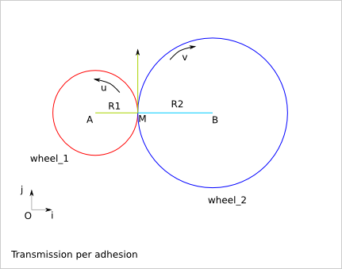

::

  (O,i,j) orthonormal reference frame

  wheel_1 rotation speed: u (radian/s)
  wheel_2 rotation speed: v (radian/s)

speed of M, point of wheel_1::

  V(M) = u*R1*j
  
speed of N, point of wheel_2::

  V(N) = v*R2*j

Because of the adhesion of the wheel_1 and wheel_2 in M::

  V(M).j = V(N).j
  u*R1 = v*R2
  v = u*R1/R2

Issue
-----
The maximal torque transmission is limited by the adhesion capacity.

Idea
----

Create hollows and bums around the wheel to get a contact point force transmission.

Transmission with teeth
=======================

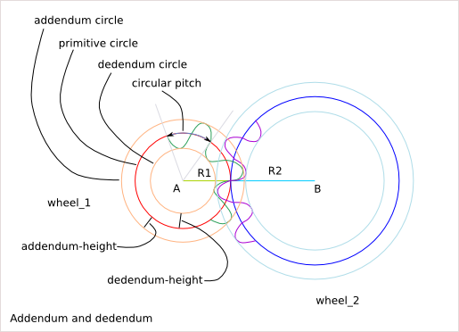

One wheel description
---------------------

::

  angular_pitch = 2*pi/tooth_nb
  circular_pitch = angular_pitch * primitive radius
  addendum_radius = primitive_radius + addendum_height
  dedendum_radius = primitive_radius + dedendum_height
  tooth_height = addendum_height + dedendum_height

Conditions for working gear
---------------------------

::

  circular_pitch_1 = circular_pitch_2
  addendum_height_1 < dedendum_height_2
  addendum_height_2 < dedendum_height_1
  transmission ratio = primitive_radius_1 / primitive_radius_2 = tooth_nb_1 / tooth_nb_2

Problematic: How to design the tooth-profile?

Tooth profile
=============

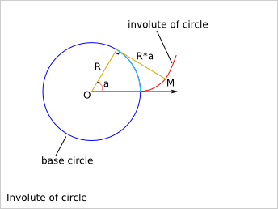

Cartesian equation::

  Mx(a) = R*cos(a)+a*R*cos(a-pi/2)
  My(a) = R*sin(a)+a*R*sin(a-pi/2)

Trigonometry formula remind::

  cos(-x) = cos(x)
  sin(-x) = -sin(x)
  cos(pi/2-x) = sin(x)
  sin(pi/2-x) = cos(x)
  cos(a-pi/2)=cos(pi/2-a)=sin(a)
  sin(a-pi/2)=-sin(pi/2-a)=-cos(a)

Tangent vector::

  Mx'(a) = -R*sin(a)+R*cos(a-pi/2)-a*R*sin(a-pi/2) = -a*R*sin(a-pi/2) = a*R*cos(a)
  My'(a) =  R*cos(a)+R*sin(a-pi/2)+a*R*cos(a-pi/2) =  a*R*cos(a-pi/2) = a*R*sin(a)

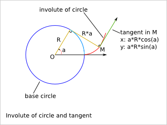

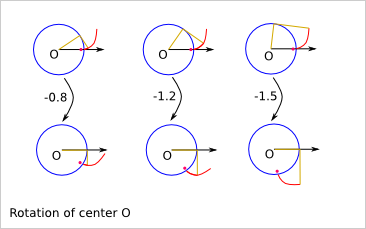
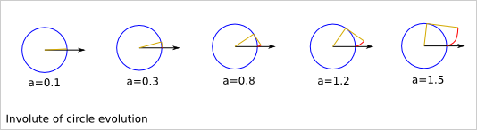
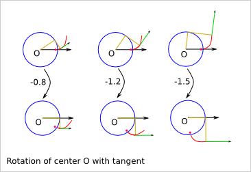
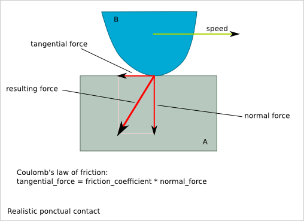
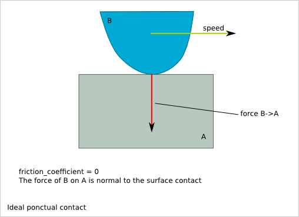
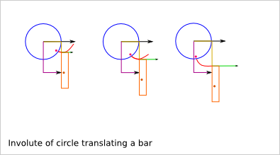
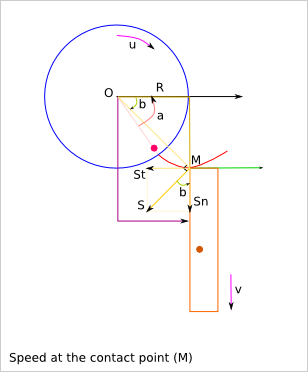

::

  u: rotation speed of the wheel
  v: linear speed of tha bar
  u(t) = d/dt(a(t))
  
  OM = sqrt(R² + (a*R)²) = R*sqrt(1+a²)
  
  S = OM*u
  Sn = S*cos(b)
  St = S*sin(b)
  
  Sn = u*R*sqrt(1+a²)*cos(b)
  relation between a(t) and b(t)?
  tan(b) = (a*R)/R = a
  Sn = u*R*sqrt(1+tan²(b))*cos(b)

Trigonometry formula remind::

  1+tan²(x) = (cos²(x)+sin²(x))/cos²(x) = 1/cos²(x)

So,::

  v = Sn = u*R

v does not depend on the angle a!

::

  St = u*R*sqrt(1+a²)*sin(b) = u*R*tan(b) = u*R*a

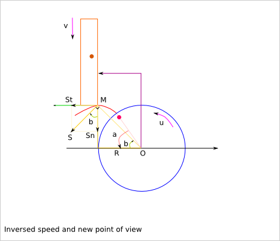

::

  u: rotation speed of the wheel
  v: linear speed of tha bar
  u(t) = d/dt(a(t))
  
  OM = sqrt(R² + (a*R)²) = R*sqrt(1+a²)
  
  S = OM*u
  Sn = S*cos(b)
  St = S*sin(b)
  
  v = Sn = u*R*sqrt(1+a²)*cos(b)
  = u*R*sqrt(1+tan²(b))*cos(b) = u*R

v does not depend on the angle a!

::

  St = u*R*sqrt(1+a²)*sin(b) = u*R*tan(b) = u*R*a

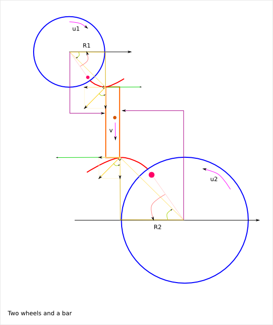

::

  v = u1*R1 = u2*R2
  So, u2 = u1*R1/R2

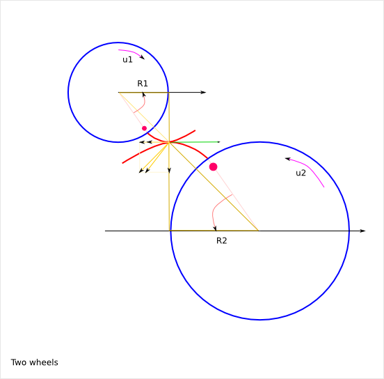

Sn1 = Sn2 because of the contact

Friction between the two wheels::

  Sf = St2 - St1 = u2*R2*a2 - u1*R1*a1
  = u1*R1*(a2-a1)
  But,
  a1 = k1-u1*t
  a2 = k2+u2*t
  Sf = u1*R1*(k1-k2+(u1+u2)*t)

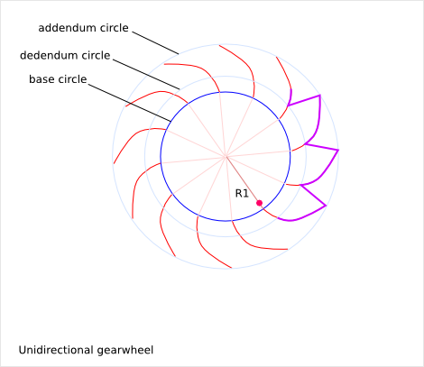
.. image:: images/gear_theory_bidirectional_gearwheel.png

Gear rules
==========

- The base diameter of the two directions can be different

- The top-land and bottom-land are not critical part of the profile
    The top-land can be a straight line. 
    The bottom-land is usually a hollow to help the manufacturing.

- The rotation ratio implies by the involutes-of-circles is::

    base_radius_1 / base_radius_2

  The rotation ratio implies by the teeth is::

    tooth_nb_1 / tooth_nb_2

  In order to get a continuous transmission without cough, we must ensure that::

    base_radius_1 / base_radius_2 = tooth_nb_1 / tooth_nb_2

  If you use two base circles for the positive rotation and the negative rotation, then::

    base_radius_positive_1 / base_radius_positive_2 = tooth_nb_1 / tooth_nb_2
    base_radius_negative_1 / base_radius_negative_2 = tooth_nb_1 / tooth_nb_2

- The position of the positive involute of circle compare to the negative involute of circle is arbitrary and it is usually defined by the addendum-dedendum-ration on the primitive circle. Just make sure the top-land and bottom-land still exist (positive length). The addendum-dedendum-ration of the second wheel must be the complementary.

Torque transmission
===================

.. image:: images/gear_theory_torque_transmission.png

::

  F = T1/R1 = T2/R2
  T2 = T1*R2/R1

The transmitted torque T2 does not depend on the angle a!

