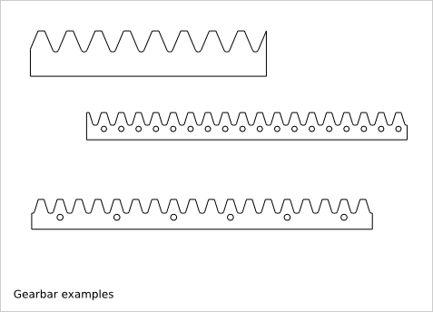
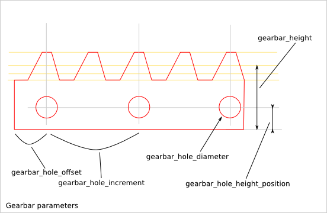

==============
Gearbar Design
==============

Ready-to-use parametric *gearbar* design (a.k.a. rack).

To get an overview of the possible gearbar designs that can be generated by *gearbar()*, run::

  > python gearbar.py --run_self_test

Gearbar Parameter List
======================

The parameter relative to the gear-profile are directly inherit from the :doc:`gear_profile_function`.

Gearbar Parameter Dependency
============================

gearbar_hole_diameter
---------------------

*gearbar_hole_diameter* sets the diameter of the  gearbar-holes. If *gearbar_hole_diameter* is set to 0.0, no gearbar-hole are created.

gearbar_hole_height_position
----------------------------

*gearbar_hole_height_position* sets the vertical position of the gearbar-hole centers. *gearbar_hole_height_position* must be placed between the bottom of the gearbar and the gear-profile::

  gearbar_hole_radius = gearbar_hole_diameter/2
  gearbar_hole_height_position > gearbar_hole_radius
  gearbar_hole_height_position < minimal_gear_profile_height - gearbar_hole_radius

gearbar_hole_offset and gearbar_hole_increment
----------------------------------------------

The abscissas of the centers of the gearbar-holes are always located at the middle of the addendum of a gear-tooth. *gearbar_hole_offset* sets the number of gear-teeth between the left-side of the gearbar to the first gearbar-hole. *gearbar_hole_increment* sets the number of gear-teeth between two consecutive  gearbar-holes::

  gearbar_hole_increment > 0

gear_tooth_nb
-------------

*gear_tooth_nb* sets the number of teeth of the gear_profile. If *gear_tooth_nb* is set to zero, the gear_profile is replaced by a simple line of length *gear_primitive_radius*.

Alignment
---------

*gear_initial_angle*, *center_position_x*, *center_position_y* and *second_gear_position_angle* are only used for the simulation. The gearbar as a simple display, as a FreeCAD object or as a design file is always placed to get its bottom-left corner at the (0,0) coordinates.

