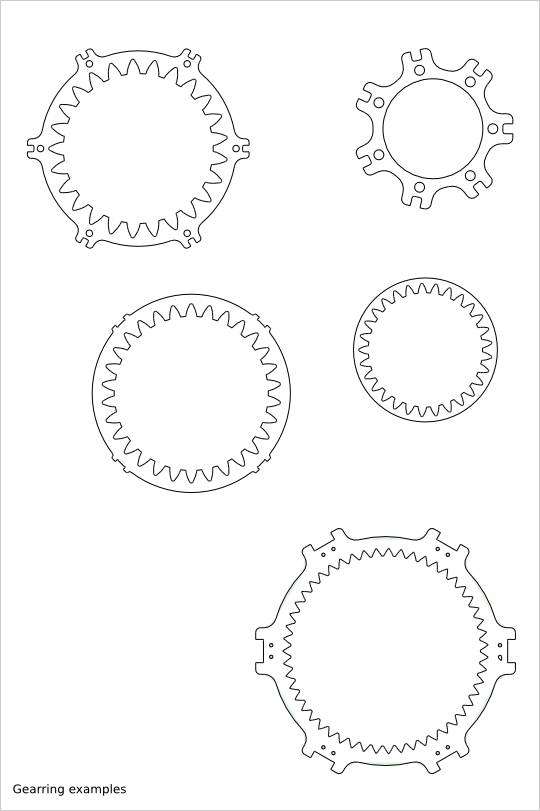
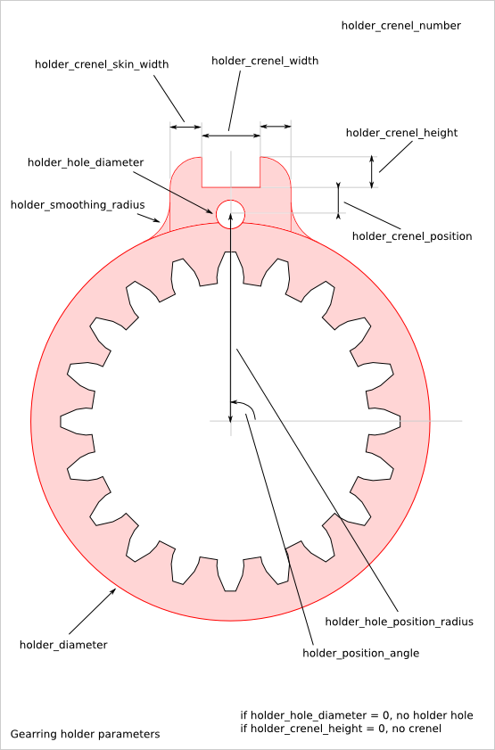
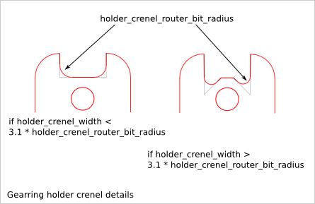
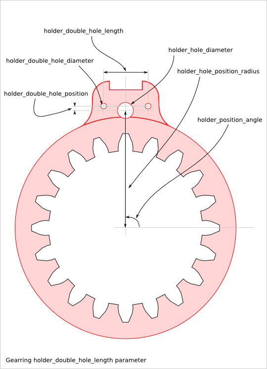

===============
Gearring Design
===============

Ready-to-use parametric *gearring* design (a.k.a. annulus).

To get an overview of the possible gearring designs that can be generated by *gearring()*, run::

  > python gearring.py --run_self_test

Gearring Parameter List
=======================

The parameter relative to the gear-profile are directly inherit from the :doc:`gear_profile_function`.

Gearring Parameter Dependency
=============================

router_bit_radius
-----------------

Four router_bit radius are defined: *gear_router_bit_radius*, *holder_crenel_router_bit_radius*, *holder_smoothing_radius* and *cnc_router_bit_radius*. Each set the router_bit radius for different areas except *cnc_router_bit_radius* that set the minimum value for the three other router_bit radius. If an other router_bit radius is smaller than *cnc_router_bit_radius*, it is set to *cnc_router_bit_radius*. So, we have the relations::

  cnc_router_bit_radius < gear_router_bit_radius
  cnc_router_bit_radius < holder_crenel_router_bit_radius
  cnc_router_bit_radius < holder_smoothing_radius

If you leave *holder_smoothing_radius* to 0.0, it will be changed automatically to the biggest possible value.

holder_hole_diameter
--------------------

*holder_hole_diameter* sets the diameter of the  holder-holes. If *holder_hole_diameter* is set to 0.0, no holder-hole are created.

holder_crenel_number
--------------------

*holder_crenel_number* sets the number of holder-crenels (equal to the number of holder-hole). If *holder_crenel_number* is set to zero, no holder-crenel is created and the outline of the gearring is a simple circle.

holder_crenel_width
-------------------

*holder_crenel_width* must be bigger than the router_bit diameter::

  holder_crenel_width > 2 * holder_crenel_router_bit_radius

If *holder_crenel_width* is big enough, the crenel bottom shape is changed to get *alternative enlarged* corners.

gear_tooth_nb
-------------

*gear_tooth_nb* sets the number of teeth of the gear_profile. If *gear_tooth_nb* is set to zero, the gear_profile is replaced by a simple circle of diameter *gear_primitive_radius*.

Alignment angles
----------------

*gear_initial_angle* sets the angle between the X-axis and the middle of the addendum of the first tooth. *holder_position_angle* sets the angle between the X-axis and the middle of the first holder-crenel. Use *gear_initial_angle* or  *holder_position_angle* or both to ajust the offset angle between the gear-profile anf the gearring-holder.

holder_hole_mark_nb
-------------------

*holder_hole_mark_nb* lets you modify the first (or the several first) crenel to help you recognizing the first tooth. The first crenels have a egg-form instead of the circle-form. If you don't want to mark the first crenel, set *crenel_mark_nb* to *zero*. This feature is useful when you need pile up gearring and find easily the first tooth to align them.

holder_double_hole
------------------

In addition to the *holder_hole*, you can generate the *holder_double_hole* defined by the parameters *holder_double_hole_diameter*, *holder_double_hole_length* and *holder_double_holde_position*. The distance between the two double_holes is set by *holder_double_hole_length*. The radius position is set by *holder_double_holde_position* relative to the *holder_hole_position_radius*.
The *holder_double_holes* are useful when you use the crenel-hole with thin steel-rod for alignment and Z-shearing resistance and you want to increase the stability. At the same time, you can use the *holder_holes* to put threaded rods.

