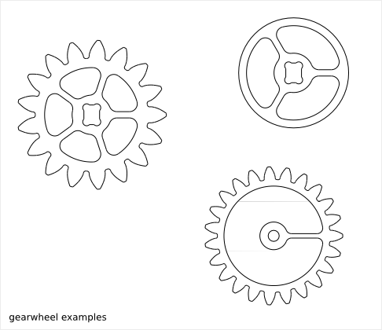
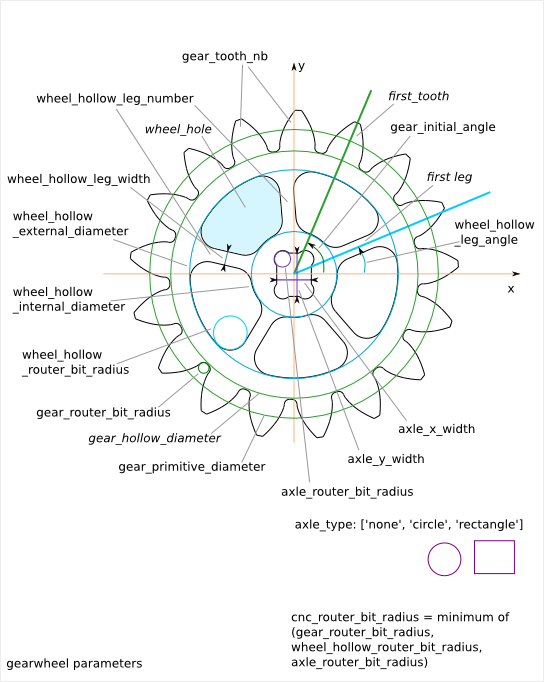

================
Gearwheel Design
================

Ready-to-use parametric *gearwheel* design.

Gearwheel Parameter List
========================

The parameter relative to the gear-profile are directly inherit from the :doc:`gear_profile_function`.

Gearwheel Parameter Dependency
==============================

router_bit_radius
-----------------

Four router_bit radius are defined: *gear_router_bit_radius*, *wheel_hollow_router_bit_radius*, *axle_router_bit_radius* and *cnc_router_bit_radius*. Each set the router_bit radius for different areas except *cnc_router_bit_radius* that set the mimnimum value for the three other router_bit radius. If an other router_bit radius is smaller than *cnc_router_bit_radius*, it is set to *cnc_router_bit_radius*. So, we have the relations::

  cnc_router_bit_radius < gear_router_bit_radius
  cnc_router_bit_radius < wheel_hollow_router_bit_radius
  cnc_router_bit_radius < axle_router_bit_radius

axle_type
---------

Three possible shapes of axle are possible: *none*, *circle* or *rectangle*. *none* means there is no axle (*axle_x_width* and *axle_y_width* are ignored). For *circle*, the parameter *axle_x_width* is used to set the circle diameter (*axle_y_width* is ignored). *axle_x_width* and *axle_y_width* must be bigger than twice *axle_router_bit_radius*::

  2*axle_router_bit_radius < axle_x_width
  2*axle_router_bit_radius < axle_y_width

wheel_hollow_leg_number
-----------------------

*wheel_hollow_leg_number* sets the number of legs (equal the number of wheel_hollows). If you set zero, no wheel_hollow are created and the other parameters related to the wheel_hollow are ignored. *wheel_hollow_internal_diameter* must be bigger than the axle. *wheel_hollow_external_diameter* must be smaller than the *gear_hollow_diameter* (which is not a parameter but derivated from other gear parameter)::

  axle_x_width < wheel_hollow_internal_diameter
  sqrt(axle_x_width²+axle_y_width²) < wheel_hollow_internal_diameter
  wheel_hollow_internal_diameter + 4*wheel_hollow_router_bit_radius < wheel_hollow_external_diameter
  wheel_hollow_external_diameter < gear_hollow_diameter

gear_tooth_nb
-------------

*gear_tooth_nb* sets the number of teeth of the gear_profile. It *gear_tooth_nb* is set to zero, the gear_profile is replaced by a simple circle of diameter *gear_primitive_radius*.

Alignment angles
----------------

The rectangle axle is always fixed to the XY-axis. The angle between the first *wheel_hollow leg* (middle of it) and the X-axis is set with *wheel_hollow_leg_angle*. The angle between the first *gear_profile* tooth (middle of the addendum) and the X-axis is set with *gear_initial_angle*.

