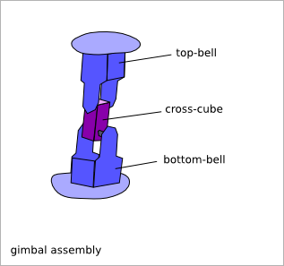
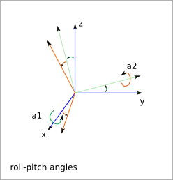

=============
Gimbal Design
=============

Ready-to-use parametric *gimbal* design. It is a mechanism with two degrees of freedom, that let's adjusting the roll-pitch orientation.
.. .. image:: images/gimbal_parts_examples.png

To get an overview of the possible *gimbal* designs that can be generated by *gimbal()*, run::

  > python gimbal.py --run_self_test

Gimbal Parameters
=================

The *gimbal* mechanism is composed by two *bell_bagel_assembly* and one *cross_cube* with crests.

The *gimbal* parameters are inherited from :doc:`cross_cube_design` and :doc:`bell_bagel_assembly`.
In addition to the *cross_cube* parameters and *bell_bagel* parameters, you have the two *roll-pitch* angles.

Gimbal Construction
===================

Material
--------

The *bagels* and the *cross_cube* are done with an harder material than the *bell*.

Assembly order
--------------

* make the *cross_cube*
* make the *bell* without the *bagels*
* make the *motors*
* place the *cross_cube* into the *bell-leg-axle-hole*
* mount the *bagels*
* mount the *motors*

