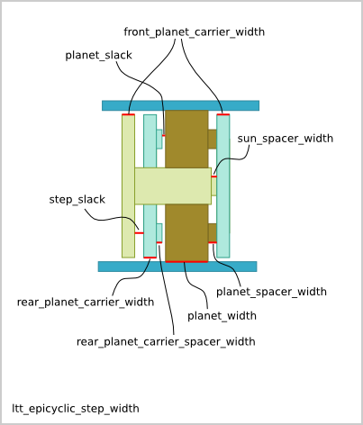
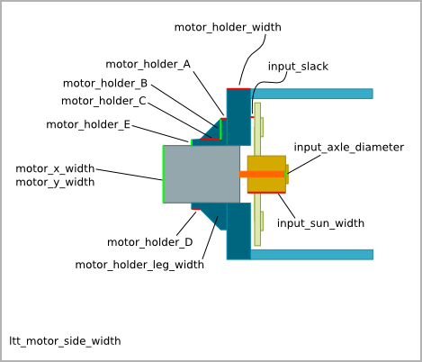
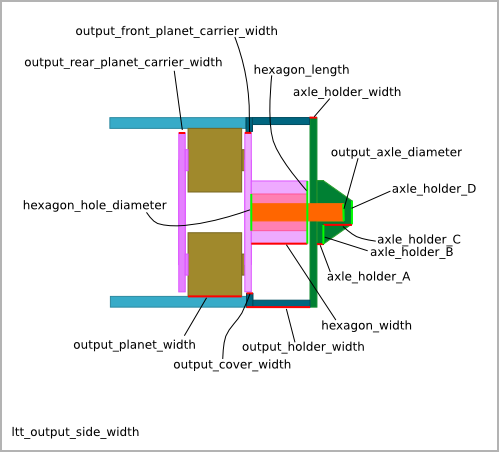
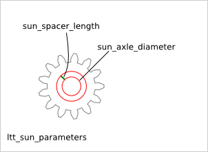
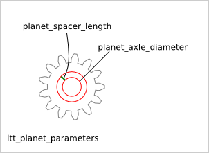
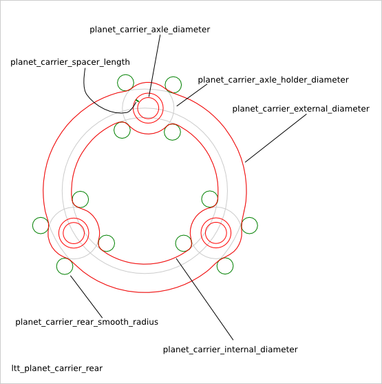
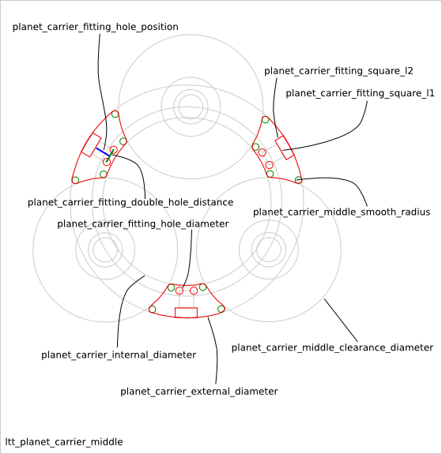
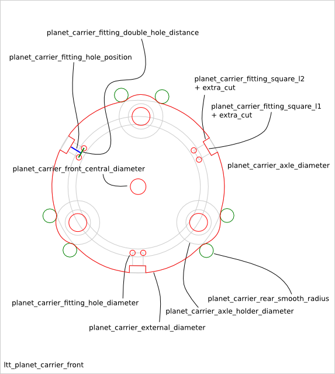

==============================
Low_torque_transmission Design
==============================

Ready-to-use parametric *low-torque-transmission* design. It is a reduction system based on a train of epicyclic-gearing. The design includes the electric-motor holder for a cylindric or square format. The output is an hexagon on which you can plug a gearwheel. It is a variant of :doc:`epicyclic_gearing_design`

low_torque_transmission design characteristics:

- train of epicyclic-gearing of n-step (to reach a high reduction ratio)
- same epicyclic profile for the n-step (to get a simple gearring-holder desing)
- same epicyclic width for the n-1 first steps (only the last step might at its yield limits)
- epicyclic with 3 planets (for a more stable planet-holder)
- coaxial electric motor at the input (for a compact and reliable transmission)
- hexagon at the output (for an exchangeable output gearwheel)
- output axle hold on one side only (because on the other side, there is already the motor)

To get an overview of the possible *low_torque_transmission* designs that can be generated by *low_torque_transmission()*, run::

  > python low_torque_transmission.py --run_self_test

Low_torque_transmission Parameters
==================================

Overview
________

The Low_torque_transmission is composed of the following parts

.. image:: images/low_torque_transmission.png

The *low_torque_transmission* inherits the parameters from the :doc:`gearring_design`. The parameter *epicyclic_step_nb* sets the number of epicyclic-steps.

z-direction parameters
______________________

The parameters related to the extrusion size in the z-direction:

Sun and planet parameters
_________________________

Planet-carrier parameters
_________________________

Low_torque_transmission Parameter Dependency
============================================

hexagon_width
_____________

The *output_hexagon* must into the *output_holder*. But also the *output_front_planet_carrier_width* must be inside the *output-cover to guarantee enough slack between the *output_planet* and the *output_cover*. So we get the relations::

  output_cover_width + hexagon_width > output_holder_width
  hexagon_width < output_holder_width

input_slack
___________

The *input_slack* parameter sets some play between the *motor_holder* and the first *rear_planet_carrier*. Notice that this value is affected by the length of the output axle.

