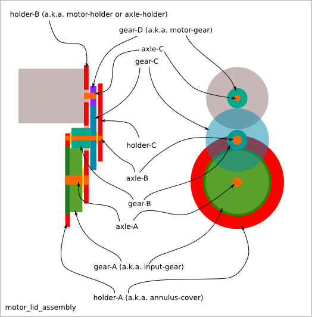
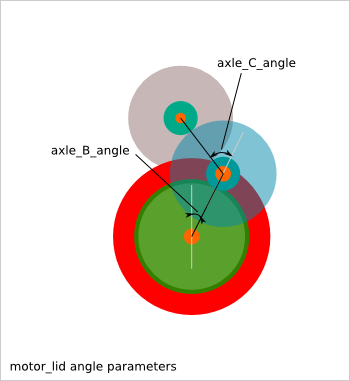
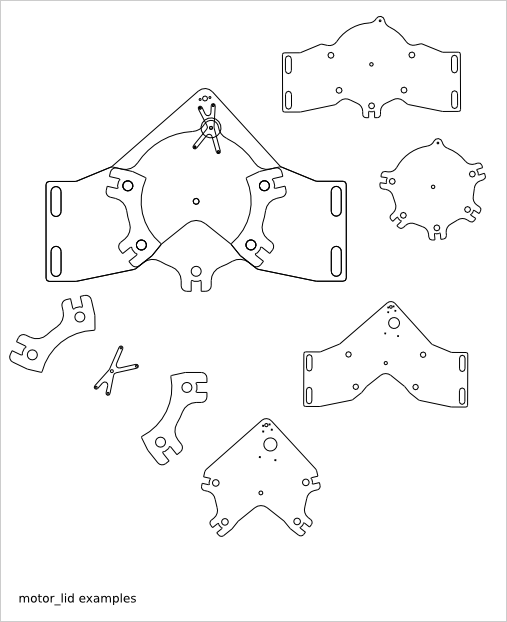
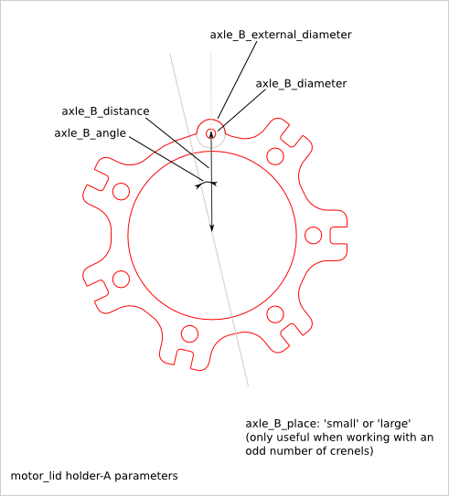
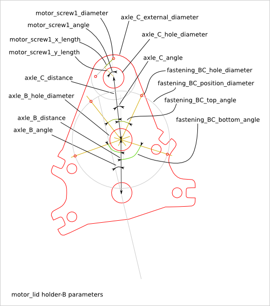
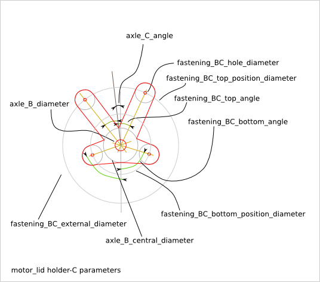

================
Motor Lid Design
================

Ready-to-use parametric *motor_lid* assembly. This assembly aims at holding the gear system between an electric motor and the epicyclic-gearing. The *motor_lid* is an assembly of several parts:

  - holder-A (a.k.a. annulus-holder)
  - holder-B (a.k.a. motor-holder or axle-holder)
  - holder-C

To get an overview of the possible motor_lid designs that can be generated by *motor_lid()*, run::

  > python mostor_lid.py --run_self_test

Motor-lid Parameter List
========================

The parameter relative to the external outline are inherit from the :doc:`gearring_design` and :doc:`axle_lid_design`.

