=========================
Plank Positioning Details
=========================

Plank definition
================

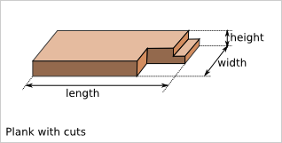

We call plank a 3D shape with a rectangular cuboid as construction base. The rectangular cuboid is defined by the three values: length, width and height with the relations: length > width > height.
With addition ad-hoc conventions, any shape can be considered as a plank.

Plank reference frame
=====================

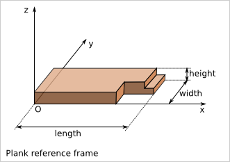

We choose the reference frame such as:

- x is the length direction
- y is the width direction
- z is the height direction
- the origin (O) is one of the corner of the base cuboid
- the main part of the plank has positive coordinates (x,y,z) in this reference frame
- (O,x,y,z) is orthonormal direct.

Plank flip possibilities
========================

According to the plank reference frame definition, there are four possibilities to place the plank within this reference frame.

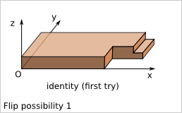
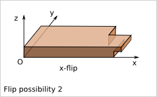
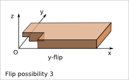
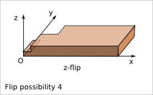

    
Notice that z-flip is equivalent to the combination of x-flip and y-flip.    

Plank orientation possibilities
===============================

We focus only on cuboid construction. Namely each plank of the construction is parallel to one of the 3 axis X, Y and Z of a given orthogonal reference frame.

Considering a simple plank (just a rectangular cuboid wihtout cut), the position of the plank is not influenced by flip along x, y and z. In a given reference frame, this plank has six possible orientations in a cuboid construction. An orientation is marked by the length direction axis followed by the width direction axis. With this nomenclature, the six orientations are: 'xy', 'xz', 'yx', 'yz', 'zx' and 'zy'.    

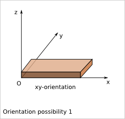
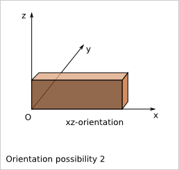
.. image:: images/orientation_possibility_3.png
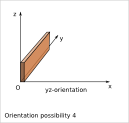
.. image:: images/orientation_possibility_5.png
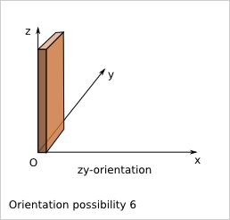

Plank position in a cuboid construction    
=======================================    

The position of a plank (or assimilated) in a cuboid construction can be defined by three operations:

- flip (identity, x-flip, y-flip, z-flip)
- orientation ('xy', 'xz', 'yx', 'yz', 'zx', 'zy')
- translation (x,y,z)

The function place_plank() realizes those operations. To realize those three operation, the function needs also as argument the length, the width and the height of the plank.

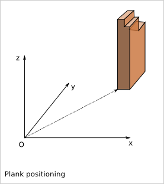

