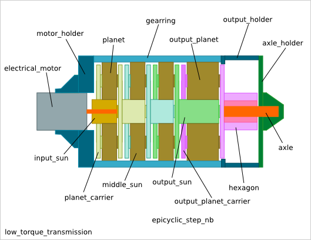
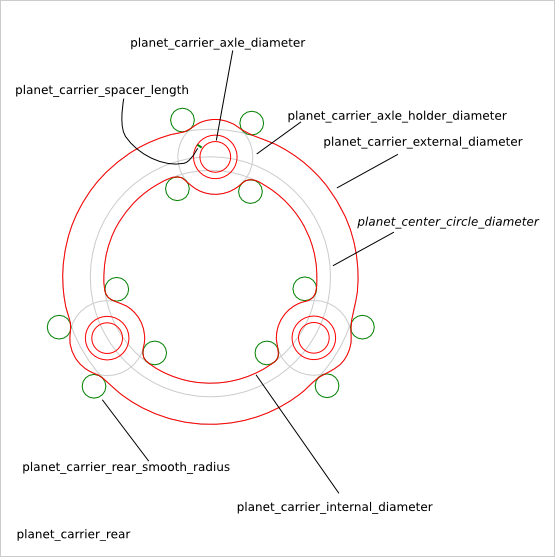
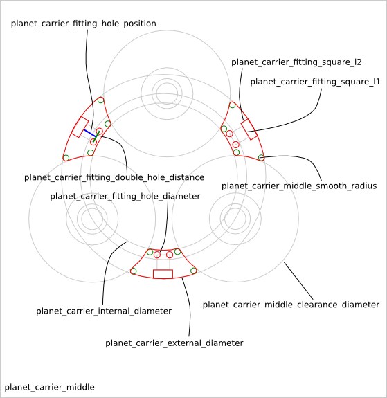
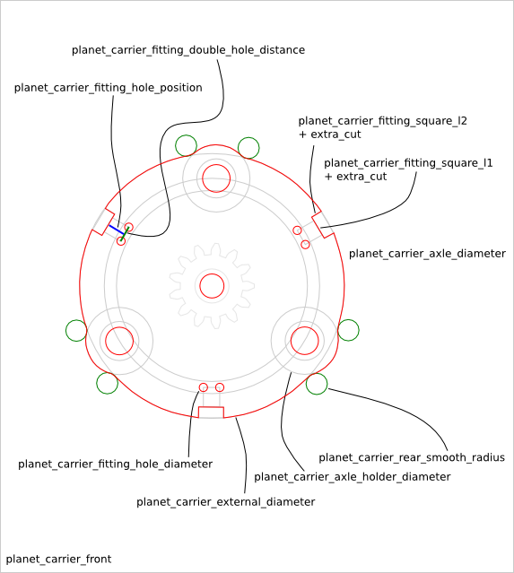

=====================
Planet_Carrier Design
=====================

Ready-to-use parametric *planet_carrier* design. It is composed of the rear and the front planet_carrier. It is used by the :doc:`low_torque_transmission_design` and :doc:`high_torque_transmission_design`.

To get an overview of the possible *planet_carrier* designs that can be generated by *planet_carrier()*, run::

  > python planet_carrier.py --run_self_test

Planet_Carrier Parameters
=========================

Overview
________

The *planet_carrier* is composed of the following parts:

 - planet_carrier_rear
 - planet_carrier_front

The *planet_carrier_rear* is the fusion of the rear plate the the middle bits. The *planet_carrier_front* is the simple plate that can be fused with a sun-gear in a future design.

Diameters
_________

z-direction parameters
______________________

The parameters related to the extrusion size in the z-direction:

.. image:: images/planet_carrier_width.png

Planet_Carrier Parameter Dependency
===================================

Diameters
_________

- planet_center_circle_diameter
- planet_carrier_external_diameter
- planet_carrier_internal_diameter

