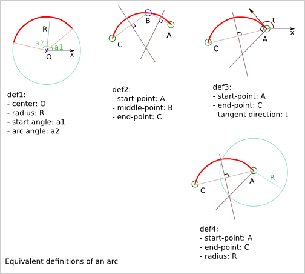

====================
Smooth Outline Curve
====================

1. Curve approximation
======================

Most of the 3-axis CNC can handle arcs at the motor driving level. This means that arcs, like lines, can be done perfectly at the mechanical precision. All other curve types must be approximated either with small lines or in small arcs in an earlier stage of the design workflow.

Approximating with lines is simple but you lose the continuity of the tangent along the path.

Approximating with arcs let you keep the continuity of the tangent along the path. This is probably what you want to approximate your mathematical curve or your free-hand curve.

2. Double-arc solution
======================

The function *smooth_outline_c_curve()* use the double-arc solution to approximate a *segment* of curve.

Given two points, A and E, and their tangent directions, you can construct two arcs that are joined in C with a common tangent direction (parallel to the line (AE)) and with the first arc that starts in A with the requested tangent direction and the second arc that ends in E with the requested tangent direction.

.. image:: images/double_arc.png
.. image:: images/double_arc_construction_of_C.png

The file *docs/smooth_polyline.svg* contains other solution attempts.

