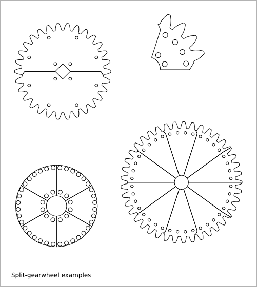
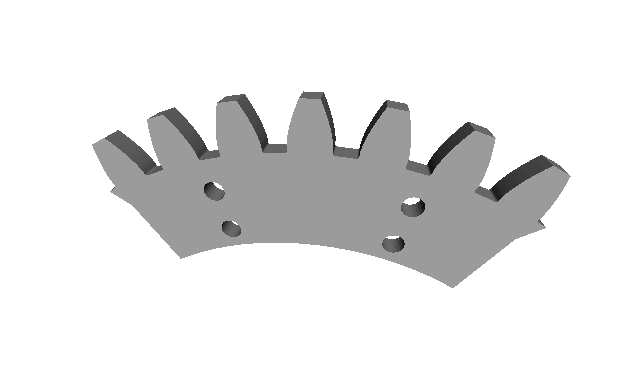
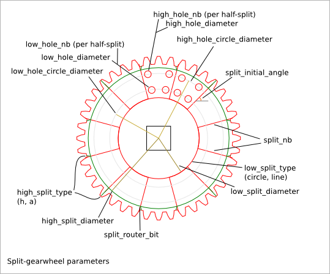

======================
Split-gearwheel Design
======================

Ready-to-use parametric *split-gearwheel* design (i.e. spur that is split for its fabrication).

To get an overview of the possible split-gearwheel designs that can be generated by *split_gearwheel()*, run::

  > python split_gearwheel.py --run_self_test

Split-gearwheel Parameter List
==============================

The parameter relative to the gear-profile are directly inherit from the :doc:`gear_profile_function`.

Split-gearwheel Parameter Dependency
====================================

router_bit_radius
-----------------

Three router_bit radius are defined: *gear_router_bit_radius*, *split_router_bit_radius*, and *cnc_router_bit_radius*. Each set the router_bit radius for different areas except *cnc_router_bit_radius* that set the mimnimum value for the two other router_bit radius. If an other router_bit radius is smaller than *cnc_router_bit_radius*, it is set to *cnc_router_bit_radius*. So, we have the relations::

  cnc_router_bit_radius < gear_router_bit_radius
  cnc_router_bit_radius < split_router_bit_radius

split_nb
--------

*split_nb* defines in how many parts the gearwheel must be split. The *split_gearwheel()* function generates two sets (A and B) of *split_nb* parts. So you get at the end 2*split_nb parts. The set A (respectively B) makes a complete gearwheel. The set-A-gearwheel and the set-B-gearwheel can be stick together to ensure a better stability. The *low-holes* and *high-holes* ensure a good alignment between the set-A parts and set-B parts. The parameters *low_hole_nb* and *high_hole_nb* define the number of holes per half-split-portion i.e. the common portion between a set-A parts and a set-B part.

low_split_diameter and high_split_diameter
------------------------------------------

The constraints define 5 circles: *low_split_diameter*, *low_hole_circle_diameter*, *high_hole_circle_diameter*, *high_split_diameter* and *minimal_gear_profile_radius* (inferred from the gear-profile). If *gear_tooth_nb* = 0 then *high_split_diameter* = *minimal_gear_profile_radius*. These five circles are strictly included in each others::

  low_split_diameter + low_hole_radius < low_hole_circle_diameter
  low_hole_circle_diameter + low_hole_radius + high_hole_radius < high_hole_circle_diameter
  high_hole_circle_diameter + high_hole_radius < high_split_diameter
  high_split_diameter < minimal_gear_profile_radius

low_split_type
--------------

*low_split_type* defines the outline at the low-split-circle::

  circle : the outline is an arc of circle
  line   : the outline is composed of two lines

high_split_type
---------------

*high_split_type* defines how to join the split radius with the gear-profile. Indeed the number of gear-teeth and the number of split-portion are independant. In most of the case, the gear-hollow doesn't fit exactly the split radius. The split radius stops at the high-split circle. Then, the outline goes straight to the gear-profile. The angle at the high-split circle is smooth with *split_router_bit_radius*. The possible values for *high_split_type* are::

  'h': the outline goes to the closest gear-hollow middle
  'a': the outline goes to the addendum middle if it best fits, otherwise it goes to the closest gear-hollow middle

gear_tooth_nb
-------------

*gear_tooth_nb* sets the number of teeth of the gear_profile. If *gear_tooth_nb* is set to zero, the gear_profile is replaced by a simple circle of diameter *gear_primitive_radius*.

Alignment angles
----------------

*gear_initial_angle* sets the angle between the X-axis and the middle of the addendum of the first tooth. *split_initial_angle* sets the angle between the X-axis and the first split radius. Use *gear_initial_angle* or *split_initial_angle* or both to ajust the offset angle between the gear-profile anf the split-portion.

